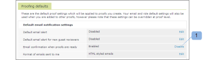

# 다음 [!UICONTROL 증명] 이메일

>[!IMPORTANT]
>
>이 문서는 독립형 제품의 기능을 참조합니다 [!DNL Workfront Proof]. 내부 교정에 대한 자세한 정보 [!DNL Adobe Workfront]를 참조하십시오. [교정](../../../review-and-approve-work/proofing/proofing.md).

A [!UICONTROL 증명] 증명 작성자가 증명을 만들 때만 이메일이 전송됩니다. 개인이 증명을 만들어 다른 사람을 소유자로 만든 경우 새 소유자만 [!UICONTROL 증명] 이메일. Creator 및/또는 Owner는 Creator를 가져오지 않습니다. 그들은 오직 [!UICONTROL 증명] 이메일. 에 대한 자세한 정보 [!UICONTROL 새 증명] 이메일, [[!UICONTROL 새로운 증명] 이메일](../../../workfront-proof/wp-emailsntfctns/proof-notifications-and-reminders/new-proof-email.md).

사용자가 [!UICONTROL 증명] 아래에 설명된 대로 프로필 설정에서 이메일을 확인합니다.

>[!NOTE]
>
> 증명의 작성자나 소유자가 [!UICONTROL 증명] 개인 설정에서 기본적으로 비활성화된 이메일이 수신되지 않습니다 [!UICONTROL 증명] 또는 [!UICONTROL 새 증명] 이메일, [!UICONTROL 전자 메일로 사람들에게 알림] 확인란이 선택되어 있습니다 [!UICONTROL 새로운 증명] 페이지.

A [!UICONTROL 증명] 전자 메일에는 개인 메시지(포함된 경우) 및 다음과 같은 증명 세부 정보가 포함됩니다.

* 증명 이름
* 증명에 대한 개인 링크
* 버전 번호
* 증명의 축소판
* 증명 진행 상황
* 다른 사람과 증명 공유 링크
* 원본 파일에 대한 증명 URL 및/또는 다운로드 링크를 공유할 수 있도록 해줍니다.

>[!NOTE]
>
> 증명 링크를 공유하면 증명에 검토자를 명시적으로 추가할 수 없으며 공개 증명 URL만 공유하며 수신자는 증명에 대한 읽기 전용 액세스 권한을 받습니다.

자세한 내용은 [증명 공유 위치 [!DNL Workfront Proof]](../../../workfront-proof/wp-work-proofsfiles/share-proofs-and-files/share-proof.md) 추가 정보.

이 링크가 수신자의 전자 메일에 표시되지 않도록 하려면 [!UICONTROL 공개 공유] 증명 설정([!UICONTROL 원본 파일 다운로드] 및 [!UICONTROL 공개 URL]).

## 비활성화 [!UICONTROL 증명] 이메일

1. 클릭 **[!UICONTROL 설정]** > **[!UICONTROL 개인 설정]**&#x200B;를 열고 **[!UICONTROL 교정 기본값]** 탭을 클릭한 다음 **[!UICONTROL 비활성화]** 다음 **[!UICONTROL 증명이 준비되면 전자 메일 확인]**.

1. 

1. 자세한 내용은 [Workfront 증명의 이메일 알림 설정 구성](../../../workfront-proof/wp-emailsntfctns/email-alerts/config-email-notification-settings-wp.md) 자세한 지침
1. 이메일 알림이 [!UICONTROL 계정 설정]의 작성자 또는 소유자가 아무 것도 받지 않습니다 [!UICONTROL 증명] 또는 [!UICONTROL 새 증명] 개인 설정 및 개인 설정에서 활성화하더라도 이메일 [!UICONTROL 전자 메일로 사람들에게 알림] 확인란이 선택되어 있습니다 [!UICONTROL 새로운 증명] 페이지.
