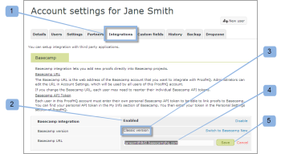

# [!DNL Workfront Proof]과(와) [!DNL Basecamp Classic] 통합

>[!IMPORTANT]
>
>이 문서는 독립 실행형 제품 [!DNL Workfront Proof]의 기능을 참조합니다. [!DNL Adobe Workfront] 내부의 증명에 대한 자세한 내용은 [증명](../../../review-and-approve-work/proofing/proofing.md)을 참조하십시오.

프로젝트 관리에 [!DNL Basecamp]을(를) 사용하는 경우 [!DNL Workfront Proof]을(를) 사용하여 프로젝트 팀에 더 풍부한 검토 및 승인 도구를 제공할 수 있습니다.

## [!DNL Workfront]과(와) [!DNL Basecamp] 통합 이해

[!DNL Basecamp]과(와) 통합하여 사용자가 [!DNL Basecamp] 내의 모든 증명을 보고, 검토하고, 승인할 수 있습니다. 사용자는 [!DNL Workfront Proof] 계정에 증명을 제출하고 [!DNL Basecamp] 프로젝트와 연결할 수 있습니다. 검토자는 [!DNL Basecamp]을(를) 통해 증명 뷰어에서 [증명에 대한 결정을 내릴 수 있습니다](../../../review-and-approve-work/proofing/reviewing-proofs-within-workfront/make-a-decision-on-a-proof/make-decisions-on-proof.md). 이때 Basecamp 메시지에 포함된 미니 증명이 사용됩니다.

[!DNL Workfront Proof]과(와) 통합되면 [!DNL Basecamp]에서 사용자는 증명을 사용하여 다음을 수행할 수 있습니다.

* 사용자는 [!DNL Basecamp Classic] 내에서 증명을 검토하고 승인할 수 있습니다.
* 사용자는 검토 도구를 즉시 사용할 수 있습니다.
* 프로젝트 검토 팀이 [!DNL Basecamp]에서 검토 및 승인을 위한 미니 증명과 함께 메시지를 받습니다.
* 사용자는 검토 및 승인을 위해 전체 페이지 증명으로 전환할 수 있습니다.
* 사용자는 미니 및 전체 크기의 증명 모두에 주석과 마크업을 추가할 수 있습니다.

  >[!NOTE]
  >
  >댓글에 회신하면 해당 댓글을 편집하거나 삭제할 수 없습니다.

* 검토자는 다른 검토자가 만든 및 마크업에 응답할 수 있습니다.
* 새 증명 버전을 사용할 수 있게 되면 사용자에게 경고가 표시됩니다.
* [!DNL Workfront Proof]명의 사용자가 아닌 사용자는 [!DNL Basecamp]에서 증명 작업을 수행할 수 있습니다.

[!DNL Workfront Proof]과(와) [!DNL Basecamp]의 통합은 다음 두 가지 수준에서 설정해야 합니다.

* [계정 설정:](https://support.workfront.com/hc/en-us/sections/115000912147-Account-settings)에서 [!DNL Basecamp]을(를) 구성하십시오. 이렇게 하면 조직 전체에 Basecamp 통합이 가능합니다.
* 자세한 내용은 [통합 사용 [!DNL Basecamp] 을 참조하십시오 [!DNL Workfront Proof]](#enabling-the-basecamp-integration-with-workfront-proof).
* [개인 설정](https://support.workfront.com/hc/en-us/sections/115000921168-Personal-settings)에서 [!DNL Basecamp]을(를) 구성합니다. 이렇게 하면 증명 생성자 및 소유자가 자신의 개인 [!DNL Basecamp] 계정에 연결하고 [!DNL Workfront Proof] 액세스 권한을 부여할 수 있습니다. 자세한 내용은 [개인 설정 구성](#configuring-personal-settings)을 참조하세요.

[!DNL Workfront]을(를) [!DNL Basecamp] 또는 [!DNL Basecamp Classic] 중 하나와 통합할 수 있습니다. [!DNL Basecamp]의 각 버전은 서로 다른 API를 사용하므로 서로 다른 구성 절차가 필요합니다.

[!DNL Basecamp Classic] 구성에 대한 자세한 내용은 이 문서에서 [통합 활성화 [!DNL Basecamp] 를 참조하십시오 [!DNL Workfront Proof]](#enabling-the-basecamp-integration-with-workfront-proof).

[!DNL Basecamp] 구성에 대한 자세한 내용은 [통합 [!DNL Workfront Proof] 와 [!DNL Basecamp]](../../../workfront-proof/wp-integrations/basecamp/integrate-workfront-proof-with-basecamp.md)을 참조하세요.

## [!DNL Workfront Proof]과(와) [!DNL Basecamp] 통합 사용

[다음 증명 권한 프로필 [!DNL Workfront Proof]](../../../workfront-proof/wp-acct-admin/account-settings/proof-perm-profiles-in-wp.md) 또는 [증명 권한 프로필 [!DNL Workfront Proof]](../../../workfront-proof/wp-acct-admin/account-settings/proof-perm-profiles-in-wp.md)로서 [계정 설정](https://support.workfront.com/hc/en-us/sections/115000912147-Account-settings)에서 전체 계정에 대한 Basecamp 통합을 설정할 수 있습니다.

1. [계정 설정으로 이동](https://support.workfront.com/hc/en-us/sections/115000912147-Account-settings)
1. **[!UICONTROL 통합]** 탭을 엽니다(1).
1. Basecamp 통합을 사용하려면 **[!UICONTROL 사용]**(2)을 클릭합니다.
1. [!DNL Basecamp Classic]이(가) 통합 중인 버전인지 확인합니다(3).
1. (조건부) [!DNL Basecamp] URL이 표시되지 않는 경우(4) **[!UICONTROL 편집]**&#x200B;을 클릭하고 [!DNL Basecamp] 계정의 URL을 입력하십시오(http:// 제외).
1. **[!UICONTROL 저장]**(5)을 클릭합니다.\
   

1. (선택 사항) [!DNL Basecamp Classic] 계정에 로그인한 후 브라우저에서 [!DNL Basecamp] URL을 확인합니다(6).

   

   [!DNL Workfront Proof]을(를) [!DNL Basecamp]과(와) 통합하면 사용자가 개인 설정을 구성할 수 있습니다. 개인 설정 설정에 대한 자세한 내용은 [개인 설정 구성](#configuring-personal-settings)을 참조하세요.

   [!DNL Basecamp] 통합을 활성화할 수 없는 경우 [!DNL Workfront Proof] 계정 ID가 [!DNL Basecamp]에서 사용하는 계정 ID와 동일하지 않을 수 있습니다.

## 개인 설정 구성

조직에 대해 [계정 설정](https://support.workfront.com/hc/en-us/sections/115000912147-Account-settings)을 설정한 후에는 증명을 만들거나 제출하는 각 작성자가 [개인 설정](https://support.workfront.com/hc/en-us/sections/115000921168-Personal-settings)을 설정해야 합니다.

>[!NOTE]
>
>[!DNL Basecamp] 세션이 한 브라우저 창에서 열려 있고 [!DNL Workfront Proof] 세션이 다른 창에서 열려 있는 경우 이 단계를 완료하는 것이 가장 쉽습니다.

* [&#x200B; [!DNL Basecamp] API 토큰 검색 중](#retrieving-your-basecamp-api-token)
* [개인 설정에  [!DNL Basecamp] API 토큰 추가](#adding-your-basecamp-api-token-to-your-personal-settings)

### [!DNL Basecamp] API 토큰 검색 중

[!DNL Workfront Proof]의 개별 수준에서 통합을 완료하려면 사용자는 [!DNL Basecamp] API에 대한 개별 인증 토큰이 필요합니다.

[!DNL Basecamp] API 토큰을 검색하려면

1. [!DNL Basecamp] 계정에 로그인합니다.
1. 화면 오른쪽 상단에서 **[!UICONTROL 내 정보]**(1)를 클릭합니다.\
   [!UICONTROL 내 정보] 페이지가 표시됩니다.\
   

1. [!UICONTROL 인증 토큰] 섹션에서 **[!UICONTROL 토큰 표시]**(2)를 클릭하여 개인 인증 토큰을 표시합니다.
1. **[!UICONTROL 피드 리더용 토큰]** 또는 **[!UICONTROL 기본 API]**(3)을 선택한 다음 토큰을 클립보드에 복사합니다.

1. [!DNL Basecamp] API 토큰을 [!UICONTROL 피드 리더용 토큰] 또는 [!UICONTROL 기본 API] 상자에 붙여 넣으십시오.\
   

### 개인 설정에 [!DNL Basecamp] API 토큰 추가

[!DNL Basecamp] API 토큰을 [!DNL Workfront Proof] [개인 설정](https://support.workfront.com/hc/en-us/sections/115000921168-Personal-settings)에 붙여 넣으려면:

1. [개인 설정](https://support.workfront.com/hc/en-us/sections/115000921168-Personal-settings)(1)의 [[!UICONTROL 통합] - 사용자 설정](../../../workfront-proof/wp-getstarted/personal-settings/integrations-user-setup.md)(으)로 이동합니다.\
   개인 설정을 사용하려면 먼저 관리자가 [!DNL Basecamp Classic] 통합을 사용하도록 설정해야 합니다. 통합 설정에 대한 자세한 내용은 이 문서에서 [통합 활성화 [!DNL Basecamp] 를 참조하십시오 [!DNL Workfront Proof]](#enabling-the-basecamp-integration-with-workfront-proof).

1. [!DNL Basecamp] API 토큰 상자(2)에서 [!DNL Basecamp] [!UICONTROL 내 정보] 페이지에서 복사한 토큰을 필드(3)에 붙여 넣습니다.\
   [!DNL Basecamp] API 토큰 복사에 대한 자세한 내용은 이 문서에서 [API 토큰 검색 [!DNL Basecamp] 3&rbrace;을 참조하십시오.](#retrieving-your-basecamp-api-token)

1. **[!UICONTROL 저장]**(4)을 클릭합니다.

[!DNL Workfront Proof] [개인 설정](https://support.workfront.com/hc/en-us/sections/115000921168-Personal-settings)이(가) 이제 [!DNL Basecamp Classic] 계정과 통합되었습니다.
