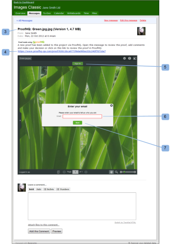

# 에서 증명 검토 [!DNL Basecamp] Classic

>[!IMPORTANT]
>
>이 문서는 독립형 제품의 기능을 참조합니다 [!DNL Workfront Proof]. 내부 교정에 대한 자세한 정보 [!DNL Adobe Workfront]를 참조하십시오. [교정](../../../review-and-approve-work/proofing/proofing.md).

[!DNL Basecamp] 는 [!DNL 37signals]. 만약 [!DNL Basecamp] 프로젝트 관리를 위해 [!DNL Workfront Proof].

## 의 증명 검토 이해 [!DNL Basecamp Classic]

통합 시 [!DNL Workfront Proof], [!DNL Basecamp] 에서는 사용자가 증명을 사용하여 다음을 수행할 수 있습니다.

* 사용자는 내에서 증명을 검토하고 승인할 수 있습니다 [!DNL Basecamp Classic].
* 사용자는 검토 도구를 쉽게 사용할 수 있습니다.
* 프로젝트 검토 팀에서 메시지를 받습니다 [!DNL Basecamp] 검토와 승인을 위한 작은 증명.
* 사용자는 검토 및 승인을 위해 전체 페이지로 전환할 수 있습니다.
* 사용자는 미니 및 전체 크기 증명 모두에 댓글 및 마크업을 추가할 수 있습니다.
* 댓글에 답글을 달면 편집/삭제할 수 없습니다. 주석에 대한 자세한 내용은 [증명에 주석 달기](../../../review-and-approve-work/proofing/reviewing-proofs-within-workfront/comment-on-a-proof/comment-on-proof.md).
* 검토자는 다른 검토자가 만든 및 마크업에 응답할 수 있습니다. 주석에 대한 자세한 내용은 [증명에 주석 달기](../../../review-and-approve-work/proofing/reviewing-proofs-within-workfront/comment-on-a-proof/comment-on-proof.md).
* 새로운 버전의 증명을 사용할 수 있으면 사용자에게 경고가 표시됩니다.
* 그렇지 않은 사용자 [!DNL Workfront Proof] 사용자는 [!DNL Basecamp].

## 알림 이메일을 통해 증명 보기

증명을 [!DNL Basecamp], [!DNL Workfront Proof] 다음 정보가 포함된 증명 알림 이메일(1)을 모든 검토자에게 보냅니다.

* **증명 세부 사항** (2): 증명에 대한 정보를 표시합니다. 표시되는 정보는 Workfront 관리자가 Basecamp를 구성한 방법에 따라 다릅니다.
* **[!UICONTROL 증명으로 이동] 링크** (3): Workfront에서 증명을 엽니다.
* **[!DNL Basecamp]URL** (4): Basecamp에서 증명을 엽니다. 비기본 amp 검토자가 증명에 추가된 경우 해당 이메일 알림에 Basecamp 링크가 포함되지 않습니다.
* **[!UICONTROL 증명 진행률]** (5): 승인 단계를 나열하고 증명 진행률 표시기를 표시합니다.
* **[!UICONTROL 단계]** (6): 검토자와 검토자의 개별 진행 상황을 나열합니다.

이메일 알림에서 증명을 열려면 다음을 수행하십시오.

1. 증명을 여는 방법 [!DNL Workfront Proof]를 클릭합니다. **[!UICONTROL 증명으로 이동]**.\
   또는\
   증명을 여는 방법 [!DNL Basecamp]에 나열된 URL을 클릭합니다. **[!UICONTROL [!DNL Basecamp]URL]** 필드.\
   증명 검토에 대한 자세한 내용은 [!DNL Basecamp Classic]를 참조하십시오. [에서 증명 검토 [!DNL Basecamp]](#reviewing-a-proof-in-basecamp) 참조하십시오.

## 를 통해 증명 보기 [!DNL Basecamp Classic] 메시지

에서 증명에 액세스할 수 있습니다. [!DNL Basecamp Classic] 메시지를 표시합니다.

1. in [!DNL Basecamp]를 클릭하여 프로젝트 페이지(1)로 이동합니다.\
   

1. 열려는 증명의 메시지를 클릭합니다. (2)\
   증명의 메시지가 열리고 작은 증표가 표시됩니다. 증명 이름은 메시지 창(3) 맨 위에 표시됩니다.\
   에서 축소판 그림을 확인할 수 있습니다. [!DNL Basecamp Classic] 또는 [!DNL Workfront Proof].\
   

1. 증명을 [!DNL Workfront proof]를 클릭하고 증명(4) 위에 나열된 URL을 클릭합니다.
1. (조건부) [!DNL Workfront Proof] 브라우저 창 중 하나에서 계정을 사용하여 증명을 검토합니다.

   1. 클릭 **[!UICONTROL 로그인]** (5) 증거물 위에.
   1. 이메일 주소(6)를 입력합니다.\

      증명에 추가할 때 사용한 것과 동일한 이메일 주소를 사용해야 합니다.
   1. 클릭 **[!UICONTROL 다음]**.
   1. 을(를) 입력합니다 [!DNL Workfront Proof] 암호(7).\

      또는\
      없는 경우 [!DNL Workfront Proof] 표시할 공용 이름을 입력합니다.\
      &quot;&quot;을(를) 선택할 수 있습니다.[!UICONTROL 내 기억]따라서 세부 사항을 한 번만 입력하면 됩니다.

1. 증명을 검토하려면 [에서 증명 검토 [!DNL Basecamp]](#reviewing-a-proof-in-basecamp).

>[!NOTE]
>
> 메시지 페이지의 미니 증명 아래에 표시된 주석 상자는 메시지 자체에만 적용됩니다. 검토 주석을 제출하려면 미니 증명 맨 위에 있는 설명 아이콘 단추 또는 더 큰 설명을 사용해야 합니다 [!UICONTROL 댓글] 전체 페이지 증명의 맨 위에 있는 단추. 자세한 내용은 [에서 증명 검토 [!DNL Basecamp]](#reviewing-a-proof-in-basecamp).

## 에서 증명 검토 [!DNL Basecamp]

작은 증명 [!DNL Basecamp] 에서는 및 을 추가하는 데 필요한 도구를 제공합니다 [교정 뷰어의 증명 결정](../../../review-and-approve-work/proofing/reviewing-proofs-within-workfront/make-a-decision-on-a-proof/make-decisions-on-proof.md) 증거에 프로젝트에 지정된 모든 사용자는 마크업과 주석을 확인하고 자신의 주석에 실시간으로 응답할 수 있습니다.

증명을 열면 증명은 [!UICONTROL 교정] 창(1)과 증명 및 버전 번호의 이름이 왼쪽 위 모서리(2)에 표시됩니다.

증명을 검토하려면

1. 댓글을 추가하려면 [!UICONTROL 댓글] (3) 증명의 맨 위에 설명을 입력합니다.\
   에 대한 응답을 보낼 필요가 없습니다 [!DNL Basecamp] 메시지, 설명 및 [교정 뷰어의 증명 결정](../../../review-and-approve-work/proofing/reviewing-proofs-within-workfront/make-a-decision-on-a-proof/make-decisions-on-proof.md) 증명에 저장됨(내에서 증명 검토와 유사) [!DNL Workfront Proof]).

1. 결정을 추가하려면 증명 상단에 있는 결정(3)을 클릭하고 승인 결정을 선택합니다.\
   증명에 대한 의사 결정에 대한 자세한 내용은 [교정 뷰어의 증명 결정](../../../review-and-approve-work/proofing/reviewing-proofs-within-workfront/make-a-decision-on-a-proof/make-decisions-on-proof.md#making-a-decision-on-a-proof).

증명 창의 기타 기능은 다음과 같습니다.

* **[!UICONTROL 작업 메뉴]** (4): 증명의 설정을 선택할 수 있습니다.
* **[!UICONTROL 전체 화면 단추]** (5): 전체 화면과 미니 증명 간을 전환할 수 있습니다.
* **[!UICONTROL 사이드바]** (6): 증명 보기를 확장하거나 축소할 수 있습니다.
* **[!UICONTROL 사용자 이름]** (7): Workfront에 로그인한 경우 사용자 이름을 표시합니다.
* **[!UICONTROL 확대/축소 도구]** (8): 증명의 영역을 확대할 수 있습니다.
* **[!UICONTROL 페이지 탐색 도구]** (9): 증명 내의 다른 페이지로 스크롤할 수 있습니다.

<!--For more information on reviewing proofs, see [Legacy proofing viewer Overview](../../../workfront-proof/wp-work-proofsfiles/review-proofs-lpv/legacy-proofing-viewer.md).-->
