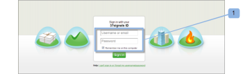

# [!DNL Workfront Proof]과(와) [!DNL Basecamp] 통합

>[!IMPORTANT]
>
>이 문서는 독립 실행형 제품 [!DNL Workfront Proof]의 기능을 참조합니다. [!DNL Adobe Workfront] 내부의 증명에 대한 자세한 내용은 [증명](../../../review-and-approve-work/proofing/proofing.md)을 참조하십시오.

프로젝트 관리에 [!DNL Basecamp]을(를) 사용하는 경우 [!DNL Workfront Proof]을(를) 사용하여 프로젝트 팀에 더 풍부한 검토 및 승인 도구를 제공할 수 있습니다.

## [!DNL Workfront]과(와) [!DNL Basecamp] 통합 이해

[!DNL Basecamp]과(와) 통합하여 사용자가 [!DNL Basecamp] 내의 모든 증명을 보고, 검토하고, 승인할 수 있습니다. 사용자는 [!DNL Workfront Proof] 계정에 증명을 제출하고 [!DNL Basecamp] 프로젝트와 연결할 수 있습니다. 검토자는 [!DNL Basecamp]을(를) 통해 Basecamp 메시지에 포함된 미니 증명을 사용하여 댓글을 달고 결정을 내릴 수 있습니다.

[!DNL Workfront Proof]과(와) 통합되는 경우 [!DNL Basecamp]에는 다음과 같은 증명 기능이 있습니다.

* 사용자는 [!DNL Basecamp Classic] 내에서 증명을 검토하고 승인할 수 있습니다.
* 사용자는 검토 도구를 즉시 사용할 수 있습니다.
* 프로젝트 검토 팀이 [!DNL Basecamp]에서 검토 및 승인을 위한 미니 증명과 함께 메시지를 받습니다.
* 사용자는 검토 및 승인을 위해 전체 페이지 증명으로 전환할 수 있습니다.
* 사용자는 미니 및 전체 크기의 증명 모두에 주석과 마크업을 추가할 수 있습니다.

  >[!NOTE]
  >
  >댓글에 회신하면 해당 댓글을 편집하거나 삭제할 수 없습니다.

* 검토자는 다른 검토자가 만든 및 마크업에 응답할 수 있습니다.
* 새 증명 버전을 사용할 수 있게 되면 사용자에게 경고가 표시됩니다.
* [!DNL Workfront Proof]명의 사용자가 아닌 사용자는 [!DNL Basecamp]에서 증명 작업을 수행할 수 있습니다.

[!DNL Workfront Proof]과(와) [!DNL Basecamp]의 통합은 다음 두 가지 수준에서 설정해야 합니다.

* [계정 설정:](https://support.workfront.com/hc/en-us/sections/115000912147-Account-settings)에서 [!DNL Basecamp]을(를) 구성하십시오. 이렇게 하면 조직 전체에 Basecamp 통합이 가능합니다. 자세한 내용은 [Basecamp 통합 사용 [!DNL Workfront Proof]](#enabling-the-basecamp-integration-with-workfront-proof)을 참조하세요.

* [개인 설정](https://support.workfront.com/hc/en-us/sections/115000921168-Personal-settings)에서 [!DNL Basecamp]을(를) 구성합니다. 이렇게 하면 증명 생성자 및 소유자가 자신의 개인 Basecamp 계정에 연결하고 [!DNL Workfront Proof] 액세스 권한을 부여할 수 있습니다. 자세한 내용은 [개인 설정 구성](#configuring-personal-settings)을 참조하세요.

[!DNL Workfront]을(를) [!DNL Basecamp] 또는 [!DNL Basecamp Classic] 중 하나와 통합할 수 있습니다. [!DNL Basecamp]의 각 버전은 서로 다른 API를 사용하므로 서로 다른 구성 절차가 필요합니다.

[!DNL Basecamp Classic] 구성에 대한 자세한 내용은 [통합 [!DNL Workfront Proof] 과(와) [!DNL Basecamp Classic].](https://support.workfront.com/knowledge/articles/115004234707/en-us?brand_id=662728&amp;return_to=%2Fhc%2Fen-us%2Farticles%2F115004234707)을(를) 참조하십시오.

## [!DNL Workfront Proof]과(와) [!DNL Basecamp] 통합 사용

 [!DNL Workfront Proof][&#128279;](../../../workfront-proof/wp-acct-admin/account-settings/proof-perm-profiles-in-wp.md)의 [증명 권한 프로필 또는  [!DNL Workfront Proof]](../../../workfront-proof/wp-acct-admin/account-settings/proof-perm-profiles-in-wp.md)의 증명 권한 프로필[계정 설정](https://support.workfront.com/hc/en-us/sections/115000912147-Account-settings)에서 전체 계정에 대한 [!DNL Basecamp] 통합을 설정할 수 있습니다.

1. [!UICONTROL Basecamp]에서 다음 정보를 수집하십시오.

   * [!DNL Basecamp] 계정의 URL
   * &quot;[!UICONTROL 내 정보]&quot; 섹션에 있는 URL

1. [!DNL Basecamp]에서 로그아웃합니다.
1. 오른쪽 상단 근처에 있는 **[!UICONTROL 계정 설정]**&#x200B;을 클릭합니다.
1. **[!UICONTROL 통합]** 탭을 클릭합니다.
1. **[!UICONTROL [!DNL Basecamp]]** 섹션에서 **[!UICONTROL [!DNL Basecamp]통합]** 오른쪽에 있는 **[!UICONTROL 사용]**&#x200B;을 클릭합니다.

1. **[!UICONTROL [!DNL Basecamp]버전]** 옆의 **[!UICONTROL Classic 버전]**&#x200B;이(가) 통합 중인 버전인지 확인합니다.

1. (조건부) [!DNL Basecamp] URL이 표시되지 않으면 **[!UICONTROL 편집]**&#x200B;을 클릭하고 &quot;http://&quot;을 포함하지 않고 [!DNL Basecamp] 계정의 URL을 입력한 다음 **[!UICONTROL 저장]**&#x200B;을 클릭합니다.

1. 창의 오른쪽 상단 모서리에서 **[!UICONTROL 설정]** > **[!UICONTROL 개인 설정]**&#x200B;을 클릭합니다.

1. **[!UICONTROL 통합]** 탭을 클릭합니다.
1. **[!DNL Basecamp]**&#x200B;에서 **[!UICONTROL Basecamp 통합]**&#x200B;의 오른쪽에 있는 **[!UICONTROL 사용]**&#x200B;을 클릭합니다.

1. 옵션이 나타나면 **[!UICONTROL [!DNL Basecamp]API 토큰]** 오른쪽에 있는 **[!UICONTROL 편집]**&#x200B;을 클릭합니다.

1. 표시되는 상자에서 [!DNL Basecamp]의 &quot;[!UICONTROL 내 정보]&quot; 섹션에 있는 URL을 입력한 다음 **[!UICONTROL 저장]**&#x200B;을 클릭합니다.\
   [!DNL Workfront Proof]을(를) [!DNL Basecamp]과(와) 통합하면 사용자가 개인 설정을 구성할 수 있습니다. 개인 설정 설정에 대한 자세한 내용은 [개인 설정 구성](#configuring-personal-settings)을 참조하세요.

1. [!DNL Basecamp] 통합을 활성화할 수 없는 경우 [!DNL Workfront Proof] 계정 ID가 [!DNL Basecamp]에서 사용하는 계정 ID와 동일하지 않을 수 있습니다.
1. [!DNL Workfront Proof]을(를) [!DNL Basecamp]과(와) 통합하면 사용자가 개인 설정을 구성할 수 있습니다. 개인 설정 설정에 대한 자세한 내용은 [개인 설정 구성](#configuring-personal-settings)을 참조하세요.

## 개인 설정 구성

조직에 대해 [계정 설정](https://support.workfront.com/hc/en-us/sections/115000912147-Account-settings)을 설정한 후에는 증명을 만들거나 제출하는 작성자 각자가 [개인 설정](https://support.workfront.com/hc/en-us/sections/115000921168-Personal-settings)을 설정해야 합니다.

1. **[!UICONTROL 개인**&#x200B;**설정]**(으)로 이동합니다.

1. **[!UICONTROL 통합]** 탭을 엽니다(1).
1. [!DNL Basecamp] 통합을 사용하려면 **[!UICONTROL 사용]**(2)을 클릭합니다.
1. **[!UICONTROL 내 [!DNL Basecamp] 계정에 연결]**(3)을 클릭합니다.\
   

1. [!DNL Basecamp] 계정에 로그인합니다(1).\
   

1. **[!UICONTROL 예,]**&#x200B;을(를) 클릭하여 [!DNL Workfront Proof] 액세스 권한을 귀하의 계정에 부여합니다(2).\
   

1. (선택 사항) 개인 통합이 활성 상태이면(3) [!DNL Basecamp] 계정 간에 쉽게 전환할 수 있습니다.

   1. **[!UICONTROL [!DNL Basecamp] 계정 전환]** 클릭 중(4).\

      \
      [!UICONTROL 기본 Amp 계정 전환]을 통해 [!UICONTROL 개인 설정] 페이지로 이동하여 [!DNL Basecamp] 계정 중 [!DNL Workfront Proof] 계정과 통합할 계정을 선택할 수 있습니다.

   1. [!DNL Basecamp] 계정을 선택하기 전에 **[!UICONTROL 다시 통합[!DNL Basecamp]]**(5)을(를) 클릭합니다\

      [!UICONTROL 개인 설정] 페이지가 새로 고침되고 [!DNL Basecamp] 계정의 최신 목록이 표시됩니다.

   1. **[!UICONTROL 이 계정과 통합]**&#x200B;을 클릭하여 [!DNL Workfront Proof]와 연결합니다.\

      \
      이제 [!DNL Basecamp] 프로젝트에 증명을 추가할 수 있습니다.
