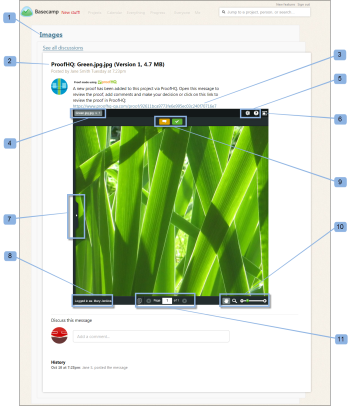

# [!DNL Basecamp]에서 증명 검토

>[!IMPORTANT]
>
>이 문서는 독립 실행형 제품 [!DNL Workfront Proof]의 기능을 참조합니다. [!DNL Adobe Workfront] 내부의 증명에 대한 자세한 내용은 [증명](../../../review-and-approve-work/proofing/proofing.md)을 참조하십시오.

[!DNL Workfront Proof]과(와) [!DNL Basecamp]을(를) 통합하면 [!DNL Basecamp]을(를) 종료하지 않고도 증명을 쉽게 검토하고 승인할 수 있습니다.

증명에 대한 댓글과 결정을 내리는 데 모든 검토 도구를 사용하기 위해 [!DNL Workfront Proof] 로그인도 필요하지 않습니다.

* [!DNL Basecamp] 계정에서 검토할 증명이 포함된 메시지를 받게 됩니다(축소 증명을 통해).
* 원하는 경우 미니증명에 주석, 마크업을 추가하고 결정을 내리거나 전체 페이지 증명으로 전환하여 검토할 수 있습니다
* 다른 검토자의 댓글 및 마크업을 보고 응답할 수 있습니다

결정에 대한 자세한 내용은 [증명 뷰어에서 증명 결정](../../../review-and-approve-work/proofing/reviewing-proofs-within-workfront/make-a-decision-on-a-proof/make-decisions-on-proof.md)을 참조하십시오.

>[!NOTE]
>
> [!DNL Workfront Proof]의 사용자가 아닌 경우에도 [!DNL Basecamp]에서 증명 작업을 수행할 수 있습니다. 이메일 주소와 화면 이름을 입력하기만 하면 됩니다. &quot;[!UICONTROL 내 정보 저장]&quot;을(를) 선택할 수도 있으므로 이러한 세부 정보를 한 번만 입력하면 됩니다.

## 알림 이메일을 통해 증명 보기

새 증명 또는 기존 증명을 [!DNL Basecamp]에 연결하면 [!DNL Workfront Proof]에서 다음을 포함하는 모든 검토자에게 증명 알림 이메일을 보냅니다.

* 증명 메시지(사용자 지정 또는 표준)(1)
* 증명 세부 정보 (2)
* 개인 URL(증명 링크로 이동) (3)
* [!DNL Basecamp]의 증명으로 바로 이동할 수 있는 [!DNL Basecamp] 프로젝트 메시지 링크(4)\
   [!DNL Basecamp]명이 아닌 검토자가 증명에 추가된 경우 전자 메일 알림에 [!DNL Basecamp] 링크가 포함되지 않습니다.
* 증명 진행 상황(5)
* 검토자 및 개별 진행 상황(6)

>[!NOTE]
>
> 다른 브라우저 창에서 열려 있는 [!DNL Basecamp] 세션이 없는 경우 [!DNL Basecamp]에서 메시지를 보려면 먼저 [!DNL Basecamp] 계정에 로그인해야 합니다.

## [!DNL Basecamp] 메시지를 통해 증명 보기

[!DNL Basecamp] 프로젝트에 추가된 새 증명에 대한 이메일 알림을 받는 경우:

1. 프로젝트 페이지 (1)로 이동합니다.
1. 증명에 대한 메시지를 찾습니다 (2).\
   메시지 페이지에는 증명 이름(제목에서)과 전체 화면 증명 뷰어 링크(4)가 포함되어 있습니다.
1. 

1. 브라우저 창 중 하나에서 [!DNL Workfront Proof] 계정에 로그인한 경우 즉시 검토를 시작할 수 있습니다. 축소판의 왼쪽 아래 모서리에 이름이 표시되지 않는 경우:
1. **[!UICONTROL 로그인]**(5)을 클릭합니다.
1. 증명에 사용자를 추가하는 데 사용한 이메일 주소를 입력합니다(6).
1. **[!UICONTROL 다음]**&#x200B;을 클릭하고 나타나는 두 번째 상자에 [!DNL Workfront Proof] 암호(7)를 입력합니다.\
   [!DNL Workfront Proof] 계정이 없는 경우 표시할 공개 이름을 입력하십시오.

1. 세부 정보를 한 번만 입력하도록 **[!UICONTROL 내 정보 저장]**&#x200B;을 클릭하세요.\
   이제 [!DNL Basecamp]에서 증명 검토를 진행할 준비가 되었습니다.

## [!DNL Basecamp]에서 증명 검토

[!DNL Basecamp]에서 증명을 검토하는 것은 [!DNL Workfront Proof]에서 확인하는 것만큼 쉽습니다. [!DNL Basecamp]의 miniproof는 증명에 주석, 마크업을 추가하고 결정하는 데 필요한 모든 도구를 제공합니다.

* [!DNL Basecamp] 프로젝트 이름(1)
* [!DNL Workfront Proof] 전자 메일 알림 제목(2)
* 전체 증명 뷰어로 직접 연결(전체 창 보기 열기) (3)
* 증명 이름 및 버전 (4)
* 작업 메뉴(5)
* 전체 화면 단추(6)
* 사이드바 (7)
* 사용자 이름(8)
* [!UICONTROL 댓글] 및 [!UICONTROL 결정] 단추(9)
* 확대/축소 도구(10)
* 페이지 탐색 도구 (11)

댓글과 결정은 증명에 저장되므로 [!DNL Basecamp] 메시지에 대한 응답을 보낼 필요가 없습니다([!DNL Workfront Proof] 내의 증명을 검토할 때와 같이).

## 전체 페이지 증명 검토

축소 증명 바로 위에 있는 메시지의 링크나 축소 증명의 오른쪽 상단 모서리에 있는 전체 화면 아이콘을 클릭하여 모든 [!DNL Workfront Proof] 일반 기능을 사용하는 전체 페이지 증명을 표시할 수 있습니다.

증명 이미지는 여전히 원래 크기이지만 페이지 자체는 축소판 페이지보다 넓습니다.

전체 페이지 증명에는 다음이 표시됩니다.

* [!UICONTROL 댓글 추가] 및 [!UICONTROL 결정 제출] 단추(miniproof에 표시되는 댓글 및 결정 아이콘 대신)(1).
* 축소판(2)보다 더 많은 확대/축소 및 탐색 도구.
* 증명의 왼쪽 상단 모서리에 있는 [!UICONTROL 이동 [!DNL Basecamp]] 단추입니다. 클릭하면 [!DNL Basecamp] 계정(3)으로 돌아갑니다.

