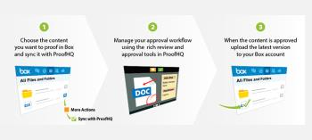

# 소개 [!DNL Workfront Proof] 및 [!DNL Box] 통합

>[!IMPORTANT]
>
>이 문서는 독립형 제품의 기능을 참조합니다 [!DNL Workfront Proof]. 내부 교정에 대한 자세한 정보 [!DNL Adobe Workfront]를 참조하십시오. [교정](../../../review-and-approve-work/proofing/proofing.md).

과의 통합 [!DNL Box] 온라인 파일 공유 및 콘텐츠 관리 시스템을 사용하면 파일의 새로운 증명과 새로운 증명 버전을 직접 만들 수 있습니다 [!DNL Box] 계정이 필요합니다. 에 대한 자세한 정보 [!DNL Box]www.box.com 을 참조하십시오.

폴더 동기화 기능을 사용하면 [!DNL Box] 폴더의 폴더 [!DNL Workfront Proof]. 파일 또는 파일의 새 버전을 의 동기화된 폴더에 추가할 때 [!DNL Box]로 설정되면 파일이 Workfront 증명의 관련 폴더에도 추가됩니다. 자세한 내용은 [동기화 [!DNL Box] 폴더 [!DNL Workfront Proof]](../../../workfront-proof/wp-integrations/box/sycn-box-folder.md).

## 주요 이점

* **공동 검토 및 승인 개선:** 팀에 리치 마크업, 주석 및 토론 도구를 제공하여 크리에이티브 자산에 대한 공동 작업을 개선할 수 있습니다.
* **프로젝트 전달 시간 단축:** 검토 주기를 단축하고 개정 수를 줄임으로써 설계 프로젝트를 56% 신속하게 전달할 수 있습니다. 더 빠른 합의 및 결정을 통해 프로젝트 전환과 시장 진출 속도가 빨라집니다. 설계 개정판은 29% 감소합니다.
* **관리 시간 절약:** 팀이 수동으로 사본을 인쇄하거나 주석을 전자 메일로 보내고 수정 사항을 라우팅하는 데 드는 시간을 줄일 경우, 증명을 관리하는 노력을 평균 59%까지 줄일 수 있습니다.
* **비용 절감:** 시간은 돈이다. 표준화된 워크플로우를 통해 승인 프로세스를 간소화할 수 있습니다. 효율성, 정확성 및 속도가 향상되므로 비용을 절감할 수 있습니다.
* **가시성과 신뢰성 향상:** 추적 가능한 감사 추적에서 타임스탬프를 사용하여 파일 버전, 주석 및 결정을 기록할 수 있습니다. 따라서 검토 프로세스의 모든 단계에서 완벽한 책임을 지게 되며 규정 준수 요구 사항을 충족할 수 있습니다.\
   

## 주요 기능

* 크리에이티브 파일을에 보내기 [!DNL Workfront Proof] 직접 [!DNL Box] 계정이 필요합니다.
* 의 파일에 대한 링크가 포함된 이메일을 통해 검토 팀에 새로운 증명을 알립니다. [!UICONTROL 상자].
* 사용자에게 다음을 제공합니다. [!DNL Workfront Proof]의 다양한 마크업, 주석 달기 및 토론 도구.
* 프로젝트 팀이 인쇄, 디지털, 웹, 비디오 및 대화형 컨텐츠를 포함하여 다양한 미디어 포맷에 대해 실시간으로 공동 작업을 수행하고 결정을 내릴 수 있도록 합니다.
* 사용 [!DNL Workfront Proof] 규정 요구 사항을 충족하고 프로세스 개선 사항을 확인합니다.

## 추가 [!DNL Workfront Proof] 앱에 동기화 [!DNL Box] 계정

아래 몇 가지 간단한 단계에 따라 앱을 Box 계정에 추가하십시오.

1. 사용자 [!DNL Box] 계정, **[!UICONTROL 앱]** 섹션을 참조하십시오.
1. 검색 막대에서 을 입력합니다 **[!DNL Workfront Proof]동기화**.
1. 클릭 **[!UICONTROL [!DNL Workfront Proof]동기화]** 참조하십시오.
1. 클릭 **[!UICONTROL 추가]** 를 추가하려면 [!DNL Workfront Proof] 앱을 Box 계정에 동기화합니다.
1. 표시되는 확인 상자에서 **[!UICONTROL 좋아요]**.

