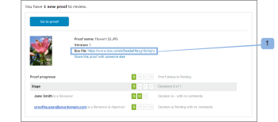

# Box에서 증명의 원본 파일 보기

>[!IMPORTANT]
>
>이 문서는 독립 실행형 제품 [!DNL Workfront Proof]의 기능을 참조합니다. [!DNL Adobe Workfront] 내부의 증명에 대한 자세한 내용은 [증명](../../../review-and-approve-work/proofing/proofing.md)을 참조하십시오.

[!DNL Workfront Proof] - [!DNL Box] 통합을 사용하는 경우 Box에서 증명을 만드는 데 사용되는 원본 파일을 볼 수 있습니다. 다음 두 가지 방법으로 이 작업을 수행할 수 있습니다.

## 증명 전자 메일 알림을 통해 [!DNL Box]에서 파일 보기

[!DNL Box] 파일에서 새 증명 또는 새 버전을 만들면 작성자 및 검토자가 [!DNL Box] 계정의 파일에 대한 링크가 포함된 전자 메일 알림을 받습니다(1).\

## [!UICONTROL 증명 세부 정보] 페이지를 통해 [!DNL Box]에서 파일 보기

[!DNL Box] 파일에서 만든 증명 [!UICONTROL 증명 세부 정보] 페이지의 [!UICONTROL 추가 공유 옵션] 섹션에 [!DNL Box] 계정에 있는 파일에 대한 링크(1)가 포함되어 있습니다.

