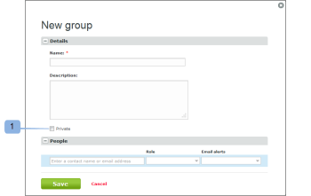

# 그룹을 [!DNL Workfront Proof]

>[!IMPORTANT]
>
>이 문서는 독립형 제품의 기능을 참조합니다 [!DNL Workfront Proof]. 내부 교정에 대한 자세한 정보 [!DNL Adobe Workfront]를 참조하십시오. [교정](../../../review-and-approve-work/proofing/proofing.md).

그룹을 비공개로 만드는 것은 사용자만 그룹을 보거나, 사용하거나, 편집하거나, 삭제할 수 있음을 의미합니다. 그룹이 비공개 그룹이 아니면 계정의 모든 사용자가 그룹을 보고 사용할 수 있습니다.

## 새 그룹을 비공개로 설정

새 그룹을 비공개로 만들려면

1. 이동 **[!UICONTROL 그룹]** 화면 왼쪽에 있습니다.
1. 을(를) 선택합니다 **[!UICONTROL 비공개]** 옵션 [!UICONTROL 새 그룹] 페이지를 설정합니다. (1)

## 기존 그룹을 비공개로 설정

기존 그룹을 비공개로 만들려면

1. 이동 **[!UICONTROL 그룹]** 화면 왼쪽에 있습니다.
1. 를 활성화합니다 **[!UICONTROL 비공개]** 옵션 을 클릭합니다. (2)

