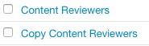

# 을 사용하여 사용자 지정 프로필 만들기 및 관리 [!DNL Workfront Proof]

>[!IMPORTANT]
>
>이 문서는 독립형 제품의 기능을 참조합니다 [!DNL Workfront Proof]. 내부 교정에 대한 자세한 정보 [!DNL Adobe Workfront]를 참조하십시오. [교정](../../../review-and-approve-work/proofing/proofing.md).

청구 관리자 및 관리자는 사용자 지정 프로필을 만들고 관리하여 조직의 계정 및 계정 설정에서 사용자가 수행할 수 있는 작업을 지정할 수 있습니다.

이 기능은 Premium 계정에서만 사용할 수 있습니다.

## 모듈 권한 {#module-permissions}

모듈 권한을 사용하여 사용자가 자신의 항목과 계정에 있는 다른 사용자가 소유한 항목을 통해 가질 액세스 권한을 결정할 수 있습니다.

기본 액세스 섹션은 사용자가 계정에서 자신의 항목을 읽고, 만들고, 편집하고, 삭제할 수 있는지를 결정합니다.

다음 [!UICONTROL 데이터 관리] 섹션은 사용자가 계정에 있는 다른 사용자가 소유한 항목을 넘어서 권한을 결정합니다.

두 섹션 모두 계정의 다음 항목에 대한 권한을 부여할 수 있습니다.

* 증명 자세한 내용은 [에서 증명 생성 [!DNL Workfront Proof]](../../../workfront-proof/wp-work-proofsfiles/create-proofs-and-files/generate-proofs.md).

* 파일 자세한 내용은 [파일 및 웹 컨텐츠를에 업로드 [!DNL Workfront Proof]](../../../workfront-proof/wp-work-proofsfiles/create-proofs-and-files/upload-files-web-content.md).

* 공용 폴더 자세한 내용은 [의 폴더 권한 이해 [!DNL Workfront Proof]](../../../workfront-proof/wp-work-proofsfiles/organize-your-work/folder-permissions.md).

* 개인 폴더 자세한 내용은 [의 폴더 권한 이해 [!DNL Workfront Proof]](../../../workfront-proof/wp-work-proofsfiles/organize-your-work/folder-permissions.md).

* 연락처 자세한 내용은 [연락처](https://support.workfront.com/hc/en-us/sections/115000920808-Contacts).

* 그룹 자세한 내용은 [그룹](https://support.workfront.com/hc/en-us/sections/115000920828-Groups).

* 태그 자세한 내용은 [에서 태그 작성 및 관리 [!DNL Workfront Proof]](../../../workfront-proof/wp-work-proofsfiles/organize-your-work/create-and-manage-tags.md).

* 사용자 지정 보기 자세한 내용은 [에서 사용자 지정 보기 만들기 및 관리 [!DNL Workfront Proof]](../../../workfront-proof/wp-work-proofsfiles/manage-your-work/create-and-manage-custom-views.md).

## 관리 권한 {#administrative-permissions}

이 섹션에서는 사용자에게 관리 권한을 부여할 수 있습니다. 일부 권한 링크와 이 옵션을 선택하면 작업을 수행하는 데 필요한 다른 권한이 자동으로 활성화됩니다. 예를 들어 사용자가 권한 프로필을 관리할 수 있도록 하면 계정에서 사용자를 자동으로 관리할 수 있습니다.

다음 권한을 부여할 수 있습니다.

* 계정 설정 관리 자세한 내용은 [계정 설정](https://support.workfront.com/hc/en-us/sections/115000912147-Account-settings).

* 사용자 관리 자세한 내용은 [사용자](https://support.workfront.com/hc/en-us/sections/115000911887-Users).

* 결정 관리 자세한 내용은 [교정 뷰어의 증명 결정](../../../review-and-approve-work/proofing/reviewing-proofs-within-workfront/make-a-decision-on-a-proof/make-decisions-on-proof.md).

* 파트너 관리 자세한 내용은 [파트너](https://support.workfront.com/hc/en-us/sections/115000912107-Partner-accounts).

* 앱 관리 자세한 내용은 [통합](https://support.workfront.com/hc/en-us/categories/115000588707-Integrations).

* 사용자 지정 필드 관리 자세한 내용은 [에서 사용자 지정 필드 만들기 및 관리 [!DNL Workfront Proof]](../../../workfront-proof/wp-acct-admin/account-settings/create-and-manage-custom-fields.md).

* 드롭 영역 관리 자세한 내용은 [Dropzone](../../../workfront-proof/wp-work-proofsfiles/create-proofs-and-files/dropzone.md).

* 고급 워크플로우 관리 자세한 내용은 [자동화된 워크플로우 개요](../../../review-and-approve-work/proofing/proofing-overview/automated-workflow.md).

* SSO 관리 자세한 내용은 [단일 사인온 [!DNL Workfront Proof]](../../../workfront-proof/wp-acct-admin/managing-security/single-sign-on-overview.md).

* 계정 내역 보기 자세한 내용은 [이해 [!DNL Workfront Proof] 활동 감사 추적](../../../workfront-proof/wp-work-proofsfiles/basic-features/activity-audit-trail.md).

* 계정 백업 보기 자세한 내용은 [백업 [!DNL Workfront Proof] 데이터](../../../workfront-proof/wp-work-proofsfiles/organize-your-work/back-up-data.md).

* 청구 관리 자세한 내용은 [청구 관리](https://support.workfront.com/hc/en-us/sections/115000912187-Managing-your-billing).

* 위성 계정 만들기 자세한 내용은 [에서 위성 계정 구성 [!DNL Workfront Proof]](../../../workfront-proof/wp-acct-admin/satellite-accounts/configure-sat-acct-in-wp.md).

* 빈 휴지통 자세한 내용은 [휴지통 복원 및 비우기 [!DNL Workfront Proof]](../../../workfront-proof/wp-work-proofsfiles/manage-your-work/restore-and-empty-trash.md).

* 권한 프로필 관리 자세한 내용은 [증명 권한 프로필 [!DNL Workfront Proof]](../../../workfront-proof/wp-acct-admin/account-settings/proof-perm-profiles-in-wp.md).

* Analytics 보기

## 새 사용자 지정 프로필 만들기

1. 다음으로 이동 **[!UICONTROL 계정 설정]**&#x200B;를 클릭한 다음 **[!UICONTROL 프로필]** 탭.

1. 클릭 **[!UICONTROL 새 프로필 만들기]**.

1. 에서 **[!UICONTROL 프로필 세부 사항]** 섹션:

   1. 에서 **[!UICONTROL 이름]** 필드에서 사용자 지정 프로필의 이름을 지정합니다.
   1. 선택 **[!UICONTROL 프로필 활성화]**. 

1. 에서 **[!UICONTROL 모듈 권한]** 섹션:

   1. 다음에 대한 권한 선택 **기본 액세스**.
   1. **데이터 관리**. 자세한 내용은 [모듈 권한](#module-permissions)

1. 에서 **[!UICONTROL 관리 권한]** 섹션에서 관리 기능에 대한 권한을 선택합니다.

   자세한 내용은 [관리 권한](#administrative-permissions).

1. Click **[!UICONTROL Create]**.
이제 새 프로필이 **[!UICONTROL 사용자]** 탭.

1. (선택 사항) 새 프로필을 새 사용자 계정과 기존 사용자 계정에 할당합니다.
자세한 내용은 [증명 권한 프로필 [!DNL Workfront Proof]](../../../workfront-proof/wp-acct-admin/account-settings/proof-perm-profiles-in-wp.md).

## 프로필 활성화 및 비활성화 {#enabling-and-disabling-a-profile}

1. 다음으로 이동 **[!UICONTROL 계정 설정]**&#x200B;를 클릭한 다음 을 클릭합니다. **[!UICONTROL 프로필]** 탭.

1. 활성화하거나 비활성화할 프로필을 선택합니다.
또는 여러 프로필을 동시에 활성화 또는 비활성화하려면 프로필을 수동으로 선택하거나 선택합니다 **[!UICONTROL 이름]** 모든 사용자 지정 프로필을 선택하려면 다음을 수행하십시오.
   

1. 을(를) 클릭합니다. **[!UICONTROL 자세히]** 드롭다운 메뉴를 클릭한 다음, 프로필을 활성화할지 또는 비활성화할지를 기준으로 다음 옵션 중 하나를 클릭합니다.

   * **프로필 활성화:** 프로필이 활성 상태가 되어 [!DNL Workfront Proof] 메뉴 아래의 제품에서 사용할 수 있습니다.
   * **프로필 사용 안 함:** 확인 상자가 나타납니다. 선택 **[!UICONTROL 예]** 확인합니다. 프로필은 비활성 상태가 되어 [!DNL Workfront Proof] 메뉴 아래의 제품에서 사용할 수 있습니다.

      >[!NOTE]
      >
      >비활성화된 프로필은 더 이상 계정의 사용자에게 할당할 수 없습니다. 해당 프로필을 가진 사용자가 계정에 있는 경우 프로필을 비활성화하기 전에 해당 사용자에 대해 다른 프로필을 선택합니다.

      

## 프로필 복사

기존 프로필의 사본을 만들어 유사한 권한을 가진 여러 프로필을 설정합니다.

1. 다음으로 이동 **[!UICONTROL 계정 설정]**&#x200B;를 클릭한 다음 **[!UICONTROL 프로필]** 탭.

1. 프로필 이름을 클릭하고 **[!UICONTROL 프로필 복사]** 버튼을 클릭합니다.

   

   이제 복사된 프로필이 프로필 목록에 나타납니다. 여기에 원래 프로필 이름과 앞에 &quot;Copy&quot;라는 단어가 있습니다.

   

1. (선택 사항) 복사된 프로필을 활성화하려면 다음을 참조하십시오 [프로필 활성화 및 비활성화](#enabling-and-disabling-a-profile).
1. (선택 사항) 복사한 프로필을 편집하려면 다음을 참조하십시오 [프로필 편집](#editing-a-profile).

## 프로필 편집 {#editing-a-profile}

프로필을 편집하면 이 프로필이 현재 할당된 모든 사용자에게 업데이트가 적용됩니다.

1. 다음으로 이동 **[!UICONTROL 계정 설정]**&#x200B;를 클릭한 다음 **[!UICONTROL 프로필]** 탭.

1. 편집할 프로필 이름을 클릭합니다.
1. 프로필의 이름 또는 권한을 필요한 대로 변경합니다. 이러한 변경 사항은 자동으로 저장되고 업데이트됩니다.
권한에 대한 자세한 내용은 [모듈 권한](#module-permissions) 및 [관리 권한](#administrative-permissions).

>[!NOTE]
>
>기본값 [!DNL Workfront Proof] 프로필은 프로필 목록에 표시되지만 수정할 수 없습니다.

## 프로필 삭제

1. 다음으로 이동 **[!UICONTROL 계정 설정]**&#x200B;를 클릭한 다음 **[!UICONTROL 프로필]** 탭.

1. 삭제할 프로필 또는 프로필을 선택합니다.
1. 을(를) 클릭합니다. **[!UICONTROL 휴지통]** 아이콘 을 클릭하여 제품에서 사용할 수 있습니다.

   

1. 클릭 **[!UICONTROL 예]** 에서 **[!UICONTROL 대화 상자 확인]** 상자가 표시됩니다.

1. 프로필이 사용자에게 할당된 경우 대화 상자의 드롭다운 메뉴를 사용하여 이 사용자에게 할당할 다른 프로필을 선택합니다. 클릭 **[!UICONTROL 예]** 확인합니다.

   

>[!NOTE]
>
>계정에서 표준 프로필을 삭제할 수 없습니다. 계정에서 표준 프로필을 사용하지 않으려면 표준 프로필을 비활성화할 수 있습니다.

프로필 비활성화에 대한 자세한 내용은 [프로필 활성화 및 비활성화](#enabling-and-disabling-a-profile).
