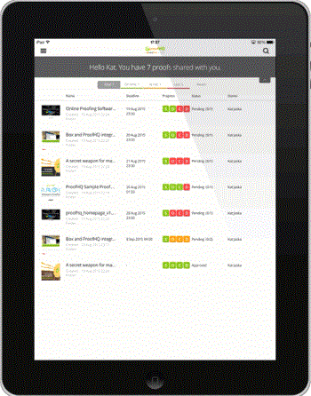
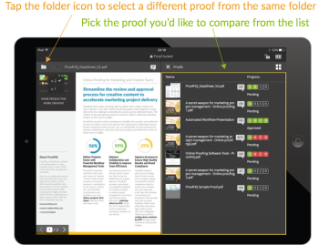
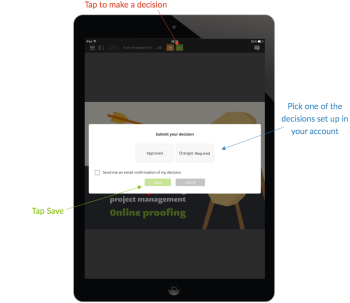

# 태블릿용 모바일 앱 [!DNL Workfront Proof]

>[!IMPORTANT]
>
>이 문서는 독립 실행형 제품 [!DNL Workfront Proof]의 기능을 참조합니다. [!DNL Adobe Workfront] 내부의 증명에 대한 자세한 내용은 [증명](../../../review-and-approve-work/proofing/proofing.md)을 참조하십시오.

[!DNL Workfront Proof] 태블릿 앱을 사용하면 이동 중에 편리하게 증명을 검토하고 승인할 수 있습니다. 앱을 모든 사용자가 다운로드할 수 있습니다. 태블릿이나 휴대폰에서 증명을 검토할 수 있도록 [!DNL Workfront Proof] 사용자가 아니어도 됩니다.

게스트가 받은 전자 메일 알림에서 [!UICONTROL 증명으로 이동] 단추를 클릭하여 앱에서 증명을 열 수 있습니다.

[!DNL Workfront Proof]명의 사용자가 앱에 로그인하고 대시보드를 사용하여 작업을 편리하게 관리할 수 있습니다.

## 장치 요구 사항

* iOS 장치: iPad 3, iPad air, iPad mini
* Android 장치: Android OS 버전 4.4+, 5+, Samsung Galaxy Tab 3+(10.1&quot;)

태블릿용으로 특별히 제작된 앱입니다. iPhone에서 [!DNL Workfront Proof]을(를) 사용하려면 iTunes Store에서 iOS 앱을 다운로드하십시오.

## 앱 다운로드

>[!IMPORTANT]
>
>Workfront Proof 모바일 앱은 더 이상 지원되지 않으며 그대로 사용할 수 있습니다.  앱의 모든 문제는 수정되지 않습니다.

[!DNL Workfront Proof] 태블릿 앱은 Apple App Store 및 Google Play 스토어에서 사용할 수 있습니다.

1. 앱을 다운로드하여 장치에 설치하려면 아래 링크를 클릭하십시오.

   

   

## 로그인

[!DNL Workfront Proof] 태블릿 앱을 사용하면 주의가 필요한 증명이 포함된 대시보드에 액세스할 수 있습니다. 대시보드에 액세스하려면:

1. 다음 중 하나를 수행하십시오.

   * [!DNL Workfront Proof] 자격 증명을 사용하여 로그인합니다.

     증명 초대 이메일을 받고 모바일 장치에서 를 여는 경우 링크가 앱의 증명으로 이동합니다. 증명을 검토할 수 있도록 사용자가 아니어도 됩니다. 그러나 증명을 볼 수 있도록 하려면 디바이스에 앱이 설치되어 있어야 합니다.

   * 계정에서 SSO(Single Sign-On)가 활성화되어 있으면 로그인 화면에서 해당 옵션을 탭합니다.

     이메일 주소를 묻는 로그인 페이지로 이동합니다. 이메일 주소를 입력하면 암호를 사용하여 로그인할 수 있는 ID 공급자의 페이지로 리디렉션됩니다.

     

## 대시보드

[!DNL Workfront Proof] 계정에 계속 로그인하려면 다음 작업을 수행하십시오.

1. **[!UICONTROL 설정]**&#x200B;의 사이드바 메뉴에서 **[!UICONTROL 로그인 유지]**&#x200B;를 사용하도록 설정:

*[!UICONTROL 대시보드]* 링크를 클릭하면 앱의 모든 보기에서 대시보드로 돌아갑니다. 대시보드를 다시 로드하는 데에도 사용할 수 있습니다.

대시보드의 다른 요소는 증명 이름으로 계정을 검색할 수 있는 검색 창이며, 워크로드를 효과적으로 관리하는 데 도움이 되는 다양한 보기가 있습니다.

## 대시보드 보기를 사용하여 워크로드 관리

웹 애플리케이션의 대시보드 차트와 유사하게, 모바일 앱에는 사용자와 공유된 증명 목록이 표시됩니다. 페이지 맨 위에 있는 시작 메시지에는 총 증명 수와 그 아래에 있는 증명 수를 *정시*, *위험 상태* 및 *지연 증명*(으)로 분류합니다.

* **정시 증명**&#x200B;은(는) 기한이 설정되지 않았거나 기한이 24시간 이상 지난 증명입니다.
* **위험 증명**&#x200B;은(는) 기한이 다음 24시간 이내인 증명입니다. 이 증명에 대한 진행률 표시줄은 주황색입니다.
* **지연된 증명**&#x200B;은(는) 이미 기한이 지난 증명입니다. 이 증명에 대한 진행률 표시줄이 빨간색입니다. 기한 [!DNL Workfront Proof]에 도달하면 지연 결정자와 증명 소유자에게 자동 미리 알림 이메일을 보냅니다.

이러한 증명은 별도의 보기로 그룹화되어 이미 기한이 지난 증명부터 작업 우선 순위를 편리하게 지정할 수 있습니다.

최근 보기는 최근에 앱에서 액세스한 증명을 보여주므로 동일한 증명을 다시 보려면 해당 목록에서 쉽게 찾을 수 있습니다.

## 앱에서 증명 검토

1. 증명 이름을 클릭하여 [!DNL Workfront Proof] 뷰어에서 엽니다.

   또는

   전자 메일 알림에서 증명을 열려면 검토자가 알림에서 **[!UICONTROL 증명으로 이동]** 링크를 클릭합니다.
[!DNL Workfront Proof] 계정이 있는 경우 로그인하고 대시보드에서 증명에 액세스할 수 있습니다.

   >[!NOTE]
   >
   >[!DNL Workfront Proof] 계정이 없더라도 [!DNL Workfront Proof]에서 증명을 검토하려면 장치에 앱이 설치되어 있어야 합니다.

   증명을 처음 열면 앱에서 증명 검토를 시작하는 데 도움이 되는 둘러보기가 표시됩니다.

   

1. 증명에서 탐색:

   * 증명의 특정 페이지로 이동하려면 옆으로 스와이프하거나 [!UICONTROL 축소판] 목록을 사용하십시오.

     페이지 하단에 있는 화살표를 사용하거나 특정 페이지 번호를 입력할 수도 있습니다.

   * 다른 버전의 증명으로 이동하려면 페이지 상단에 있는 버전 드롭다운 메뉴를 사용합니다.
   * 확대하려면 화면을 꼬집습니다.
   * 패닝하려면 이미지를 누른 상태에서 올바른 위치를 찾을 때까지 움직입니다.

     모바일 앱에서 증명을 검토하는 것은 [!DNL Workfront Proof] 뷰어를 사용하여 증명을 검토하는 것만큼 간단합니다. 아래에서는 댓글 및 마크업 추가, 피드백 관리 및 의사 결정에 대해 자세히 살펴봅니다. 또한 앱의 사이드바에서 사용할 수 있는 다양한 옵션에 대해 설명합니다.

## 앱의 댓글

아래 비디오에서는 모바일 앱에 댓글을 다는 기본 사항을 보여 줍니다. 댓글을 작성하는 방법, 댓글에 대한 답글을 게시하는 방법, 다양한 마크업을 사용하고 삭제하는 방법, 댓글을 편집하고 삭제하는 방법을 보여줍니다.

회신이 게시되지 않은 경우 댓글만 편집하고 삭제할 수 있습니다. [!UICONTROL 휴지통] 아이콘이 보이지 않는 경우 [!DNL Workfront Proof] 관리자가 이 옵션을 비활성화했을 수 있습니다.

앱에는 세 가지 주석 보기 옵션이 있습니다. 주석 버튼을 클릭하면 둘 사이를 전환할 수 있습니다.

* **[!UICONTROL 목록 보기]**&#x200B;에 모든 댓글 목록이 표시됩니다. 각 주석을 탭하거나 위쪽 및 아래쪽 화살표를 탭하여 탐색할 수 있습니다.
* **[!UICONTROL 한 개의 댓글 보기]**&#x200B;에 한 번에 하나의 댓글이 표시됩니다. 다음 주석으로 이동하려면 페이지 상단의 화살표를 누릅니다.
* **[!UICONTROL 댓글 보기 숨기기]**&#x200B;는 모든 댓글을 숨깁니다.

증명에 남아 있는 모든 마크업이 이미지에 핀을 놓습니다. 핀과 연관된 주석 및 마크업을 보려면 핀을 탭하면 됩니다. 주석 편집 상자를 닫은 경우에만 이 작업을 수행할 수 있습니다. 설명 상자를 닫으려면 왼쪽 상단의 [!UICONTROL x]을(를) 탭합니다.

## 텍스트 주석 도구

이동 중 증명 텍스트가 실제로 [!DNL Workfront Proof] 태블릿 앱에 있습니다. 주황색 **[!UICONTROL 댓글 추가]** 단추를 클릭하면 Markups 도구 모음에서 텍스트 주석 도구를 사용할 수 있습니다.

1. 도구를 선택한 다음 강조 표시할 단어를 탭합니다.
1. 강조 표시를 사용할 수 있을 때까지 해당 단어를 누른 채로 슬라이더를 사용하여 마크업할 전체 단어나 구를 강조 표시합니다.

   텍스트 도구에는 다음 네 가지 옵션 중 하나를 선택할 수 있습니다.

   | **[!UICONTROL 강조]** | 텍스트를 강조 표시하고 주석 상자에 복사합니다. |
   |---|---|
   | **[!UICONTROL 바꾸기]** | 텍스트와 함께 [[!UICONTROL REPLACE]] 및 [[!UICONTROL WITH]]을(를) 댓글 상자에 추가하여 대체 텍스트를 보다 쉽게 추천할 수 있습니다. |
   | **[!UICONTROL 삭제]** | 텍스트를 누르고 [DELETE]을(를) 댓글 상자에 추가합니다. |
   | **[!UICONTROL 다음 항목 뒤에 삽입]** | 주석 상자에 [다음 항목 뒤에 삽입]을 추가합니다. |

   {style="table-layout:auto"}

1. (선택 사항) 타블렛에 저장한 다른 문서의 텍스트를 붙이려면 문서에서 복사한 텍스트를 붙이는 옵션이 표시될 때까지 주석 상자를 길게 탭합니다.

## 모바일 앱의 댓글 관리

모든 사람이 증명에 대한 의견과 마크업을 남긴 후에는 증명 관리자가 피드백을 검토하여 다음 증명 버전에 적용할 변경 사항을 결정해야 하는 경우가 많습니다. [!DNL Workfront Proof]에서 댓글에 작업 을 사용하여 각 개별 댓글에 플래그를 지정하고 작업을 수행할 댓글을 표시할 수 있습니다.

댓글에 대한 작업은 [!DNL Workfront Proof] 관리자가 계정에 설정해야 하며, 편집 권한이 있는 사람이 증명에 대해서만 사용할 수 있습니다.

증명의 다음 버전을 준비하는 동안 이동 중에 주석을 확인할 수 있습니다. 주석이 녹색 확인 표시로 확인됨으로 표시됩니다. 주석을 다시 열어야 하는 경우 주석 상자 하단의 화살표를 클릭할 수 있습니다.

다른 검토자가 주석 스레드에 응답하지 않도록 하려면 주석 스레드를 잠글 수 있습니다. 이렇게 하려면 증명에 대한 편집 권한이 있어야 합니다. 주석 스레드를 잠그는 것은 매우 간단하며 주석 상자 하단에 있는 자물쇠 아이콘을 탭하기만 하면 됩니다.

## 비디오 증명 검토

[!DNL Workfront Proof] 태블릿 앱을 사용하면 이동 중에 비디오를 쉽게 검토할 수 있습니다. 아래 비디오에서는 앱에서 댓글, 마크업 및 의사 결정을 수행하는 방법을 보여 줍니다.

## 비교 모드

태블릿 앱의 비교 모드를 사용하면 두 개의 서로 다른 증명 버전을 동일한 폴더에서 쉽게 비교할 수 있습니다.

>[!NOTE]
>
>iOS의 한계로 인해 iPad에서는 두 개의 비디오를 비교할 수 없습니다. Android 운영 체제가 설치된 태블릿에서 사용할 수 있습니다.

비교 모드는 화면 오른쪽 상단에서 사용할 수 있습니다.

비교 도구에는 두 가지 최신 증명 버전이 표시됩니다.

1. 비교할 버전을 변경하려면 페이지 상단에 있는 버전 드롭다운을 사용합니다.
1. 동일한 폴더에서 다른 증명을 선택하려면 폴더 브라우저(페이지 상단에 있는 폴더 아이콘)를 사용합니다.

   
   
비교 도구를 사용하면 버전을 나란히 비교하여 요청된 변경 사항이 적용되었는지 확인할 수 있습니다. 탐색의 잠금을 해제하면 두 버전의 서로 다른 페이지를 비교할 수 있습니다.

   

   이제 보고 있는 증명의 여러 페이지를 비교할 수 있습니다. 동일한 증명의 여러 페이지를 비교할 수도 있습니다. 이는 메시징과 브랜딩의 일관성을 확인하는 데 유용합니다.

   

## 앱에서 의사 결정

1. 페이지 상단의 녹색 결정 버튼을 탭합니다.

   

   녹색 **[!UICONTROL 검토 완료]** 단추가 보이지 않고 증명에 대한 결정을 내려야 한다고 생각되면 [의 증명 역할 관리 [!DNL Workfront Proof]](../../../workfront-proof/wp-work-proofsfiles/share-proofs-and-files/manage-proof-roles.md)에 설명된 대로 [!DNL Workfront Proof] 관리자가 증명 역할을 업데이트할 수 있습니다.

## 증명 뷰어 사이드바

사이드바에는 많은 유용한 기능과 기능이 포함되어 있습니다. 증명에 대한 권한에 따라 일부 항목은 표시되지 않을 수 있습니다. 그 모든 것들 아래에서 더 자세히 논의됩니다.

| 대시보드 | 모바일 앱 대시보드로 돌아갑니다. |
|---|---|
| **[!UICONTROL 워크플로]** | 검토 단계의 세부 정보를 검토자 목록, 기한, 진행률 표시줄, 결정 및 댓글 및 답글 수와 함께 표시합니다. |
| **[!UICONTROL 세부 정보]** | 증명, 추가 공유 옵션 및 활동 감사 추적에 대한 정보를 표시합니다. |
| **[!UICONTROL 공유]** | 증명 URL 및 포함 코드를 표시합니다. |
| **[!UICONTROL 알림]** | 현재 검토 중인 증명에 대한 이메일 경고를 업데이트할 수 있습니다. 기본 설정은 변경되지 않습니다. |
| **[!UICONTROL 잠금]** | 증명을 잠글 수 있습니다. 이 옵션을 보려면 증명에 대한 편집 권한이 있어야 합니다. |
| **[!UICONTROL 삭제]** | 증명을 휴지통 폴더로 이동합니다. 증명을 삭제하려면 증명 편집 권한이 있어야 합니다. |
| **[!UICONTROL 설정]** | 증명에 고정 항목 및/또는 마크업을 표시하도록 결정할 수 있으며, 앱에서 로그아웃되지 않도록 [!UICONTROL 로그인 유지]를 활성화할 수도 있습니다. |
| **[!UICONTROL 도움말]** | 앱 투어를 다시 불러올 수 있습니다. |
| **[!UICONTROL 로그아웃]** | 앱 및 계정에서 로그아웃합니다. |
