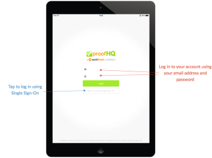

# [!DNL Workfront Proof] 태블릿용 모바일 앱

>[!IMPORTANT]
>
>이 문서는 독립형 제품의 기능을 참조합니다 [!DNL Workfront Proof]. 내부 교정에 대한 자세한 정보 [!DNL Adobe Workfront]를 참조하십시오. [교정](../../../review-and-approve-work/proofing/proofing.md).

다음 [!DNL Workfront Proof] 태블릿 앱을 사용하면 이동 중에도 간편하게 증명을 검토하고 승인할 수 있습니다. 모든 사용자가 이 앱을 다운로드할 수 있으며 [!DNL Workfront Proof] 사용자가 태블릿 또는 휴대폰에서 증명을 검토할 수 있습니다.

고객은 [!UICONTROL 증명으로 이동] 앱에서 증명을 열기 위해 수신한 이메일 알림의 버튼.

[!DNL Workfront Proof] 사용자는 앱에 로그인하고 대시보드를 사용하여 작업을 편리하게 관리할 수 있습니다.

## 장치 요구 사항

* iOS 장치: iPad 3, iPad air, iPad mini
* Android 장치: Android OS 버전 4.4+, 5+; 삼성 갤럭시 탭 3+(10.1형)

태블릿용으로 특별히 제작된 앱입니다. 원하는 경우 [!DNL Workfront Proof] iPhone에서 iTunes 스토어에서 iOS 앱을 다운로드합니다.

## 앱 다운로드

>[!IMPORTANT]
>
>Workfront Proof 모바일 앱은 더 이상 지원되지 않으며 있는 그대로 사용할 수 있습니다.  앱의 모든 문제는 수정되지 않습니다.

다음 [!DNL Workfront Proof] 태블릿 앱은 Apple App Store 및 Google Play 스토어에서 사용할 수 있습니다.

1. 아래 링크를 클릭하여 앱을 다운로드하여 장치에 설치합니다.

   

   

## 로그인

다음 [!DNL Workfront Proof] 태블릿 앱을 사용하면 주의가 필요한 증명을 사용하여 대시보드에 액세스할 수 있습니다. 대시보드에 액세스하려면

1. 다음 중 하나를 수행하십시오.

   * 을(를) 사용하여 로그인합니다. [!DNL Workfront Proof] 자격 증명.

      증명 초대 이메일을 받고 모바일 장치에서 을 여는 경우, 링크가 앱의 증명으로 이동합니다. 사용자가 아니더라도 증명을 검토할 수 있습니다. 그러나 앱을 볼 수 있으려면 장치에 앱이 설치되어 있어야 합니다.

   * 계정에서 단일 사인온이 활성화된 경우 로그인 화면에서 해당 옵션을 탭합니다.

      이메일 주소를 묻는 로그인 페이지가 표시됩니다. 이메일 주소를 입력한 후 암호를 사용하여 로그인할 수 있는 ID 공급자 페이지로 리디렉션됩니다.

      

## 대시보드

로그인되어 있으려면 [!DNL Workfront Proof] 계정:

1. 활성화 **[!UICONTROL 계속 로그인]** 아래의 사이드바 메뉴에서 **[!UICONTROL 설정]**:

다음 *[!UICONTROL 대시보드]* 링크를 클릭하면 앱의 모든 보기에서 대시보드로 돌아갑니다. 대시보드를 다시 로드하는 데 사용할 수도 있습니다.

대시보드의 다른 요소는 작업 로드를 효과적으로 관리하는 데 도움이 되는 증명 이름 및 다양한 보기를 통해 계정을 검색할 수 있도록 해주는 검색 표시줄입니다.

## 대시보드 보기를 사용하여 작업 로드 관리

웹 애플리케이션의 대시보드 차트와 유사하게, 모바일 앱에서는 사용자와 공유된 증명 목록을 표시합니다. 페이지 상단에 있는 시작 메시지에 총 증명 수와 아래에 표시되는 증명 수가 제공됩니다 *시간*, *위험*, 및 *늦은 증명*.

* **시간 증명** 마감일이 설정되어 있지 않거나 마감일이 24시간 이상 초과되는 증명입니다.
* **위험 증명** 마감일이 다음 24시간 이내인 지점입니다. 진행률 표시줄은 이러한 증명에 주황색입니다.
* **늦은 증명** 증명은 이미 마감일이 지난 증표입니다. 진행률 표시줄은 빨간색으로 표시됩니다. 마감일이 되면 [!DNL Workfront Proof] 최신 의사 결정권자와 증명 소유자에게 자동 리마인더 이메일을 보냅니다.

이러한 증명을 별도의 보기로 그룹화하여 마감일이 이미 지난 증명을 시작할 때 작업의 우선 순위를 편리하게 지정할 수 있습니다.

유용한 다른 보기는 최근 보기입니다. 최근 보기는 앱에서 최근에 액세스한 증명을 보여주므로 동일한 증명을 다시 보려면 해당 목록에서 해당 증명을 쉽게 찾을 수 있습니다.

## 앱에서 증명 검토

1. 증명 이름을 클릭하여 [!DNL Workfront Proof] 뷰어.

   또는

   전자 메일 알림에서 증명을 열려면 검토자가 **[!UICONTROL 증명으로 이동]** 링크를 클릭합니다.
만약 [!DNL Workfront Proof] 계정, 대시보드에서 로그인하고 증명에 액세스할 수 있습니다.

   >[!NOTE]
   >
   >에서 증명을 검토할 수 있으려면 장치에 앱이 설치되어 있어야 합니다 [!DNL Workfront Proof]가 없는 경우에도 [!DNL Workfront Proof] 계정이 필요합니다.

   증명을 처음 열면 앱에서 증명 검토를 시작할 수 있도록 둘러보기를 표시합니다.

   

1. 증명에서 탐색:

   * 증명의 특정 페이지로 이동하려면 옆으로 밀거나 [!UICONTROL 축소판] 목록.

      페이지 하단에 있는 화살표를 사용하거나 특정 페이지 번호를 입력할 수도 있습니다.

   * 다른 버전의 증명으로 이동하려면 페이지 상단에 있는 버전 드롭다운 메뉴를 사용합니다.
   * 확대하려면 화면을 꽉 조입니다.
   * 패닝하려면 올바른 위치를 찾을 때까지 이미지를 길게 누르고 이동합니다.

      모바일 앱에서 증명을 검토하는 것은 를 사용하여 증명을 검토하는 것만큼 간단합니다. [!DNL Workfront Proof] 뷰어. 아래에서는 댓글 및 마크업 추가, 피드백 관리 및 의사 결정에 대해 자세히 살펴봅니다. 또한 앱의 사이드바에서 사용할 수 있는 다양한 옵션에 대해서도 설명합니다.

## 앱의 댓글

아래 비디오에서는 모바일 앱에서 주석을 다는 기본 사항을 보여줍니다. 이 비디오에서는 댓글을 다는 방법, 댓글에 답글을 게시하는 방법, 다른 마크업을 사용하고 삭제하는 방법, 댓글을 편집하고 삭제하는 방법을 보여 줍니다.

응답이 게시되지 않은 경우에만 주석을 편집하고 삭제할 수 있습니다. 이 표시되지 않으면 [!UICONTROL 쓰레기] 아이콘, 이 옵션은 [!DNL Workfront Proof] 관리자

앱에는 세 가지 주석 보기 옵션이 있습니다. 주석 버튼을 클릭하여 두 항목 간을 전환할 수 있습니다.

* **[!UICONTROL 목록 보기]** 모든 댓글 목록을 표시합니다. 각 주석을 탭하거나 위쪽 및 아래쪽 화살표를 탭하여 찾아봅니다.
* **[!UICONTROL 단일 댓글 보기]** 한 번에 한 개의 주석을 표시합니다. 다음 주석으로 이동하려면 페이지 상단에 있는 화살표를 누릅니다.
* **[!UICONTROL 댓글 보기 숨기기]** 모든 주석을 숨깁니다.

증표에 남아 있는 모든 마크업이 이미지의 핀을 떨어뜨립니다. 핀과 연결된 주석 및 마크업을 보려면 핀을 탭하면 됩니다. 이 작업은 댓글 편집 상자가 닫혀 있는 경우에만 수행할 수 있습니다. 댓글 상자를 닫으려면 [!UICONTROL x] 상자의 왼쪽 맨 위에 있는 설명.

## 텍스트 주석 도구

이동 중에 텍스트를 교정할 수 있습니다 [!DNL Workfront Proof] 태블릿 앱. 주황색을 클릭한 후 마크업 도구 모음에서 텍스트 주석 도구를 사용할 수 있습니다 **[!UICONTROL 댓글 추가]** 버튼을 클릭합니다.

1. 도구를 선택한 다음 강조 표시할 단어를 탭합니다.
1. 강조 표시가 표시될 때까지 손가락으로 단어를 누르고 슬라이더를 사용하여 마크업할 단어 또는 구 전체를 강조 표시합니다.

   텍스트 도구에는 다음 네 가지 선택 사항이 있습니다.

   | **[!UICONTROL 강조 표시]** | 텍스트를 강조 표시하고 주석 상자에 복사합니다. |
   |---|---|
   | **[!UICONTROL 바꾸기]** | 추가 [[!UICONTROL REPLACE]] 및 [[!UICONTROL WITH]] 를 텍스트와 함께 주석 상자에 추가하여 대체 텍스트를 보다 쉽게 추천할 수 있습니다. |
   | **[!UICONTROL 삭제]** | 텍스트를 열고 를 추가합니다 [DELETE] 추가 정보 |
   | **[!UICONTROL 다음 항목 뒤에 삽입]** | 추가 [다음 항목 뒤에 삽입] 를 클릭합니다. |

   {style=&quot;table-layout:auto&quot;}

1. (선택 사항) 태블릿에 저장한 다른 문서의 텍스트를 붙여 넣으려면 문서에서 복사한 텍스트를 붙여넣는 옵션이 표시될 때까지 주석 상자에서 손가락을 누른 채 탭합니다.

## 모바일 앱에서 주석 관리

모든 사람이 증명에 댓글 및 마크업을 남겼을 때 증명 관리자는 피드백을 통해 다음 버전의 증명에 적용할 변경 사항을 결정해야 합니다. in [!DNL Workfront Proof] 주석에 작업 을 사용하여 각 개별 주석에 플래그를 지정하고 수행할 주석을 표시할 수 있습니다.

댓글에 대한 작업은 [!DNL Workfront Proof] 관리자 및 는 편집 권한이 있는 사람이 증명에서만 사용할 수 있습니다.

증명의 다음 버전을 준비하는 동안 진행 중인 주석을 확인할 수 있습니다. 이 댓글은 녹색 확인 표시로 해결된 것으로 표시됩니다. 주석을 다시 열어야 하는 경우 주석 상자 하단에 있는 화살표를 클릭할 수 있습니다.

다른 검토자가 주석 스레드에 응답하지 않도록 하려면 이를 잠글 수 있습니다. 이를 수행하려면 증표에 대한 편집 권한이 있어야 합니다. 주석 스레드를 잠그는 것은 매우 간단하며 주석 상자 하단에 있는 자물쇠 아이콘을 탭하면 됩니다.

## 비디오 증명 검토

이동 중에 비디오를 검토하는 것은 [!DNL Workfront Proof] 태블릿 앱. 아래 비디오에서는 앱에서 주석, 마크업 및 결정을 내리는 방법을 보여줍니다.

## 비교 모드

태블릿 앱의 비교 모드를 사용하면 동일한 폴더에서 두 개의 서로 다른 버전의 증명 또는 두 개의 증명을 쉽게 비교할 수 있습니다.

>[!NOTE]
>
>iOS의 제한 사항으로 인해 iPad에서는 두 비디오를 비교할 수 없습니다. Android 운영 체제가 포함된 태블릿에서 사용할 수 있습니다.

비교 모드는 화면의 오른쪽 상단 모서리에서 사용할 수 있습니다.

비교 도구는 증명의 최신 버전을 두 개 표시합니다.

1. 비교할 버전을 변경하려면 페이지 상단에 있는 버전 드롭다운을 사용합니다.
1. 동일한 폴더에서 다른 증명을 선택하려면 폴더 브라우저(페이지 상단에 있는 폴더 아이콘)를 사용합니다.

   
   
비교 도구를 사용하면 요청된 변경 사항이 있는지 확인하기 위해 버전을 나란히 비교할 수 있습니다. 탐색의 잠금을 해제하면 두 버전의 서로 다른 페이지를 비교할 수 있습니다.

   

   이제 보고 있는 증의 다른 페이지를 비교할 수 있습니다. 동일한 증명의 다른 페이지를 비교할 수도 있습니다. 이는 메시징 및 브랜딩 일관성을 위해 증명을 확인하는 경우에 유용할 수 있습니다.

   

## 앱에서 결정

1. 페이지 상단에 있는 녹색 결정 단추를 누릅니다.

   

   녹색이 보이지 않으면 **[!UICONTROL 검토 완료]** 버튼을 누르면 당신이 증거를 결정해야만 한다고 생각하겠지만 [!DNL Workfront Proof] 관리자는 [의 증명 역할 관리 [!DNL Workfront Proof]](../../../workfront-proof/wp-work-proofsfiles/share-proofs-and-files/manage-proof-roles.md).

## 교정 뷰어 사이드바

사이드바는 많은 유용한 기능과 기능을 포함합니다. 증명에 대한 사용 권한에 따라, 일부 사용자가 표시되지 않을 수 있습니다. 아래에 자세히 설명되어 있습니다.

| 대시보드 | 모바일 앱 대시보드로 돌아갑니다. |
|---|---|
| **[!UICONTROL 워크플로]** | 검토자 목록, 검토자 기한, 진행률 표시줄, 결정 및 댓글 및 회신 수와 함께 검토 단계의 세부 사항을 표시합니다. |
| **[!UICONTROL 세부 정보]** | 증명, 추가 공유 옵션 및 활동 감사 추적에 대한 정보를 표시합니다. |
| **[!UICONTROL 공유]** | 증명 URL 및 포함 코드를 표시합니다. |
| **[!UICONTROL 알림]** | 현재 검토 중인 증표에 대한 이메일 경고를 업데이트하도록 해줍니다. 이렇게 해도 기본 설정이 변경되지는 않습니다. |
| **[!UICONTROL 잠금]** | 증명을 잠글 수 있습니다. 이 옵션을 보려면 증표에 대한 편집 권한이 있어야 합니다. |
| **[!UICONTROL 삭제]** | 증명을 휴지통 폴더로 이동합니다. 삭제할 수 있으려면 증표에 대한 편집 권한이 있어야 합니다. |
| **[!UICONTROL 설정]** | 증명에 핀 및/또는 마크업을 표시하도록 결정하고, 다음을 활성화할 수도 있습니다 [!UICONTROL 계속 로그인] 앱에서 로그아웃되지 않도록 하려면 다음을 수행하십시오. |
| **[!UICONTROL 도움말]** | 앱 투어를 다시 시작하겠습니다. |
| **[!UICONTROL 로그아웃]** | 앱과 계정에서 로그아웃합니다. |
