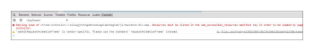

# 문제 해결 - [!DNL Workfront Proof] 교정 뷰어

>[!IMPORTANT]
>
>이 문서는 독립형 제품의 기능을 참조합니다 [!DNL Workfront Proof]. 내부 교정에 대한 자세한 정보 [!DNL Adobe Workfront]를 참조하십시오. [교정](../../../review-and-approve-work/proofing/proofing.md).

증명 콘텐츠가 로드되지 않고 빈 교정 뷰어만 표시되는 경우 로컬로 이 작업을 차단하므로 문제가 발생할 수 있습니다. 아래의 가능한 솔루션을 사용해 보십시오.

## 브라우저 및 [!DNL Flash Player] 버전이 최신 버전입니다.

모든 개발자는 애플리케이션을 지속적으로 작업하고 제품에 대한 새로운 기능과 수정 사항을 정기적으로 출시합니다. 최신 버전만 사용하는 것이 가장 좋습니다. 따라서 애플리케이션 간의 충돌을 방지할 수 있습니다.

### [!DNL Flash Player] 플러그인 버전

현재 상태를 확인하려면 [!DNL Flash Player] 버전 방문 [[!DNL Adobe] 웹 사이트](http://www.adobe.com/software/flash/about/).

플랫폼에 대해 나열된 버전 번호와 다른 경우 [[!DNL Flash Player] 다운로드 페이지](http://get.adobe.com/flashplayer/otherversions/) 최신 버전을 다운로드하십시오.

참고: 원본을 사용하는 것이 좋습니다 [!DNL Adobe] 플러그인이므로 브라우저가 기본 제공 솔루션을 사용하는 경우 이 플러그인을 비활성화하고 [!DNL Adobe] 솔루션.

### 브라우저 버전

요즘 대부분의 브라우저는 자동으로 업데이트되지만 문제가 발생하는 경우 사용 중인 버전을 확인하고 필요한 경우 업데이트를 수행하는 것이 좋습니다.

브라우저에서 [!UICONTROL 메뉴] 그리고 [!UICONTROL 정보] 선택 사항(경우에 따라 다음과 같이 표시될 수 있음) [!UICONTROL 도움말] 메뉴 아래의 제품에서 사용할 수 있습니다. 에서 [!UICONTROL 정보] 팝업에서는 현재 브라우저 버전에 대한 정보와 업데이트를 업데이트/확인하는 선택 사항을 찾을 수 있습니다.

Chrome에서 다음을 참조하십시오.

최신 정보를 제공하면 [!DNL Flash Player] 설치된 플러그인 및 브라우저 버전에서 증명을 다시 열고 문제가 해결되었는지 확인합니다.

## 로컬 확인 [!DNL Flash] 스토리지 사용 가능

Adobe [!DNL Workfront Proof] 뷰어는 Flash을 기반으로 하며 증명(예: 댓글, 증명 타일)에 대한 일부 데이터를 저장합니다. [!DNL Workfront Proof] 뷰어 설정) [!DNL Flash Player]. 만약 [!DNL Workfront Proof] 뷰어가 열리지만, 내부에 Flash 저장소를 컴퓨터에서 사용할 수 있는지 확인할 컨텐츠가 없습니다 [!DNL Workfront Proof] 사용할 수 있습니다.

저장소가 일부 할당되었지만 여러 페이지로 더 큰 증명을 사용하여 작업하는 경우 주석을 이용하여 [!DNL Flash] 증명을 저장하고 다시 로드합니다.

다음을 확인하십시오 [증명 보기 문제 - [!DNL Flash] 공유 개체 설명](../../../workfront-proof/wp-tech-corner/troubleshooting/view-proof-flash-shared-object.md) 자세한 지침을 참조하십시오.

## 문제의 위치 확인

* 증명이 다른 브라우저에서 열리고 있습니까?
* 매일 한 브라우저를 사용하고 있는데 증명을 보는 데 문제가 있는 경우 컴퓨터에서 다른 브라우저에서 동일한 증명을 열려고 합니다. 이렇게 하려면 기본 브라우저의 URL 표시줄에서 증명 링크를 복사하여 다른 브라우저에 붙여넣으면 됩니다. 기본 브라우저 구성, 플러그인 및 확장을 검토할 수 있으며 그 과정에서 장애가 발생할 수도 있습니다.
* 선호하는 브라우저는 없지만 현재 브라우저에서 성능 문제가 있는 경우 다른 브라우저로 전환하는 것이 좋습니다.
* 해당 위치에서 증명이 다른 컴퓨터에서 열리고 있습니까?
사용자 컴퓨터의 브라우저에서 증명을 열지 않은 경우 위치 및/또는 위치 외부의 다른 컴퓨터에서 증명을 열어 보십시오. 이렇게 하면 특정 컴퓨터에 문제가 있는지 또는 로컬 네트워크에 문제가 있는지 확인할 수 있습니다.
보안 수준이 높은 경우 [!DNL Workfront Proof] 다음을 통해 차단될 수 있습니다.

   * 로컬 AV 소프트웨어
   * 네트워크 보안 솔루션
   * DNS, 방화벽 또는 프록시 구성
   * 이러한 설정은 Adobe의 제어 범위를 벗어납니다. 사용할 수 있는 다양한 보안 솔루션이 있으며, 네트워크에 구현된 솔루션과 연결을 차단하는 대상을 알 수 없습니다 [!DNL Workfront Proof]. 또한 이 작업은 수행할 수 없습니다 [!DNL Workfront Proof] 내부 보안 구성을 결정합니다. 위치/네트워크의 여러 컴퓨터에서 증명을 여는 데 문제가 있는 경우 네트워크 설정을 확인하고 권한을 부여하거나 추가할 수 있도록 IT 팀에 문의하는 것이 좋습니다 [!DNL Workfront Proof] 필요한 허용 목록에 추가하다 경우에 추가합니다.

* 연결 대상 [!DNL Workfront Proof] 네트워크에 허용됩니까?
증명 뷰어 내에서 타일 - 페이지의 조각을 로드합니다. 이 컨텐츠가 끝에 제대로 로드되지 않으면 일부 연결일 수 있습니다 [!DNL Workfront Proof] 네트워크에서 차단되었습니다. *.proohq.com의 모든 연결 및 모든 컨텐츠가에 추가되어 있는지 허용 목록에 추가하다 확인합니다. IT 팀이 확인을 위해 도움을 줄 수 있어야 합니다.

## 플러그인 검토

브라우저와 [!DNL Flash Player] 플러그인이 최신 상태이고 네트워크가 연결을 차단하지 않습니다 [!DNL Workfront Proof] 브라우저에 증명 보기에 영향을 주는 내용이 있을 수 있습니다. 현재 브라우저에서 사용할 수 있는 여러 개의 플러그인 및 확장이 있으며, 일부 플러그인은 다른 플러그인과 충돌하거나 다른 플러그인과 충돌합니다.

가장 좋은 방법은 알 수 없는 모든 추가 기능을 제거하고 사용자가 사용하고 신뢰할 수 있는 추가 기능만 유지하는 것입니다. 각 브라우저에는 플러그인 및 확장을 확인/수정/삭제하는 옵션이 제공됩니다. Adobe [!DNL Workfront Proof] 뷰어는 [!DNL Flash] 또한 JavaScript를 사용하여 뷰어를 로드하므로 이러한 플러그인에 영향을 줄 수 있는 플러그인을 특히 검토하려는 경우

브라우저 추가 기능을 비활성화하는 방법에 대한 개발자의 자세한 지침은 아래 나열된 페이지를 참조하십시오.

* Chrome: [plugins](https://support.google.com/chrome/answer/142064?hl=en-GB) / [확장](https://support.google.com/chrome/answer/113907?hl=en-GB)
* Firefox: [추가 기능](https://support.mozilla.org/en-US/kb/disable-or-remove-add-ons)
* Internet Explorer: [추가 기능](http://windows.microsoft.com/en-GB/internet-explorer/manage-add-ons#ie=ie-11)
* Safari: [추가 기능](http://support.apple.com/en-gb/HT203353)

증명 로드를 방해하는 특정 추가 기능이 있는 경우 브라우저의 콘솔에서 세부 사항을 확인해보십시오.

대부분의 최신 브라우저에는 몇 가지 추가 개발자 도구를 사용할 수 있으며 이러한 도구를 사용하여 더 고급 문제 해결에 사용할 수 있습니다.

증명을 보는 데 문제가 있는 경우:

* 브라우저의 콘솔을 열고 증명을 다시 로드합니다.
* 콘솔에 경고나 메시지가 있는지 확인합니다. 이러한 세부 사항은 문제의 근본 원인을 식별하는 데 도움이 될 수 있습니다.
* IT 팀이 결과를 분석하도록 합니다. 그들은 지역 문제를 해결하는 것을 조언하고 도울 수 있어야 한다.
* 결과를 Adobe와 공유 [지원 팀](https://support.workfront.com/hc/en-us/requests/new). 기꺼이 도와 드리겠습니다.

브라우저에서 콘솔을 여는 방법을 모를 경우, 기록된 단계를 참조하십시오.

* [Firefox](http://screencast.com/t/eP6FRtk4vxWS)
* [Internet Explorer](http://screencast.com/t/bYzq1iQv)
* [Google Chrome](http://screencast.com/t/2anpeAzOOyj)
* [Safari](http://screencast.com/t/rnOvgl3GidjL)

또한 브라우저 개발자의 설명서에서 자세한 지침을 확인할 수 있습니다.

## 혼합 콘텐츠 설정 확인

모든 연결 [!DNL Workfront Proof] HTTPS를 통해 전송됩니다. 그러나, 에서는 [!DNL Workfront Proof] 뷰어에서는 HTTP를 통해 타일을 로드하며 데이터는 토큰으로 안전합니다. 이렇게 하면 일부 브라우저 또는 보안 솔루션에서 차단될 수 있는 혼합 콘텐츠가 만들어집니다(기본적으로 또는 수동 구성에 따라).

이러한 이유로 컴퓨터에서 증명이 열리지 않는 경우(브라우저의 콘솔에서 관련 경고를 볼 수 있어야 함) 에 대해 이러한 연결을 승인합니다 [!DNL Workfront Proof] 또는 사용자 시스템에서 수동 혼합 콘텐츠를 허용하도록 설정을 수정합니다. 혼합된 컨텐츠는 브라우저, AV 소프트웨어, 네트워크 구성 등에 의해 차단될 수 있으므로 정확한 원인을 파악하려면 IT 팀/네트워크 관리자에게 문의하십시오. 또한 시스템에서 혼합 컨텐츠 사용을 지원할 수 있습니다.

연락처 [지원 팀](https://support.workfront.com/hc/en-us/requests/new) 저희 쪽에서 도움이 필요하시면
