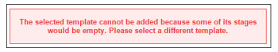

# [!DNL Workfront Proof]에서 자동화된 워크플로를 사용하여 증명 설정

>[!IMPORTANT]
>
>이 문서는 독립 실행형 제품 [!DNL Workfront Proof]의 기능을 참조합니다. [!DNL Adobe Workfront] 내부의 증명에 대한 자세한 내용은 [증명](../../../review-and-approve-work/proofing/proofing.md)을 참조하십시오.

자동화된 워크플로를 사용하면 복잡한 검토 프로세스가 있거나 검토용 콘텐츠를 정기적으로 동일한 사용자 그룹에 보내는 경우 콘텐츠 검토 및 승인을 보다 쉽게 관리할 수 있습니다.

증명을 만든 다음 최종 승인까지 단계에서 단계로 이동합니다. 관련 사용자는 승인을 해야 할 때마다 알림을 받습니다.

문서를 업로드할 때 또는 문서가 업로드된 후 증명에 자동화된 워크플로를 추가할 수 있습니다.

## 자동화된 워크플로를 사용하여 증명 만들기

1. 증명 만들기를 시작합니다.
1. **[!UICONTROL 공유]** 섹션에서 **[!UICONTROL 자동화된 워크플로 사용]**&#x200B;을 클릭합니다.

   이 옵션을 선택 해제하여 표준 워크플로우로 다시 전환할 수 있습니다.

1. (선택 사항) [!DNL Workfront] 관리자가 구성하고 사용자와 공유한 자동 워크플로 템플릿을 사용하려면 **[!UICONTROL 워크플로 템플릿 선택]** 드롭다운 메뉴에서 선택합니다.

   >[!NOTE]
   >
   >템플릿 수정 기능은 [!DNL Workfront] 관리자가 구성한 템플릿 설정에 따라 다릅니다. 템플릿 수정 기능이 비활성화된 경우 템플릿 소유자만 수정할 수 있습니다.

1. 다음 정보를 지정하여 자동화된 워크플로우의 첫 번째 단계를 구성합니다.

   * **[!UICONTROL 이름]:** 단계 이름이 워크플로 다이어그램에 나타나며 검토자에게 보내는 전자 메일 알림에 포함됩니다.
   * **[!UICONTROL 기한]:** 이 필드의 기능은 **[!UICONTROL 기한이]**&#x200B;부터 계산됨 드롭다운 목록에서 선택한 옵션에 따라 다릅니다.

   * **[!UICONTROL 증명 만들기에서]:** 증명 기한 날짜를 선택합니다.
   * **[!UICONTROL 단계 활성화부터]:** 단계 활성화 날짜에 추가할 영업일 수를 선택하여 증명에 대한 기한을 자동으로 설정합니다.
   * **[!UICONTROL 단계 활성화]:** 워크플로의 각 단계에 대해 활성화 시기를 결정할 수 있습니다. 첫 번째 단계에서 다음 옵션을 사용할 수 있습니다.

      * 증명 생성 시
      * 특정 시간 및 날짜에
      * 수동\

        추가 옵션은 후속 단계에 사용할 수 있습니다. 이러한 옵션을 사용하려면 상위 단계가 필요합니다. 이는 다음과 같습니다.
      * 이전 기한 도달 후
      * 모든 결정은 승인됨 또는 변경과 함께 승인됨
      * 모든 결정 승인됨
      * 모든 결정은 내려집니다.
   * **[!UICONTROL 기한 계산 시기]:** 이 드롭다운 목록에서 선택한 옵션은 **[!UICONTROL 기한]** 필드에서 사용할 수 있는 옵션에 영향을 줍니다.

   * **[!UICONTROL 증명 만들기]:** **[!UICONTROL 기한]** 필드에서 증명 기한 날짜를 선택합니다.

   * **[!UICONTROL 단계 활성화]:** **[!UICONTROL 기한]** 필드에서 증명의 기한을 자동으로 설정하려면 단계 활성화 날짜에 추가할 영업일 수를 선택합니다.

   * **[!UICONTROL 단계 잠금]:** 단계를 잠글 수 있는 시기를 선택합니다.
   * **[!UICONTROL 기본 의사 결정자]:** 스테이지에서 기본 의사 결정자를 선택합니다. 의사 결정자는 단계에 검토자를 추가한 후에만 드롭다운 목록에서 사용할 수 있습니다.
   * **[!UICONTROL 필요한 결정은 하나뿐입니다]:** 의사 결정자 중 한 명이 결정한 후 검토를 완료하려면 이 옵션을 선택하십시오.\

     **[!UICONTROL 기본 의사 결정자]** 드롭다운 메뉴에서 사용자를 지정한 경우에는 이 옵션을 사용할 수 없습니다.

   * **[!UICONTROL 비공개 단계]:** 이 옵션을 선택하면 이 단계에 추가되지 않았거나 계정의 감독자, 관리자 또는 청구 관리자가 아닌 사용자에게는 댓글 및 결정이 표시되지 않습니다

1. (선택 사항) 단계에 검토자를 추가합니다.
1. 검토자를 추가할 때는 다음 사항을 고려하십시오.

   * 검토자는 증명에 한 번만 추가할 수 있습니다. (증명의 두 단계 이상에 동일한 사용자를 추가할 수 없습니다.)
   * 비공개 단계에 추가된 검토자는 해당 단계에 작성된 증명 및 주석에 추가된 단계만 볼 수 있습니다.
   * 기본적으로 단계에 사용자를 추가하면 해당 사용자는 증명을 만든 시점부터 증명을 볼 수 있는 액세스 권한이 부여됩니다.\

     시스템 관리자는 워크플로가 사용자가 추가된 단계에 들어갈 때까지 사용자가 증명에 액세스하지 못하도록 증명 시스템을 구성할 수 있습니다. 자세한 내용은

1. (선택 사항) **[!UICONTROL 새 단계]**&#x200B;를 클릭한 다음 4단계와 5단계를 반복하여 자동화된 워크플로에 여러 단계를 추가합니다.
1. 다음에 설명된 대로 [!UICONTROL 새 증명] 페이지의 [!UICONTROL 구성] 및 [!UICONTROL 추가 설정] 섹션에서 필요한 정보를 지정하여 증명을 계속 만듭니다.

## 자동화된 워크플로우 다이어그램

증명에 대한 워크플로를 설정하는 동안 다이어그램이 만들어지는 것을 볼 수 있습니다. 증명에 추가하는 모든 단계가 다이어그램에 표시되어 단계 간 종속성을 명확하게 나타냅니다. 비공개 단계는 키 아이콘으로 표시됩니다.

다이어그램이 표시됩니다. 즉, 페이지를 아래로 스크롤해도 다이어그램이 계속 표시됩니다.

다이어그램을 볼 필요가 없으면 (1)을 숨길 수 있습니다.

## 단계 추가

만들거나 수정하는 워크플로우에 단계를 추가할 수 있습니다.

1. 기존 증명에 단계를 추가하는 경우 [의 증명 세부 정보 관리 [!DNL Workfront Proof]](../../../workfront-proof/wp-work-proofsfiles/manage-your-work/manage-proof-details.md)에 설명된 대로 증명 세부 정보 페이지로 이동하십시오.
1. **[!UICONTROL 워크플로]** 섹션에서 **[!UICONTROL 새 단계]**&#x200B;를 클릭합니다.

1. 이 문서의 [!UICONTROL 자동화된 워크플로를 사용하여 증명 만들기] 섹션에서 4단계와 같이 단계에 대한 정보를 지정하십시오.
1. **[!UICONTROL 단계 추가]**&#x200B;를 클릭한 다음 **[!UICONTROL 완료]**&#x200B;를 클릭합니다.

## 단계 삭제

1. 단계 (1)의 오른쪽 위 모서리에 있는 휴지통 아이콘을 클릭합니다.\
   이 아이콘은 스테이지를 마우스로 가리키면 표시됩니다.\
   

## 스테이지 설정

* **[!UICONTROL 단계 이름]**: 워크플로 다이어그램에 표시되며 검토자에게 전송된 전자 메일 알림에 포함됩니다.
* **[!UICONTROL 단계 활성화]**: 워크플로우의 각 단계에 대해 활성화 시기를 결정할 수 있습니다. 첫 번째 단계에서는 다음 옵션을 사용할 수 있습니다.

   * 증명 생성 시
   * 특정 시간 및 날짜에
   * 수동
   * 첫 번째 단계에서는 이 세 가지 옵션만 사용할 수 있습니다. 다른 옵션은 두 번째 단계를 추가할 때 사용할 수 있습니다. 이러한 옵션을 사용하려면 상위 단계를 선택해야 합니다.
   * 이전 최종 기한에 도달한 후(상위 단계 선택 필요)
   * 모든 결정이 승인됨 또는 [!UICONTROL 변경 사항과 함께 승인됨] (상위 단계 선택 필요)
   * 모든 결정이 승인됩니다(상위 단계 선택 필요).
   * 모든 의사 결정이 이루어집니다(상위 단계를 선택해야 함).

* **[!UICONTROL 기한]:** 워크플로우의 각 단계에서 기한을 계산하는 방법을 결정할 수 있습니다. 옵션은 다음과 같습니다.

   * 증명 만들기에서: [!UICONTROL 기한] 필드(9)에서 증명의 기한 날짜를 선택할 수 있습니다.
   * 단계 활성화에서: [!UICONTROL deadline] 드롭다운에서 단계 활성화 날짜에 추가될 업무일 수를 선택하여 증명에 대한 기한을 자동으로 설정합니다.

* **[!UICONTROL 잠금]:** 단계를 잠글 수 있는 시기를 결정하는 여러 가지 옵션이 있습니다. 옵션은 다음과 같습니다.

   * 수동 잠금
   * 안 함
   * 다음 단계가 시작될 때
   * 모든 결정이 이루어지는 시기

**[!UICONTROL 기본 의사 결정자]**: 스테이지에서 기본 의사 결정자를 설정했습니다. 단계에 검토자를 추가한 후에만 사용 가능한 의사 결정자가 목록에 나타납니다.

>[!NOTE]
>
>기본 의사 결정자를 선택하는 경우 이 단계에서 더 이상 하나의 의사 결정 필수 옵션만 사용할 수 없습니다.

* **[!UICONTROL 필요한 결정은 하나뿐입니다]**: 스테이지에서 이 옵션을 활성화할 수 있습니다. 의사 결정자 중 한 명이 결정을 내리면 심사가 완료된다는 의미다.
* **[!UICONTROL 개인 정보]:** 각 단계는 비공개로 설정할 수 있습니다. 단계가 비공개인 경우 이 단계에 추가되지 않았거나 계정의 감독자, 관리자 또는 청구 관리자가 아닌 사용자에게는 주석 및 결정이 표시되지 않습니다. 자세한 내용은 [자동화된 워크플로 개요](../../../review-and-approve-work/proofing/proofing-overview/automated-workflow.md) 를 참조하십시오.

## 단계에 검토자 추가

1. 각 단계 하단의 필드에 연락처 이름 또는 이메일 주소를 입력합니다.
1. 녹색 더하기 아이콘을 클릭하여 추가합니다.
1. 증명에서 역할을 설정합니다.
1. 이메일 경고를 설정합니다.
1. 첫 번째 단계를 설정할 때 증명 소유자를 변경할 수도 있습니다.

   >[!NOTE]
   >
   >* 검토자는 증명에 한 번만 추가할 수 있습니다. 동일한 사람을 증명의 두 단계 이상에 추가할 수 없습니다.
   >* 비공개 단계에 추가되지 않은 검토자는 해당 단계에서 수행한 증명 또는 주석에서 단계를 볼 수 없습니다.

## 증명을 자동화된 워크플로로 변환

기본 증명을 자동화된 워크플로로 변환할 수 있습니다.

1. [!UICONTROL 증명 세부 정보] 페이지에서 **[!UICONTROL 자동화된 워크플로로 변환]**&#x200B;을 클릭합니다.
증명이 자동화된 워크플로로 다시 작동되면 모든 단계가 활성 상태이고 공개되며 [!UICONTROL 단계 잠금] 옵션이 기본적으로 [수동]으로 설정됩니다. 모든 단계는 사용자 및 해당 설정과 함께 유지됩니다.

   * 단계 활성화는 모든 단계에서 증명 생성 시 로 설정됩니다.
   * 옵션에서 계산된 기한은 모든 단계에서 증명 만들기로 설정됩니다.
   * 기본 증명에서 하나의 결정 옵션만 선택한 경우 모든 단계가 선택됩니다.
   * 기본 증명 [!UICONTROL 기본 의사 결정자]을(를) 선택한 경우 해당 수신자의 단계가 다음으로 설정되고 다른 모든 단계는 없음으로 설정됩니다.
   * 단계 이름은 그대로 유지됩니다.

## 기존 자동화된 워크플로에 추가 템플릿 추가

기본 증명이 자동화된 워크플로로 변환된 후 추가 템플릿을 추가할 수 있습니다.

1. 증명 세부 정보 페이지의 워크플로 섹션에서 **[!UICONTROL 템플릿 추가].**&#x200B;를 클릭합니다.

   * 템플릿 설정은 이 템플릿이 추가된 증명으로 수행할 수 있는 작업을 결정합니다. 예를 들어 템플릿에 [!UICONTROL 단계 추가 및 단계에 사용자 추가] 옵션이 비활성화된 경우 [!UICONTROL 단계 추가] 및 [!UICONTROL 증명 공유]에 대한 단추가 표시되지 않습니다.
   * 지정된 템플릿에서 [!UICONTROL 단계 옵션 추가]가 비활성화된 경우 [!UICONTROL 템플릿 추가] 단추가 표시되지 않습니다.
   * 자동화된 워크플로 템플릿의 단계에 추가된 사용자이지만 증명에 이미 존재하는 경우 이 템플릿이 적용되면 시스템에서 자동으로 해당 사용자를 단계에서 제거합니다. 이 특정 단계에 추가된 사용자가 없는 경우 시스템에서 워크플로우에 빈 단계를 추가할 수 없으므로 다음 오류가 표시됩니다.

     
