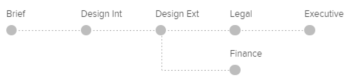

# 에서 자동화된 워크플로우를 사용하여 증명 설정 [!DNL Workfront Proof]

>[!IMPORTANT]
>
>이 문서는 독립형 제품의 기능을 참조합니다 [!DNL Workfront Proof]. 내부 교정에 대한 자세한 정보 [!DNL Adobe Workfront]를 참조하십시오. [교정](../../../review-and-approve-work/proofing/proofing.md).

자동화된 워크플로우를 사용하면 복잡한 검토 프로세스가 있거나 검토를 위해 컨텐츠를 동일한 사용자 그룹에 정기적으로 보내는 경우 컨텐츠 검토 및 승인을 보다 쉽게 관리할 수 있습니다.

증명을 만든 다음 스테이지에서 최종 승인까지 이동합니다. 관련 사용자는 승인이 필요할 때마다 알림을 받습니다.

문서를 업로드할 때 또는 문서가 업로드된 후에 자동화된 워크플로우를 증표에 추가할 수 있습니다.

## 자동화된 워크플로우를 사용하여 증명 만들기

1. 증명 만들기를 시작합니다.
1. 에서 **[!UICONTROL 공유]** 섹션을 클릭합니다. **[!UICONTROL 자동화된 워크플로우 사용]**.

   이 옵션을 선택 해제하여 표준 워크플로우로 다시 전환할 수 있습니다.

1. (선택 사항) [!DNL Workfront] 관리자 구성 및 공유에서 선택합니다. **[!UICONTROL 워크플로우 템플릿 선택]** 드롭다운 메뉴

   >[!NOTE]
   >
   >템플릿을 수정하는 기능은 [!DNL Workfront] 관리자 템플릿을 수정하는 기능이 비활성화되어 있으면 템플릿 소유자만 수정할 수 있습니다.

1. 다음 정보를 지정하여 자동화된 워크플로우의 첫 번째 단계를 구성합니다.

   * **[!UICONTROL 이름]:** 스테이지 이름이 워크플로우 다이어그램에 나타나고 검토자에게 전송된 전자 메일 알림에 포함됩니다.
   * **[!UICONTROL 기한]:** 이 필드의 기능은 **[!UICONTROL 다음 기간에서 계산된 기한]** 드롭다운 목록.

   * **[!UICONTROL 증명 생성에서]:** 증명의 마감 일자를 선택합니다.
   * **[!UICONTROL 단계 활성화]:** 증명 마감일을 자동으로 설정하려면 단계 활성화 날짜에 추가될 비즈니스 일수를 선택합니다.
   * **[!UICONTROL 단계 활성화]:** 워크플로우의 각 단계에 대해 활성화 시기를 결정할 수 있습니다. 첫 번째 단계에 대해 다음 옵션을 사용할 수 있습니다.

      * 증명 작성 시
      * 특정 시간 및 날짜
      * 수동으로\

         이후 단계에 대해 추가 옵션을 사용할 수 있습니다. 이러한 옵션에는 상위 단계가 필요합니다. 절차는 다음과 같습니다.
      * 이전 마감일에 도달한 후
      * 모든 결정은 변경 사항이 있는 승인됨 또는 승인됨
      * 모든 결정은 승인됨
      * 모든 결정이 내려집니다
   * **[!UICONTROL 다음 기간에서 계산된 기한]:** 이 드롭다운 목록에서 선택하는 옵션은 **[!UICONTROL 기한]** 필드.

   * **[!UICONTROL 증명 만들기]:** 에서 **[!UICONTROL 기한]** 필드에서 증명의 마감 날짜를 선택합니다.

   * **[!UICONTROL 단계 활성화]:** 에서 **[!UICONTROL 기한]** 필드에서 단계 활성화 날짜에 추가할 비즈니스 일수를 선택하여 증명의 최종 기한을 자동으로 설정합니다.

   * **[!UICONTROL 스테이지 잠금]:** 스테이지를 잠글 수 있는 시기를 선택합니다.
   * **[!UICONTROL 주요 의사 결정권자]:** 스테이지에서 기본 의사 결정자를 선택합니다. 결정자는 스테이지에 검토자를 추가한 후에만 드롭다운 목록에서 사용할 수 있습니다.
   * **[!UICONTROL 한 가지 결정만 필요합니다]:** 의사 결정권자 중 하나가 결정을 내린 후 검토를 완료하려면 이 옵션을 선택합니다.\

      에서 사용자를 지정한 경우에는 이 옵션을 사용할 수 없습니다 **[!UICONTROL 주요 의사 결정권자]** 드롭다운 메뉴

   * **[!UICONTROL 비공개 단계]:** 이 옵션을 선택하면 이 단계에 추가되지 않거나 계정의 감독자, 관리자 또는 청구 관리자가 아닌 사용자에게 댓글 및 결정이 표시되지 않습니다

1. (선택 사항) 스테이지에 검토자를 추가합니다.
1. 검토자를 추가할 때 다음 사항을 고려하십시오.

   * 검토자는 한 번만 증표에 추가할 수 있습니다. 증명의 두 단계 이상에 동일한 사람을 추가할 수 없습니다.
   * 비공개 단계에 추가된 검토자는 해당 단계에서 만든 증명 및 댓글에 추가된 단계만 볼 수 있습니다.
   * 기본적으로 스테이지에 사용자를 추가하면 사용자가 증명을 만들 때부터 증명을 볼 수 있는 액세스 권한을 부여합니다.\

      시스템 관리자는 워크플로우가 사용자가 추가된 단계에 들어갈 때까지 사용자가 증표에 액세스하는 것을 제한하도록 언어 교정 시스템을 구성할 수 있습니다. 자세한 내용은

1. (선택 사항) **[!UICONTROL 새로운 단계]**&#x200B;그런 다음 4단계 및 5단계를 반복하여 자동화된 워크플로우에 여러 단계를 추가합니다.
1. 에서 필요한 정보를 지정하여 증명 만들기를 계속합니다. [!UICONTROL 구성] 및 [!UICONTROL 추가 설정] 의 섹션 [!UICONTROL 새 증명] 에 설명된 대로 페이지를 페이지 페이지 페이지 페이지 페이지 페이지 페이지 페이지에 삽입됩니다.

## 자동화된 워크플로우 다이어그램

증명을 위한 워크플로우를 설정할 때 다이어그램이 만들어졌다는 것을 알 수 있습니다. 증명에 추가하는 모든 단계가 다이어그램에 표시되며 단계 간의 종속성을 명확하게 나타냅니다. 비공개 단계는 키 아이콘으로 표시됩니다.

다이어그램은 유동됩니다. 즉, 페이지를 아래로 스크롤하더라도 계속 볼 수 있습니다.

다이어그램을 볼 필요가 없는 경우 (1)을 숨길 수 있습니다.

## 단계 추가

만들거나 수정하는 워크플로우에 스테이지를 추가할 수 있습니다.

1. 기존 증표에 스테이지를 추가하는 경우 다음에 설명된 대로 증명 세부 정보 페이지로 이동합니다 [의 증명 세부 정보 관리 [!DNL Workfront Proof]](../../../workfront-proof/wp-work-proofsfiles/manage-your-work/manage-proof-details.md).
1. 에서 **[!UICONTROL 워크플로우]** 섹션을 클릭합니다. **[!UICONTROL 새로운 단계]**.

1. 단계 4 와 같이 단계에 대한 정보를 [!UICONTROL 자동화된 워크플로우를 사용하여 증명 만들기] 섹션에 자세히 설명되어 있습니다.
1. 클릭 **[!UICONTROL 단계 추가]**&#x200B;를 클릭한 다음 **[!UICONTROL 완료]**.

## 스테이지 삭제

1. 스테이지(1)의 오른쪽 위 모서리에 있는 사용 가능한 휴지통 아이콘을 클릭합니다.\
   스테이지를 마우스로 가리키면 아이콘이 표시됩니다.\
   

## 스테이지 설정

* **[!UICONTROL 스테이지 이름]**: 워크플로우 다이어그램에 표시되며, 검토자에게 보내는 이메일 알림에 포함됩니다.
* **[!UICONTROL 단계 활성화]**: 워크플로우의 각 단계에 대해 활성화 시기를 결정할 수 있습니다. 첫 번째 단계에 대해 다음 옵션을 사용할 수 있습니다.

   * 증명 작성 시
   * 특정 시간 및 날짜
   * 수동으로
   * 첫 번째 단계에는 이 세 가지 옵션만 사용할 수 있습니다. 다른 옵션은 두 번째 단계를 추가할 때 사용할 수 있습니다. 상위 단계를 선택해야 합니다.
   * 이전 마감일에 도달한 후(상위 단계를 선택해야 함)
   * 모든 결정은 승인됨 또는 [!UICONTROL 변경 사항이 있는 승인됨] (상위 단계를 선택해야 함)
   * 모든 결정은 승인됩니다(상위 단계를 선택해야 함)
   * 모든 결정이 수행됩니다(상위 단계를 선택해야 함)

* **[!UICONTROL 기한]:** 워크플로우의 각 단계에서 기한을 계산하는 방법을 결정할 수 있습니다. 옵션은 다음과 같습니다.

   * 증명 생성에서: 에서 [!UICONTROL 기한] 필드 (9) 증명의 마감 날짜를 선택할 수 있습니다.
   * 단계 활성화: 에서 [!UICONTROL 기한] 드롭다운에서 단계 활성화 날짜에 추가될 비즈니스 일수를 선택하여 증명의 최종 기한을 자동으로 설정합니다.

* **[!UICONTROL 잠금]:** 스테이지를 잠글 수 있는 시기를 결정하는 여러 가지 옵션이 있습니다. 옵션은 다음과 같습니다.

   * 수동 잠금
   * 안 함
   * 다음 단계가 시작될 때
   * 모든 결정을 내릴 때

**[!UICONTROL 주요 의사 결정권자]**: 기본 의사 결정자를 스테이지에 설정합니다. 사용 가능한 의사 결정자는 스테이지에 검토자를 추가한 후에만 목록에 나타납니다.

>[!NOTE]
>
>기본 의사 결정 담당자를 선택하는 경우, 이 단계에서 필요한 결정 옵션 하나만 더 이상 사용할 수 없습니다.

* **[!UICONTROL 한 가지 결정만 필요합니다]**: 스테이지에서 이 옵션을 활성화할 수 있습니다. 이것은 의사 결정권자 중 한 명이 결정을 하면 검토가 완료된다는 것을 의미합니다.
* **[!UICONTROL 개인 정보 보호]:** 각 스테이지는 비공개로 만들 수 있습니다. 스테이지가 개인 경우 이 단계에 추가되지 않거나 계정의 감독자, 관리자 또는 청구 관리자가 아닌 사용자에게는 댓글 및 결정이 표시되지 않습니다. 자세한 내용은 [자동화된 워크플로우 개요](../../../review-and-approve-work/proofing/proofing-overview/automated-workflow.md) .

## 스테이지에 검토자 추가

1. 각 단계 하단에 있는 필드에 연락처 이름 또는 이메일 주소를 입력합니다.
1. 녹색 더하기 아이콘을 클릭하여 추가합니다.
1. 증명의 역할을 설정합니다.
1. 이메일 경고를 설정합니다.
1. 첫 번째 단계를 설정할 때 증명의 소유자를 변경할 수도 있습니다.

   >[!NOTE]
   >
   >* 검토자는 한 번만 증표에 추가할 수 있습니다. 증명의 두 단계 이상에 동일한 사람을 추가할 수 없습니다.
   >* 비공개 단계에 추가되지 않은 검토자는 해당 단계에서 작성한 증명 또는 댓글에 있는 스테이지를 볼 수 없습니다.

## 증명을 자동화된 워크플로우로 변환

기본 증명을 자동화된 워크플로우로 변환할 수 있습니다.

1. 클릭 **[!UICONTROL 자동화된 워크플로우로 변환]** on [!UICONTROL 증명 세부 사항] 페이지.
증명의 자동 워크플로우가 다시 작동되면 모든 단계는 활성, 공개 및 표시됩니다 [!UICONTROL 스테이지 잠금] 옵션이 기본적으로 수동으로 설정되어 있습니다. 모든 단계는 사용자 및 해당 설정으로 유지됩니다.

   * 단계 활성화 는 모든 단계에서 증명 생성으로 설정됩니다.
   * 선택 사항에서 계산된 마감일은 모든 단계에서 증명 생성으로 설정됩니다.
   * 기본 증명의 결정 옵션을 하나만 선택한 경우 모든 단계에서 선택한 것입니다.
   * 기본 증명으로 되어 있는 경우 [!UICONTROL 주요 의사 결정권자] 이 선택되면 해당 수신자와 함께 단계가 설정되고 다른 모든 단계가 없음으로 설정됩니다.
   * 스테이지 이름은 동일하게 유지됩니다.

## 기존 자동화된 워크플로우에 템플릿 추가

기본 증명을 자동화된 워크플로우로 변환한 후 템플릿에 템플릿을 추가할 수 있습니다.

1. 증명 세부 사항 페이지의 워크플로우 섹션에서 **[!UICONTROL 템플릿 추가].**

   * 템플릿 설정은 이 템플릿이 추가된 증표로 수행할 수 있는 작업을 결정합니다. 예를 들어, 템플릿에 [!UICONTROL 단계 추가 및 단계에 사람 추가] 옵션 사용 안 함, 단추 [!UICONTROL 단계 추가] 및 [!UICONTROL 증명 공유] 표시되지 않습니다.
   * If [!UICONTROL 단계 옵션 추가] 이 비활성화되어 있으면, [!UICONTROL 템플릿 추가] 단추가 표시되지 않습니다.
   * 사용자가 자동화된 워크플로우 템플릿의 스테이지에 추가되지만 증명에도 이미 있으면 이 템플릿이 적용되면 시스템에서 이 사람을 자동으로 단계에서 제거합니다. 이 특정 단계에 추가된 다른 사용자가 없는 경우 시스템에서 워크플로우에 빈 단계를 추가할 수 없으므로 다음 오류가 표시됩니다.

      
