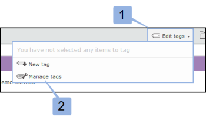
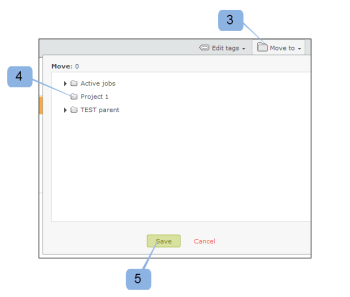

# [!DNL Workfront Proof]의 대시보드

>[!IMPORTANT]
>
>이 문서는 독립 실행형 제품 [!DNL Workfront Proof]의 기능을 참조합니다. [!DNL Adobe Workfront] 내부의 증명에 대한 자세한 내용은 [증명](../../../review-and-approve-work/proofing/proofing.md)을 참조하십시오.

대시보드는 [!DNL Workfront Proof] 계정에 로그인할 때 처음 표시되는 페이지입니다. [!DNL Workfront Proof] 계정의 활동을 요약하고 [!DNL Workfront Proof] 내의 다른 섹션 및 함수에 대한 빠른 링크를 제공합니다.

대시보드에는 다음 항목이 포함됩니다.

* 조직 로고 (1)
* 위쪽 탐색 (2)
* 검색(3)

* 헤더 메뉴 (4)
* 새 메뉴 (5)
* 사이드바 (6)
* 시작 섹션(7)
* 개요 (8)
* 최근에 액세스한 항목 (9)
* 최근 활동(10)

>[!NOTE]
>
>대시보드에서 보고 사용할 수 있는 메뉴 및 링크는 사용자 프로필 및 권한에 따라 다릅니다.

조직의 로고, 색상, 사용자 지정 링크 등을 표시하도록 계정을 브랜딩할 수 있습니다. 자세한 내용은 [사이트 브랜딩 [!DNL Workfront Proof] 사이트](../../../workfront-proof/wp-acct-admin/branding/brand-wp-site.md)을 참조하세요.&quot;

계정을 브랜딩하지 않으면 [!DNL Workfront Proof] 로고와 표준 색상이 나타납니다.

## 머리글 메뉴

### 사용자 이름

선택한 사용자 이름(2)이 여기에 표시됩니다. 개인 설정에서 변경할 수 있습니다.

### 설정

여기에서(3) 다음에 액세스할 수 있습니다.

* 개인 설정
* 계정 설정
* 과금

>[!NOTE]
>
>위 메뉴의 가시성은 프로필에 따라 다릅니다. 자세한 내용은 사용자 프로필 및 권한 을 참조하십시오.

### 도움말

여기에서(4) 다음 항목에 액세스할 수 있습니다.

* 도움말 문서
* 데모 영화

>[!NOTE]
>
>Select 및 Premium 플랜을 사용하면 사용자가 자신의 콘텐츠를 가리키도록 도움말 옵션을 구성할 수 있습니다. 자세한 내용은 고급 브랜딩 옵션을 참조하십시오.

### 로그아웃

계정에서 로그아웃하려면 여기를 클릭하십시오.

## 새 메뉴

새 메뉴를 열려면

1. 드롭다운 화살표(7)를 클릭합니다.

   **[!UICONTROL 새로 만들기]** 메뉴에는 다음 옵션이 있습니다.

   * 새 증명(8)
   * 파일 업로드 (9)
   * 새 폴더(10)
   * 새 게스트(11)
   * 새 사용자(12)
   * 새 그룹 (13)

## 대시보드 메뉴

대시보드 메뉴에는 다음 메뉴가 포함되어 있습니다.

* 태그 편집
* 다음으로 이동
* 기타 액션
* 삭제

## 태그 편집

[!UICONTROL 태그 편집] 메뉴(1)를 사용하면 다음 작업을 수행할 수 있습니다.

* 항목에 태그 적용
* 새 태그 만들기
* 태그 관리(2)

## 다음으로 이동

이 함수를 사용하면 증명 및 파일을 폴더 중 하나로 이동할 수 있습니다. 방법은 다음과 같습니다.

1. 관련 항목에 대한 확인 상자를 선택합니다.
1. **[!UICONTROL 이동]**(3)을 클릭하고 관련 폴더(4)를 선택합니다.
1. **[!UICONTROL 저장]**(5)을 클릭합니다.

   

### 기타 액션

[!UICONTROL 추가 작업] 메뉴(6)에서 다음 작업을 수행할 수 있습니다.

* 잠금(증명만)
* 활성화
* 보관(증명만 해당)
* 보관 해제(증명만)
* 소유자 변경

### 삭제

항목을 삭제하려면 다음 작업을 수행하십시오.

1. 항목 왼쪽에 있는 확인 상자를 선택하고 **[!UICONTROL 삭제]**(7)를 클릭합니다.

1. 표시되는 확인 화면에서 세부 정보를 확인하고 **[!UICONTROL 예]**(8)을 클릭하여 확인합니다.

### 사이드바

사이드바에는 다음 페이지에 대한 링크가 있습니다.

* 대시보드 (1)
* 보기 (2)
* 워크플로우 (3) (Premium 플랜만 해당)
* 드롭 영역 (4) (선택 및 프리미엄 플랜)
* 연락처 (5)
* 그룹 (6)
* 활동(7)
* 휴지통 (8)
* 내 폴더 (9)(사이드바에서 각 개별 폴더에 액세스할 수도 있음)
* 기타 조직의 폴더(10)(여기서 다른 조직이 사용자와 공유한 항목을 찾을 수 있음)
* 태그(11)

사이드바는 사이드바 도움말 페이지에 더 자세히 설명되어 있습니다.

### [!UICONTROL 시작] 섹션

[!UICONTROL 시작] 섹션에는 다음과 같은 유용한 링크가 있습니다.

* 데모 영화 보기 (1)
* 도움말 페이지 (2)
* 지원 연락처 세부 정보 (3)
* &quot;시작 섹션을 다시 표시하지 않음&quot; 링크(4)

### 개요

이 섹션에는 다음 항목에 대한 빠른 링크가 있습니다.

* 새 증명 만들기 파일 업로드
* 새 폴더 만들기
* 새 사용자 추가
* 암호 변경

개요 섹션에는 미리 필터링된 정보도 표시됩니다. 이는 다음과 같습니다.

* 관리할 증명 - 사용자가 소유하고 사용자에게 위임된 총 활성 증명 수
* 결정을 기다리는 증명 - 결정을 필요로 하는 총 활성 증명 수

  

여기에서 바로 귀하 또는 검토자의 즉각적인 조치가 필요한 증명 수를 확인할 수 있습니다.

* 합계
* 정시 - 기한이 없거나 기한까지 24시간 이상 남아 있는 증명
* 위험 - 기한이 24시간 미만인 증명
* 지연 - 일부 작업이 완료되어 기한이 경과하지 않은 증명

>[!NOTE]
>
>차트 값을 클릭할 수 있습니다. 항목의 세부 목록으로 쉽게 이동할 수 있습니다.

### 최근에 액세스한 항목

[!UICONTROL 최근에 액세스한 항목] 섹션에는 최근에 액세스한 항목이 표시됩니다. 여기에는 사용자가 소유한 항목, 프로필 권한에 따라 볼 수 있는 권한이 있는 항목 및 사용자와 공유된 항목이 포함됩니다. 이 섹션에는 사용자가 직접 연 항목만 포함됩니다([!DNL Workfront Proof] 뷰어 또는 증명 세부 정보 페이지를 통해).

[!UICONTROL 최근에 액세스한 항목] 섹션에는 최근 증명 및 파일에 대한 다음 정보가 표시됩니다.

* 이름
* 진행
* 상태
* 결정
* 소유자

요약(이 정보는 기본적으로 축소됩니다. 관련 증명 왼쪽에 있는 확장/축소 단추를 클릭하여 증명 요약을 엽니다.)

작업 메뉴

이 섹션에서 사용할 수 있는 다양한 레이아웃 옵션에 대해서는 페이지 레이아웃 을 참조하십시오.

>[!NOTE]
>
>[!UICONTROL 최근에 액세스한 항목] 섹션에서 증명 이름을 클릭하면 증명 뷰어의 증명으로 바로 이동합니다.

증명 세부 정보 페이지에 액세스하려면:

1. 증명 이름 오른쪽에 있는 **[!UICONTROL 작업]** 메뉴(1)를 클릭합니다.
1. 메뉴에서 **[!UICONTROL 증명 세부 정보 보기]**(2)를 선택합니다.

### 최근 활동

이 섹션에는 계정의 최근 활동에 대한 다음 세부 사항이 표시됩니다.

* 날짜 및 시간 증명/파일 이름
* 액션
* 세부 사항

항목의 작업 메뉴를 클릭하고 세부 정보 보기를 선택하여 항목의 세부 정보 페이지로 이동할 수도 있습니다. 계정의 활동에 대한 자세한 내용은 활동 감사 추적 을 참조하십시오.

>[!NOTE]
>
>[!UICONTROL 최근 활동] 섹션에서 증명 이름을 클릭하면 증명 뷰어에서 증명이 열립니다.

해당 증명의 증명 세부 정보 페이지로 이동하려면 다음을 수행하십시오.

1. **[!UICONTROL 작업]** 메뉴를 클릭합니다(1).
1. 드롭다운 메뉴에서 **[!UICONTROL 증명 세부 정보 보기]**(2)를 선택합니다.

   
