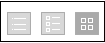

# [!DNL Workfront Proof]의 보기 탭에 있는 페이지 레이아웃

>[!IMPORTANT]
>
>이 문서는 독립 실행형 제품 [!DNL Workfront Proof]의 기능을 참조합니다. [!DNL Adobe Workfront] 내부의 증명에 대한 자세한 내용은 [증명](../../../review-and-approve-work/proofing/proofing.md)을 참조하십시오.

[!UICONTROL 보기] 탭에서 페이지 레이아웃을 조정할 수 있습니다. 다음 레이아웃 옵션을 사용할 수 있습니다.

## 목록

* 증명 또는 파일 이름과 표준 보기 열을 표시합니다.
* [!UICONTROL 증명 작업] 메뉴는 (1) 줄의 오른쪽에 있습니다.

  

## 썸네일 목록

* 증명 이미지/파일 아이콘, 증명 또는 파일 이름과 표준 보기 열을 표시합니다.
* [!UICONTROL 증명 작업] 메뉴는 (1) 줄의 오른쪽에 있습니다.
* 기본 표준 보기입니다.

  

## 축소판

* 증명 이미지/파일 아이콘 및 증명/파일 이름만 표시
* [!UICONTROL 증명 작업] 메뉴는 각 증명(1)의 오른쪽 상단 모서리에 있습니다.

  

## 페이지 레이아웃 변경

대시보드 또는 휴지통 페이지의 페이지 레이아웃을 변경하려면 페이지 상단에 있는 보기 버튼 중 하나를 클릭하여 원하는 보기를 선택합니다.

계정의 다른 모든 보기 페이지에서 페이지 레이아웃을 변경하려면 페이지 상단에 있는 드롭다운 메뉴를 확장하고 원하는 페이지 레이아웃을 클릭합니다.

