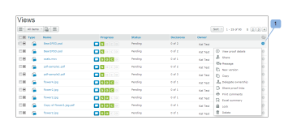

# 의 보기 탭에 있는 페이지 레이아웃 [!DNL Workfront Proof]

>[!IMPORTANT]
>
>이 문서는 독립형 제품의 기능을 참조합니다 [!DNL Workfront Proof]. 내부 교정에 대한 자세한 정보 [!DNL Adobe Workfront]를 참조하십시오. [교정](../../../review-and-approve-work/proofing/proofing.md).

에서 페이지 레이아웃을 조정할 수 있습니다 [!UICONTROL 보기 횟수] 탭. 다음 레이아웃 옵션을 사용할 수 있습니다.

## 목록

* 증명 또는 파일 이름과 표준 보기 열을 표시합니다
* 다음 [!UICONTROL 증명 작업] 메뉴는 선(1)의 오른쪽에 있습니다

   

## 썸네일 목록

* 증명 이미지/파일 아이콘, 증명 또는 파일 이름과 표준 보기 열을 표시합니다
* 다음 [!UICONTROL 증명 작업] 메뉴는 선(1)의 오른쪽에 있습니다
* 기본 표준 보기입니다.

   

## 축소판 그림

* 증명 이미지/파일 아이콘과 증명/파일 이름만 표시
* 다음 [!UICONTROL 증명 작업] 메뉴는 각 증명의 오른쪽 상단 모서리에 있습니다(1).

   

## 페이지 레이아웃 변경

대시보드 또는 휴지통 페이지의 페이지 레이아웃을 변경하려면 페이지 상단에 있는 보기 단추 중 하나를 클릭하여 기본 보기를 선택합니다.

계정의 다른 모든 보기 페이지에서 페이지 레이아웃을 변경하려면 페이지 상단의 드롭다운 메뉴를 확장하고 기본 설정 페이지 레이아웃을 클릭합니다.

