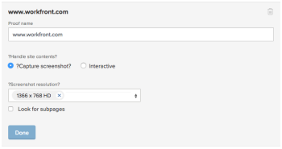

# 에서 증명 생성 [!DNL Workfront Proof]

>[!IMPORTANT]
>
>이 문서는 독립 실행형 제품의 기능에 대해 설명합니다 [!DNL Workfront Proof]. 내부 교정에 대한 정보 [!DNL Adobe Workfront], 참조 [증명](../../../review-and-approve-work/proofing/proofing.md).

[!DNL Workfront Proof] 를 사용하면 문서 또는 웹 사이트에서 증명을 만들고 다른 사용자와 공유할 수 있습니다. 다음 단계에서는 사용할 수 있는 다양한 구성 옵션에 대해 설명합니다.

## 문서에 대한 증명 생성

1. 다음 중 하나를 수행하여 새 증명 만들기를 시작하고 [!UICONTROL 새 증명] 페이지:

   * 녹색 클릭 **[!UICONTROL 새 증명]** 단추를 클릭합니다.
   * 다음에서 **[!UICONTROL 대시보드]** 영역, **[!UICONTROL 개요]** 탭을 클릭하고 **[!UICONTROL 새 증명]** 링크를 클릭합니다.

   * Dropzone(엔터프라이즈 기능)을 통해 제출합니다.
   * 다음 **[!UICONTROL 새 증명]** 페이지가 표시됩니다.

1. 하나 이상의 문서를 증명하려면 다음 방법 중 하나로 증명을 추가할 문서를 추가합니다(이 프로세스를 반복하여 증명을 추가할 문서를 여러 개 추가).

   * 파일 시스템의 문서를 의 드래그 앤 드롭 영역으로 드래그합니다. **[!UICONTROL 파일 추가]** 영역입니다.
   * 의 드래그 앤 드롭 영역을 클릭합니다. **[!UICONTROL 파일 추가]** 영역을 찾은 다음 워크스테이션의 파일 시스템에서 업로드할 문서를 찾아 선택합니다.

     

1. 하나 이상의 웹 사이트를 증명하려면 웹 사이트에서 증명하려는 웹 사이트의 URL을 **[!UICONTROL 파일 추가]** 영역을 선택한 다음 키를 누릅니다. **[!UICONTROL 입력]**.

1. (선택 사항) 이 프로세스를 반복하여 증명에 여러 웹 사이트를 추가합니다.

   증명 웹 사이트에 대한 자세한 내용은 [URL에 대한 증명 생성](#generate-a-proof-for-a-url).

   

1. (선택 사항) 업로드된 파일의 파일 이름을 수정합니다.

   1. 의 문서 목록에서 수정할 문서 이름 위로 마우스를 가져갑니다. **[!UICONTROL 파일 추가]** 영역을 클릭한 다음 **[!UICONTROL 편집]** 아이콘.

      

   1. 다음에서 **[!UICONTROL 증명 이름]** 필드를 지정하고 새 이름을 지정한 다음 **[!UICONTROL 완료]**.

   1. (선택 사항) 업로드되는 파일을 삭제하려면 의 문서 목록에서 삭제할 문서를 마우스로 가리킵니다. **[!UICONTROL 파일 추가]** 영역을 클릭한 다음 **[!UICONTROL 삭제]** 아이콘.

      

   1. (선택 사항) 옵션을 활성화합니다. **[!UICONTROL 호환되는 모든 파일을 단일 증명으로 결합]**.

      **이 옵션을 활성화하면 다음과 같은 결과가 발생합니다.** 모든 정적 파일 및 웹 사이트는 하나의 증명에서 사용할 수 있으며 한 번에 최대 50개의 파일을 업로드할 수 있습니다.

      >[!NOTE]
      >
      >비디오 및 대화형 웹 사이트를 포함한 대화형 파일은 하나의 증명으로 결합할 수 없습니다.

      **이 옵션이 비활성화되면:** 모든 문서 및 웹 사이트는 개별 증명으로 생성되며, 제공된 시간에 최대 20개의 파일을 업로드할 수 있습니다.

      업로드된 모든 파일과 웹 사이트를 하나의 증명으로 결합하려면 다음을 수행하십시오.

      1. 옵션 활성화, **[!UICONTROL 호환되는 모든 파일을 단일 증명으로 결합]**.
      1. 다음에서 **[!UICONTROL 증명 이름]** 필드에서 결합된 증명의 새 이름을 지정합니다.
      1. 다음에서 **[!UICONTROL 파일 추가]** 영역을 선택하고 파일을 원하는 순서로 끌어 포함된 파일의 순서를 변경합니다. 파일 순서는 결합된 증명의 페이지 순서입니다. 결합된 증명 만들기에 대한 자세한 내용은 [여러 페이지로 된 증명 만들기](../../../review-and-approve-work/proofing/creating-proofs-within-workfront/create-multi-page-proof.md).

1. (선택 사항) 여러 단계를 포함하는 자동화된 워크플로를 사용하려면 **[!UICONTROL 워크플로]** 섹션에서 다음 옵션 중 하나를 선택합니다.

   * **기본:** 증명을 만든 직후 해당 증명에 액세스할 사용자를 지정하려면 이 옵션을 선택합니다. 여러 사용자와 증명을 공유할 수 있습니다.

     증명 공유에 대한 자세한 내용은 의 &quot;증명에 사용자 추가&quot;를 참조하십시오. [다음 범위 내에서 증명 공유 [!DNL Adobe Workfront]](../../../review-and-approve-work/proofing/managing-proofs-within-workfront/share-a-proof-in-workfront.md).

   * **자동화:** 복잡한 검토 프로세스가 있거나 검토용 콘텐츠를 정기적으로 동일한 사용자 그룹에 보내는 경우 콘텐츠 검토 및 승인을 관리하려면 이 옵션을 선택합니다. 자동화된 워크플로를 사용하면 증명이 최종 승인까지 단계에서 스테이지로 이동합니다. 관련 사용자는 승인을 해야 할 때마다 알림을 받습니다.

     자동화된 워크플로우 만들기에 대한 자세한 내용은 [에서 자동화된 워크플로를 사용하여 증명 설정 [!DNL Workfront Proof]](../../../workfront-proof/wp-work-proofsfiles/automated-workflow/set-up-proof-auto-workflow.md#create2).

1. 이전 단계에서 선택한 사용자에게 이메일 알림 및 사용자 지정 메시지를 전송할지 여부를 선택합니다.

   * **이 증명에 대해 수신자에게 알림:** 사용자에게 이메일 알림을 전송하려면 이 옵션을 선택합니다. 날짜 **[!UICONTROL 기본 공유]** 다음에서 선택됨: **[!UICONTROL 워크플로]** 섹션에서 증명을 만들 때 이메일 알림이 전송됩니다. 날짜 **[!UICONTROL 자동화된 워크플로우]** 다음에서 선택됨: **[!UICONTROL 워크플로]** 섹션에서 증명이 사용자와 연결된 자동화된 워크플로의 단계에 들어오면 이메일 알림이 전송됩니다.

   * **사용자 정의 메시지 추가:** 알림에 사용자 지정 메시지를 포함하려면 이 옵션을 선택합니다. 제목과 메시지 본문을 지정할 수 있습니다. 메시지 본문에는 굵게, 글머리 기호 및 하이퍼링크와 같은 서식 있는 텍스트 서식이 포함될 수 있습니다.

1. 다음 증명 설정 중 하나를 선택합니다.

   <table style="table-layout:auto"> 
    <col> 
    <col> 
    <tbody> 
     <tr> 
      <td role="rowheader">로그인 필요 - 증명은 다른 사용자와만 공유할 수 있음</td> 
      <td> 
<strong>로그인 필요 - 증명은 다른 사용자와 공유할 수 있습니다.</strong> 이 옵션을 선택한 경우에만 [!DNL Workfront Proof] 사용자가 증명을 볼 수 있습니다.
 
이 옵션은 기본적으로 비활성화되어 있으며 URL이 있는 사람은 누구나 증명을 볼 수 있습니다.
 
이 옵션을 선택한 경우:
 
       <ul> 
        <li>사용자가 증명에 추가되지 않은 경우 증명에 로그인할 수 없습니다.</li> 
        <li>구독을 활성화할 수 없습니다.</li> 
       </ul> </td> 
     </tr> 
     <tr> 
      <td role="rowheader">이 증명에는 단 하나의 결정만 필요합니다.</td> 
      <td> 
이 선택지를 선택하면, 의사 결정자 중 한 명이 결정을 한 후 심사가 완료된다.
 
이 옵션은 기본적으로 비활성화되어 있습니다.
 </td> 
     </tr> 
     <tr> 
      <td role="rowheader">결정 시 전자 서명 필요</td> 
      <td>사용자는 증명을 결정할 때 사용자 이름과 암호를 지정해야 합니다.</td> 
     </tr> 
     <tr> 
      <td role="rowheader">필요한 모든 결정을 내릴 때 증명 잠금</td> 
      <td> 
<strong></strong> 이 설정을 사용하면 모든 결정이 내려진 후 증명 상태가 잠깁니다. 최종 승인자가 결정을 내리면 상태는 자동으로 잠금 해제에서 잠금으로 변경됩니다.
 
이 옵션은 기본적으로 비활성화되어 있습니다.
 </td> 
     </tr> 
     <tr> 
      <td role="rowheader">원본 파일 다운로드</td> 
      <td> 
<strong></strong> 이 옵션을 선택하면 검토자는 증명을 만든 원본 파일을 다운로드할 수 있습니다.
 
이 옵션을 선택 취소하면 다운로드 아이콘이 더 이상 표시되지 않습니다. 이 옵션은 기본적으로 활성화되어 있습니다.
 </td> 
     </tr> 
     <tr> 
      <td role="rowheader">공개 URL 또는 포함 코드를 통해 증명 공유</td> 
      <td>이 옵션을 선택하면 공용 URL 또는 포함 코드를 통해 증명을 공유할 수 있습니다.</td> 
     </tr> 
     <tr> 
      <td role="rowheader">공개 URL 또는 포함 코드를 통해 증명 구독</td> 
      <td> 
이 옵션을 선택하면 증명에 명시적으로 추가되지 않은 사람도 증명에 가입할 수 있습니다. 증명을 구독하는 사용자에게는 다음 설정에서 정의한 역할 및 이메일이 부여됩니다.
 
       <ul> 
        <li><strong>구독자 역할</strong>: 증명을 구독하는 모든 검토자에게 할당되는 기본 증명 역할입니다.</li> 
        <li><strong>구독자에 대한 이메일 경고 설정</strong>: 증명을 구독하는 모든 검토자에게 할당되는 기본 이메일 경고입니다.</li> 
        <li> 
<strong>이메일 링크를 통한 증명 액세스 필요</strong>: 구독자가 증명에 대한 링크가 포함된 이메일을 받는지 여부를 구성합니다. 다음을 선택할 수 있습니다. <strong>이메일 없음</strong> (증명에 액세스하는 데 이메일 링크가 필요하지 않음), <strong>증명 알림 이메일만</strong> (구독자가 확인 없이 이메일을 통해 증명에 대한 링크를 받음) 또는 <strong>유효성 확인 및 증명 알림 이메일</strong> (구독자는 이메일을 통해 증명에 대한 링크를 수신하고 증명에 액세스하려면 링크를 클릭해야 합니다. 이 옵션의 목적은 개인이 액세스 권한이 있는 올바른 이메일 주소를 입력했는지 확인하는 것입니다.)
 
참고: 증명에 자동화된 워크플로가 첨부된 경우 모든 구독은 증명 소유자에게 확인 이메일을 생성하므로 대상자를 추가해야 하는 단계를 결정할 수 있습니다.
 </li> 
       </ul> </td> 
     </tr> 
    </tbody> 
   </table>

1. 클릭 **[!UICONTROL 증명 만들기]**.

   Workfront에서 선택한 문서 또는 웹 사이트에 대한 증명 생성을 시작합니다. 파일 크기와 유형에 따라 문서 업로드의 지연 시간이 달라집니다. 파일이 크면 생성하는 데 시간이 오래 걸리므로 기다려 주십시오. 페이지에서 멀리 탐색할 수 있으며 Workfront에서 파일을 계속 생성합니다. 최대 파일 업로드 크기는 4GB입니다.

   증명이 생성된 후 다음을 클릭: **[!UICONTROL 증명으로 이동]** 를 클릭하여 증명 도구를 실행합니다.

   

   문서가 교정 도구에 나타납니다.

   계정에 증명이 활성화되지 않은 사용자는 여전히 문서를 보고 증명에 대한 댓글을 달 수 있습니다.

## URL에 대한 증명 생성 {#generate-a-proof-for-a-url}

처음으로 URL에 대한 증명을 생성할 수 있습니다. 또는 증명이 이전에 생성된 새 버전의 URL 증명을 생성할 수 있습니다.

>[!NOTE]
>
>다음 경우에만 URL에 대한 대화형 증명을 생성할 수 있습니다. [!DNL Workfront] 환경은 [!DNL Workfront Proof] Premium 계정입니다. 이 섹션에서 설명한 대로 증명을 사용할 수 없는 경우 시스템 관리자에게 문의하십시오.

URL에 대한 증명을 생성하려면:

1. 다음 중 하나를 수행하여 새 증명 만들기를 시작하고 [!UICONTROL 새 증명] 페이지:

   * 녹색 클릭 **[!UICONTROL 새 증명]** 단추를 클릭합니다.
   * 다음에서 **[!UICONTROL 대시보드]** 영역, **[!UICONTROL 개요]** 탭을 클릭하고 **[!UICONTROL 새 증명]** 링크를 클릭합니다.

   * Dropzone(엔터프라이즈 기능)을 통해 제출합니다.

1. (조건부) **[!UICONTROL 새 증명]** 기존 증명의 새 버전을 만들기 위해 표시되는 페이지:

   1. 새 버전을 추가할 URL 증명을 선택합니다.
   1. 다음을 클릭합니다. **[!UICONTROL 새 버전]** 단추를 클릭합니다.

      

1. 표시되는 새 증명 버전 페이지에서 증명을 하려는 웹 사이트의 URL을 **[!UICONTROL 파일 추가]** 영역을 선택한 다음 키를 누릅니다. **[!UICONTROL 입력]**.

1. (선택 사항) 이 프로세스를 반복하여 증명에 여러 웹 사이트를 추가합니다.

   

1. 의 문서 목록에서 웹 사이트를 클릭합니다. **[!UICONTROL 파일 추가]** 영역입니다.

   

1. 지정 **[!UICONTROL 증명 이름]** 증명.

   기본적으로 증명 이름은 사이트 URL과 동일합니다.

1. 선택 **[!UICONTROL 사이트 콘텐츠 처리]** 옵션:

   <table style="table-layout:auto"> 
    <col> 
    <col> 
    <tbody> 
     <tr> 
      <td role="rowheader">스크린샷 캡처</td> 
      <td>URL 앞 페이지의 정적 이미지에 대한 증명을 만듭니다.</td> 
     </tr> 
     <tr> 
      <td role="rowheader">인터랙티브</td> 
      <td> 
검토자가 사이트를 탐색하고, HTML5 이미지를 보고, Flash 요소를 보는 등의 작업을 수행할 수 있도록 하는 증명을 만듭니다.
 
대화형 증명을 만들려면 보안 프로토콜(https)을 사용하여 웹 사이트를 호스팅해야 합니다. 또한 iframe에 포함할 수 없는 웹 사이트는 대화형 증명으로 생성할 수 없습니다(iframe 포함 제한 사항은 포함하려는 웹 사이트에 의해 제어됨).
 
초기 증명을 만든 후에는 후속 버전을 만들 때 이 설정을 변경할 수 없습니다.
 
대화형 증명에 대한 자세한 내용은 <a href="#generate-a-proof-for-interactive-content" class="MCXref xref">대화형 콘텐츠에 대한 증명 생성</a>.
 </td> 
     </tr> 
     <tr> 
      <td role="rowheader">스크린샷 해상도</td> 
      <td> 
(이 옵션은 대화형 증명에 사용할 수 없습니다.) 콘텐츠가 표시되는 해상도를 조정하거나 여러 해상도를 선택할 수 있습니다.
 
이를 통해 사용자는 증명을 검토하여 다양한 크기의 휴대폰, 태블릿 및 모니터와 같은 다양한 디바이스에 콘텐츠가 표시되는 방식을 확인할 수 있습니다.
 
여러 개의 해상도를 선택하면 선택한 각 해상도에 대해 별도의 증명이 만들어집니다.
 
사용자가 증명에 댓글을 달면 댓글에 현재 화면 해상도가 자동으로 표시되어 댓글이 어떤 해상도와 연관되어 있는지 다른 사용자가 알 수 있도록 합니다.
 </td> 
     </tr> 
     <tr> 
      <td role="rowheader">하위 페이지 찾기</td> 
      <td>(이 옵션은 대화형 증명에 사용할 수 없습니다.) 웹 사이트의 페이지를 탐색하려면 이 옵션을 선택합니다. 웹 사이트를 기본 페이지에서 최대 2단계까지 확장할 수 있습니다. 페이지의 URL을 보려면 페이지 위로 마우스를 가져갑니다. 증명하려는 페이지만 선택하십시오. 선택하는 각 페이지는 기본적으로 개별 증명으로 만들어지거나 <strong>단일 증명으로 결합</strong> 선택한 모든 페이지를 하나의 증명으로 결합하는 옵션입니다.</td> 
     </tr> 
    </tbody> 
   </table>

1. (선택 사항) 증명 공유, 자동화된 워크플로 추가 또는 액세스 및 구독 설정 설정과 같은 고급 증명 옵션을 구성합니다. 이러한 옵션에 대한 자세한 내용은 다음 문서를 참조하십시오.

   * [다음 범위 내에서 증명 공유 [!DNL Adobe Workfront]](../../../review-and-approve-work/proofing/managing-proofs-within-workfront/share-a-proof-in-workfront.md)
   * [에서 자동화된 워크플로를 사용하여 증명 설정 [!DNL Workfront Proof]](../../../workfront-proof/wp-work-proofsfiles/automated-workflow/set-up-proof-auto-workflow.md)
   * [증명에 대한 액세스 및 구독 설정 구성](../../../review-and-approve-work/proofing/managing-proofs-within-workfront/configure-access-subscription-settings-proof.md)

1. 클릭 **[!UICONTROL 완료]**.

   기존 URL 증명에 새 버전을 추가하는 경우 원본 증명 또는 이전 버전에 구성된 모든 옵션이 이 버전에서 유지됩니다.기존 URL 증명에 새 버전을 추가하는 경우 원본 증명 또는 이전 버전에 구성된 모든 옵션이 이 버전에서 유지됩니다.

1. 클릭 **[!UICONTROL 증명 만들기]**.

## 대화형 콘텐츠에 대한 증명 생성 {#generate-a-proof-for-interactive-content}

이 기능을 사용하려면 Pro Workfront 플랜 이상이 필요합니다. 사용 가능한 다양한 플랜에 대한 자세한 내용은 [Workfront 플랜](https://www.workfront.com/plans).

대화형 콘텐츠에 대한 자세한 내용은 [대화형 콘텐츠 증명 개요](../../../review-and-approve-work/proofing/proofing-overview/interactive-content-proofs.md).

* [대화형 컨텐츠를 URL로 추가](#add-interactive-content-as-a-url)
* [대화형 컨텐츠를 ZIP 파일로 추가](#add-interactive-content-as-a-zip-file)

### 대화형 컨텐츠를 URL로 추가 {#add-interactive-content-as-a-url}

대화형 URL 증명을 추가하는 방법에 대한 자세한 내용은  [URL에 대한 증명 생성](#generate-a-proof-for-a-url).

### 대화형 컨텐츠를 ZIP 파일로 추가 {#add-interactive-content-as-a-zip-file}

1. .zip 번들 파일을 만들어 콘텐츠를 준비합니다.

   .zip 번들 파일 사양에 대한 자세한 내용은 다음을 참조하십시오. [증명을 위해 ZIP 파일에서 대화형 콘텐츠 준비 정보](../../../review-and-approve-work/proofing/proofing-overview/interactive-content-proofs.md#howtoprepareaninteractiveziparchive) 이 문서에서 [대화형 콘텐츠 증명 개요](../../../review-and-approve-work/proofing/proofing-overview/interactive-content-proofs.md).

1. 다음 중 하나를 수행하여 새 증명 만들기를 시작하고 [!UICONTROL 새 증명] 페이지:

   * 녹색 클릭 **[!UICONTROL 새 증명]** 단추를 클릭합니다.
   * 다음에서 **[!UICONTROL 대시보드]** 영역, **[!UICONTROL 개요]** 탭을 클릭하고 **[!UICONTROL 새 증명]** 링크를 클릭합니다.

   * Dropzone(엔터프라이즈 기능)을 통해 제출합니다.

1. 다음에서 **[!UICONTROL 새 증명]** 페이지가 나타나면 대화형 .zip 번들을 **[!UICONTROL 파일 추가]** 영역입니다.

1. (선택 사항) 증명 공유, 자동화된 워크플로 추가 또는 액세스 및 구독 설정 설정과 같은 고급 증명 옵션을 구성합니다. 이러한 옵션에 대한 자세한 내용은 다음 문서를 참조하십시오.

   * [다음 범위 내에서 증명 공유 [!DNL Adobe Workfront]](../../../review-and-approve-work/proofing/managing-proofs-within-workfront/share-a-proof-in-workfront.md)
   * 이 문서에서
   * [증명에 대한 액세스 및 구독 설정 구성](../../../review-and-approve-work/proofing/managing-proofs-within-workfront/configure-access-subscription-settings-proof.md)

1. 클릭 **[!UICONTROL 증명 만들기]**.

   Workfront은 .zip 번들의 증명을 생성하기 시작합니다. 번들 크기에 따라 문서 업로드의 지연 시간이 달라집니다. 파일이 클수록 생성하는 데 시간이 오래 걸립니다. 페이지에서 멀리 탐색할 수 있으며 Workfront에서 파일을 계속 생성합니다. 최대 파일 업로드 크기는 4GB입니다.

   증명이 생성되면 다음을 클릭할 수 있습니다. **[!UICONTROL 증명으로 이동]** 증명을 열 수 있는 단추입니다.
