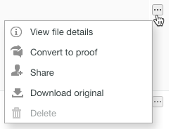

# [!DNL Workfront Proof]에서 파일 관리

>[!IMPORTANT]
>
>이 문서는 독립 실행형 제품 [!DNL Workfront Proof]의 기능을 참조합니다. [!DNL Adobe Workfront] 내부의 증명에 대한 자세한 내용은 [증명](../../../review-and-approve-work/proofing/proofing.md)을 참조하십시오.

Workfront Proof에 업로드된 파일(증명이 아님)에 대한 정보를 관리, 공유 및 볼 수 있습니다([파일 및 웹 콘텐츠 업로드 [!DNL Workfront Proof]](../../../workfront-proof/wp-work-proofsfiles/create-proofs-and-files/upload-files-web-content.md) 참조).

1. 왼쪽 탐색 패널에서 **[!UICONTROL 보기]** 오른쪽에 있는 아래쪽 화살표를 클릭한 다음 드롭다운 메뉴에서 **[!UICONTROL 파일]**&#x200B;을 클릭합니다.

1. 파일에 대한 **[!UICONTROL 자세히]** 단추를 클릭한 다음 나타나는 메뉴에서 **[!UICONTROL 파일 세부 정보 보기]**&#x200B;를 클릭합니다.\
   \
   표시되는 창에서 파일에 대한 세부 정보를 보고 편집할 수 있습니다. 예를 들어 창 위쪽에 있는 파일 이름, 파일을 저장하는 [!DNL Workfront Proof] **폴더** 및 파일의 **소유자**&#x200B;를 변경할 수 있습니다.\
   

1. (선택 사항) 파일에 대한 편집 권한이 있는 경우 오른쪽 상단의 작업 버튼을 사용하여 파일을 관리하고 공유합니다.

* **[!UICONTROL 태그]**. 파일에 적용된 태그를 관리합니다.\
   \
   작업 단추 아래에서 파일에 적용된 모든 태그를 볼 수 있습니다. 옆에 있는 x를 클릭하여 원하지 않는 태그를 제거할 수 있습니다.\
   

* **[!UICONTROL 이동]**. 파일을 폴더로 구성합니다. 기존 폴더 간에 파일을 이동하거나 새 폴더에 배치할 수 있습니다.\
   

* **[!UICONTROL 공유]**. 다른 사람과 파일을 공유합니다. [!DNL Workfront Proof]이(가) 사용자 지정 메시지와 다운로드 링크가 포함된 전자 메일 알림을 받는 사람에게 보냅니다.\
   

* **[!UICONTROL 휴지통]**. 파일을 휴지통으로 이동하여 삭제할 수 있습니다. 휴지통을 비울 때까지 파일이 저장소 제한에 포함됩니다([휴지통 복원 및 비우기 [!DNL Workfront Proof]](../../../workfront-proof/wp-work-proofsfiles/manage-your-work/restore-and-empty-trash.md) 참조).\
   

* **[!UICONTROL 자세히]**. 이 드롭다운 목록에서 **[!UICONTROL 증명으로 변환]**&#x200B;을 클릭하여 파일에 대한 증명을 만들 수 있습니다([증명 생성 [!DNL Workfront Proof]](../../../workfront-proof/wp-work-proofsfiles/create-proofs-and-files/generate-proofs.md) 참조). 이 파일은 증명을 위한 파일 형식 요구 사항을 충족해야 합니다([지원되는 증명 파일 형식 및 크기 제한 개요](../../../review-and-approve-work/proofing/proofing-overview/supported-proofing-file-types.md) 참조). 파일 이름이 기존 증명의 이름과 일치하는 경우 [!DNL Workfront Proof]에서 해당 증명의 **[!UICONTROL 새 버전]**(으)로 파일을 변환할 수 있는 링크가 포함된 메시지를 표시합니다( 참조).\
   

  >[!TIP]
  >
  >다른 [!DNL Workfront Proof] 계정에서 공유되고 자신의 계정으로 업로드되지 않은 파일의 경우 Enterprise Plans에서만 변환할 수 있습니다.

  **[!UICONTROL 다운로드]**&#x200B;를 클릭하여 원본 파일을 컴퓨터에 다운로드할 수도 있습니다.

1. (선택 사항) **[!UICONTROL 공유 대상]** 섹션을 열어 파일을 공유한 사용자를 나열합니다.

   오른쪽의 **[!UICONTROL 자세히]** 아이콘을 사용하여 사용자를 **[!UICONTROL 메시지]** 또는 **[!UICONTROL 제거]**&#x200B;할 수 있습니다.

   

   이러한 사용자 중 한 명에게 메시지를 보내도록 선택하면 여러 메시지를 한 번에 보낼 수 있는 **[!DNL Message all]** 페이지가 나타납니다.

1. **[!UICONTROL 활동]** 섹션을 열어 시간, 날짜, 작업을 수행한 사용자를 포함하여 파일에 대한 모든 활동을 나열합니다. 활동에는 다음이 포함됩니다.

   * 업로드된 파일
   * 새 사람 추가됨
   * 제거된 사람
   * 파일 다운로드됨

1. **[!UICONTROL 메시지]** 섹션을 열어 사용자가 파일과 연결하여 보낸 메시지를 추적합니다. 오른쪽의 &quot;i&quot; 아이콘을 클릭하여 메시지 콘텐츠를 볼 수 있습니다.
