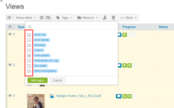

# 에서 태그 작성 및 관리 [!DNL Workfront Proof]

>[!IMPORTANT]
>
>이 문서는 독립형 제품의 기능을 참조합니다 [!DNL Workfront] 증명. 내부 교정에 대한 자세한 정보 [!DNL Adobe Workfront]를 참조하십시오. [교정](../../../review-and-approve-work/proofing/proofing.md).

태그를 만들고 편집하고 증명 및 파일에 적용할 수 있습니다. 이것은 여러분이 많은 다른 것을 가지고 있을 때 좋은 것입니다 [!DNL Workfront Proof] 프로젝트, 사업부, 클라이언트와 같은 항목을 식별하고 쉽게 찾을 수 있습니다.

목록 보기 페이지에서 새 증명, 새 파일, 새 버전 및 복사본에 태그를 적용할 수 있습니다.

>[!TIP]
>
>두 개 이상의 카테고리가 하나의 항목에 적용되는 경우 여러 태그를 사용하는 것이 유용할 수 있습니다. 항목에 무제한으로 태그를 적용할 수 있습니다.

프로필 및 권한 설정은 사용 가능한 태그 기능에 영향을 줍니다.

* 청구 관리자, 관리자 및 감독자는 이 페이지에 설명된 모든 기능을 사용할 수 있습니다.
* 관리자는 항목에 대해서만 태그를 만들고 편집할 수 있습니다.
* 옵저버 캐논은 항목에 대한 태그를 적용하거나 편집하지만, 다른 사용자가 항목에 적용한 태그를 볼 수 있으며, 개인 설정에서 태그 탭을 볼 수 있습니다.

이러한 프로필 및 권한에 대한 자세한 내용은 [증명 권한 프로필 [!DNL Workfront Proof]](../../../workfront-proof/wp-acct-admin/account-settings/proof-perm-profiles-in-wp.md).

## 계정에서 태그 만들기, 편집 또는 삭제

1. 클릭 **[!UICONTROL 설정]** > **[!UICONTROL 개인 설정]**.

1. 를 엽니다. **[!UICONTROL 태그]** 탭의 상단 **[!UICONTROL 개인 설정]** 페이지.\
   다음 중 하나를 수행하십시오.

   * 태그를 만들려면 **[!UICONTROL 새 태그]**&#x200B;를 입력한 후 태그 이름을 입력한 다음 키를 누릅니다 **[!UICONTROL Enter 키]**.\

      태그 이름에는 영숫자 및 30자 이하의 숫자를 포함해야 합니다.\
      기존 태그를 편집하려면 태그 이름을 클릭하고 새 텍스트를 입력한 다음 키를 누릅니다 **[!UICONTROL Enter 키]**.

   * 태그를 삭제하려면, 태그가 나열된 행 끝에 있는 휴지통 아이콘을 클릭합니다.

## 태그에 대한 정보 보기

1. 클릭 **[!UICONTROL 설정]** > **[!UICONTROL 개인 설정]**.

1. 를 엽니다. **[!UICONTROL 태그]** 탭의 상단 **[!UICONTROL 개인 설정]** 페이지.\
   다음 **[!UICONTROL 태그]** 탭에서는 태그에 대한 다음 정보를 제공합니다.

   * **이름**
   * **총 항목 수** 태그에 적용된
   * **볼 수 있는 권한이 있는 항목** 태그가 적용된 대상

1. (선택 사항) 특정 태그가 적용된 모든 항목을 보려면 해당 태그 아래의 숫자를 클릭합니다 **볼 수 있는 권한이 있는 항목**.\
   표시되는 검색 결과 페이지에는 태그가 적용되는 항목을 볼 수 있는 모든 항목이 나열됩니다.

## 하나 이상의 항목에 대한 태그 만들기

1. 목록 보기 또는 대시보드에서 태그를 만들거나 관리할 항목을 선택합니다.
1. 클릭 **[!UICONTROL 태그]** > **[!UICONTROL 새 태그]** 목록 바로 위에 태그 이름을 입력한 다음 **[!UICONTROL 만들기]**.

1. 새 태그를 선택한 다음 **[!UICONTROL 태그 추가]**.

## 하나 이상의 항목에 대한 태그 관리

1. 목록 보기 또는 대시보드에서 태그를 만들거나 관리할 항목을 선택합니다.
1. 클릭 **[!UICONTROL 태그]** > **[!UICONTROL 태그 관리]** 목록 바로 위에 있습니다.

1. 설정 [!UICONTROL 태그] 표시되는 탭에서는 [탭 생성, 편집 또는 삭제](https://support.workfront.com/knowledge/articles/115004379508/en-us?brand_id=662728&amp;return_to=%2Fhc%2Fen-us%2Farticles%2F115004379508#CreatingEditingDeletingTag)\
   태그 옆에 있는 확인란에 있는 확인란이 어두운 회색으로 표시되면 선택한 모든 항목에 태그가 적용됩니다. 밝은 회색이면 선택한 배치에 있는 일부 항목만 태그로 지정됩니다. 선택한 모든 항목에서 태그를 제거하려면 태그 옆에 있는 확인 표시가 비어 있는지 확인하십시오.\
   

## 증명 세부 정보나 파일 세부 정보에서 태그 관리

증명 또는 파일에 적용된 태그는 증명 세부 정보 페이지와 파일 세부 정보 페이지에 각각 표시됩니다. 이 페이지에서 태그를 보고 변경하고 제거할 수 있습니다. 자세한 내용은 [의 증명 세부 정보 관리 [!DNL Workfront Proof]](../../../workfront-proof/wp-work-proofsfiles/manage-your-work/manage-proof-details.md) 및 [의 파일 관리 [!DNL Workfront Proof]](../../../workfront-proof/wp-work-proofsfiles/manage-your-work/manage-files.md).

1. 다음에 설명된 대로 증명을 위한 증명 세부 정보 페이지를 엽니다. [의 증명 세부 정보 관리 [!DNL Workfront Proof]](../../../workfront-proof/wp-work-proofsfiles/manage-your-work/manage-proof-details.md).\
   또는\
   다음에 설명된 대로 파일에 대한 [파일 세부 정보] 페이지를 엽니다. [의 파일 관리 [!DNL Workfront Proof]](../../../workfront-proof/wp-work-proofsfiles/manage-your-work/manage-files.md).\
   항목에 적용된 모든 태그는 오른쪽 상단 모서리 근처에 나타납니다.\
   

1. (선택 사항) 증명 또는 파일에서 태그를 제거하려면 태그 옆에 있는 x를 클릭합니다.
1. 오른쪽 위 모서리에서 을(를) 클릭합니다. **[!UICONTROL 태그]**.\
   

1. 표시되는 상자에서 항목에 적용할 태그를 선택하거나 제거할 태그를 선택 취소한 다음 **[!UICONTROL 태그 추가]**.

## 태그 이름을 사용하여 항목 검색

항목에 적용되는 태그의 이름을 사용하여 항목을 검색할 수 있습니다.항목을 공유하면 같은 방식으로 해당 항목을 검색할 수 있습니다.태그를 적용한 모든 항목 목록을 보려면 다음을 수행하십시오.

1. 목록 보기 또는 대시보드에서 **[!UICONTROL 태그]** 왼쪽 사이드바에서 탭을 클릭한 다음 나타나는 태그 목록에서 태그를 클릭합니다.\
   \
   태그 이름이 의 오른쪽 위 모서리에 있는 검색 필드에 나타납니다 [!DNL Workfront Proof]. 추가 태그를 선택하거나 검색 필드에 추가 키워드를 입력하여 검색을 개선할 수 있습니다. 태그 이름 옆에 있는 x 아이콘을 클릭하여 검색 필드에서 태그를 제거할 수 있습니다.
