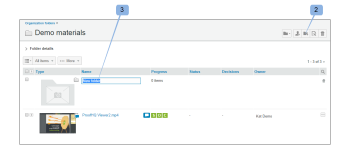

# 에서 폴더 만들기 [!DNL Workfront Proof]

>[!IMPORTANT]
>
>이 문서는 독립 실행형 제품의 기능에 대해 설명합니다 [!DNL Workfront Proof]. 내부 교정에 대한 정보 [!DNL Adobe Workfront], 참조 [증명](../../../review-and-approve-work/proofing/proofing.md).

## 새 최상위 폴더 만들기 {#creating-a-new-top-level-folder}

1. 사이드바에서 녹색 옆에 있는 드롭다운 화살표 (1) 를 클릭합니다 **[!UICONTROL 새 증명]** 단추를 클릭합니다.
1. 선택 **[!UICONTROL 새 폴더]**. (2)\
   다음 [!UICONTROL 새 폴더] 페이지가 표시됩니다.

1. 계속 [새 폴더 구성](#configuring-the-new-folder).\
   

## 새 하위 폴더 만들기 {#creating-a-new-sub-folder}

다음 방법 중 하나로 하위 폴더를 만들 수 있습니다.

* [폴더 세부 정보 페이지에서 하위 폴더 만들기](#creating-a-sub-folder-from-the-folder-details-page)
* [계정 폴더 페이지에서 하위 폴더 만들기](#creating-a-sub-folder-from-the-account-folders-page)

>[!NOTE]
>
>새 하위 폴더를 만들 때 공유 목록은 상위 폴더에서 상속됩니다.

### 에서 하위 폴더 만들기 [!UICONTROL 폴더 세부 정보] 페이지 {#creating-a-sub-folder-from-the-folder-details-page}

에 대한 자세한 내용은 [!UICONTROL 폴더 세부 정보] 페이지, 참조 [Workfront Proof에서 폴더 및 해당 컨텐츠 관리](../../../workfront-proof/wp-work-proofsfiles/organize-your-work/manage-folders-and-contents.md).

에서 하위 폴더를 만들려면 [!UICONTROL 폴더 세부 정보] 페이지:

1. 사이드바에서 폴더 이름을 클릭합니다. [!UICONTROL 내 폴더] 폴더 세부 정보 페이지에 액세스하기 위한 목록 (1)

1. 페이지 상단에 있는 새 하위 폴더 단추(2)를 클릭합니다.\
   폴더의 항목 목록에 새 폴더가 나타납니다.
1. 새 하위 폴더의 이름을 입력합니다. (3)
1. 누르기 **[!UICONTROL 입력]**.\
   또는\
   폴더 이름 필드 외부를 클릭합니다.

1. (선택 사항) 폴더 세부 정보 페이지에서 새 하위 폴더의 세부 정보를 편집합니다.
1. 계속 [새 폴더 구성](#configuring-the-new-folder).

### 계정 폴더 페이지에서 하위 폴더 만들기 {#creating-a-sub-folder-from-the-account-folders-page}

1. 클릭 [계정 이름] 계정 폴더 페이지에 액세스하기 위한 사이드바의 폴더 (1)\
   

1. 하위 폴더를 추가할 폴더를 찾아 [!UICONTROL 작업] 메뉴 (2)
1. 선택 [!UICONTROL 새 하위 폴더] 메뉴에서(3)\
   다음 [!UICONTROL 새 폴더] 페이지가 표시됩니다.
1. 계속 [새 폴더 구성](#configuring-the-new-folder).

## 새 폴더 구성 {#configuring-the-new-folder}

다음 중 하나에 설명된 대로 새 폴더를 만들기 시작합니다. [새 최상위 폴더 만들기](#creating-a-new-top-level-folder) 또는 [새 하위 폴더 만들기](#creating-a-new-sub-folder)) 이 섹션에 설명된 대로 구성 옵션을 설정할 수 있습니다.

* [탐색 표시](#breadcrumb-navigation) (1)
* [폴더 세부 정보](#folder-details) (2)
* [클라이언트 세부 정보](#client-details) (3)
* [공유](#share) (4)

### 탐색 표시 {#breadcrumb-navigation}

이동 경로 탐색은 최상위 폴더 또는 하위 폴더를 만드는지 보여 줍니다. (1)

### 폴더 세부 정보 {#folder-details}

이 섹션에서는 생성 중인 폴더에 다음 정보를 추가(및 확인)할 수 있습니다.

* 폴더 이름 - 이 필드는 필수 필드입니다(1).
* 클릭 [!UICONTROL 목록 보기] 링크 (2) 이 폴더가 공유되는 사람 목록이 표시됩니다. 이 정보는 하위 폴더가 상위 폴더와 동일한 사람과 자동으로 공유되므로 하위 폴더를 만들 때 특히 유용합니다.
* 설명 (3) - 여기에서 폴더에 대한 간단한 설명을 추가할 수 있습니다. 이 설명은 폴더 세부 정보 페이지에 표시됩니다.
* 폴더 비공개로 설정 (4) - 상자를 선택하면 이 폴더가 비공개로 설정됩니다(이 폴더는 명시적으로 폴더를 공유하는 사용자와 프로필이 있는 계정의 사용자만 볼 수 있음). [에서 증명 권한 프로필 [!DNL Workfront Proof]](../../../workfront-proof/wp-acct-admin/account-settings/proof-perm-profiles-in-wp.md), [에서 증명 권한 프로필 [!DNL Workfront Proof]](../../../workfront-proof/wp-acct-admin/account-settings/proof-perm-profiles-in-wp.md) 또는 [에서 증명 권한 프로필 [!DNL Workfront Proof]](../../../workfront-proof/wp-acct-admin/account-settings/proof-perm-profiles-in-wp.md) ). 다음을 참조하십시오. [의 폴더 권한 이해 [!DNL Workfront Proof]](../../../workfront-proof/wp-work-proofsfiles/organize-your-work/folder-permissions.md) Workfront Proof에서 개인 및 공용 폴더에 대해 자세히 알아봅니다.

### 클라이언트 세부 정보 {#client-details}

이 섹션에서 클라이언트의 세부 정보를 입력할 수 있습니다. 이를 통해 클라이언트/프로젝트 이름별로 내 폴더 페이지를 정렬할 수 있습니다.

* 클라이언트 이름(1)
* 프로젝트 이름 (2)

### 공유 {#share}

다음에서 [!UICONTROL 공유] 섹션에서 다음 작업을 수행할 수 있습니다.

* 폴더의 새 소유자 할당 (1) - 폴더 생성자는 폴더에 나열된 상태로 유지되며 제거할 수 없습니다. 단, 계정의 다른 사용자에게 폴더에 대한 편집 권한을 부여할 소유자를 지정할 수 있습니다.
* 다른 사용자와 폴더 공유 [!DNL Workfront Proof] 이메일 주소를 입력하여 사용자(2) - 폴더는 자신의 소유자만 공유할 수 있습니다. [!DNL Workfront Proof] 로그인합니다.
* 폴더를 공유하는 사람들의 권한을 설정합니다(3). 이 기능은 계정의 사용자와 개인 폴더를 공유할 때 유용합니다. [에서 증명 권한 프로필 [!DNL Workfront Proof]](../../../workfront-proof/wp-acct-admin/account-settings/proof-perm-profiles-in-wp.md) 프로필에서 폴더의 항목을 만들고, 편집하고, 삭제할 수 있어야 합니다.
* 사용자 이름 오른쪽에 있는 휴지통 아이콘(4)을 클릭하여 폴더 공유 목록에서 사용자를 제거합니다.
* 맨 위 휴지통 아이콘(5)을 클릭하여 폴더 공유 목록에서 모든 사람을 제거합니다. 폴더의 생성자 또는 소유자를 제거할 수 없습니다.

다음 항목도 참조하십시오. [에서 폴더 공유 [!DNL Workfront Proof]](../../../workfront-proof/wp-work-proofsfiles/organize-your-work/share-folders.md).

