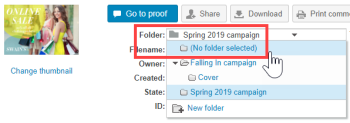

# [!DNL Workfront Proof]에서 폴더 및 해당 콘텐츠 관리

>[!IMPORTANT]
>
>이 문서는 독립 실행형 제품 [!DNL Workfront Proof]의 기능을 참조합니다. [!DNL Adobe Workfront] 내부의 증명에 대한 자세한 내용은 [증명](../../../review-and-approve-work/proofing/proofing.md)을 참조하십시오.

프로젝트 및 증명을 폴더로 구성할 때 얻을 수 있는 이점 중 하나는 [!UICONTROL 폴더 세부 정보] 페이지에서 프로젝트 및 증명을 관리할 수 있다는 것입니다. 이 페이지는 프로젝트의 제어 센터입니다. 여기에서 개별 증명 및 파일을 편리하게 관리하고 대량 작업을 수행할 수 있습니다.

## 검토자가 함께 작업할 수 있도록 항목 그룹화

폴더를 사용하여 검토자가 함께 작업할 증명을 그룹화할 수 있습니다. 검토자가 폴더에서 증명 중 하나를 열어 증명 뷰어를 시작하면 폴더의 다른 모든 증명을 사용할 수 있습니다. 검토자는 증명 뷰어를 종료하지 않고 폴더의 모든 증명에 대해 작업할 수 있습니다. 자세한 내용은 [증명 뷰어에서 여러 증명 작업](../../../workfront-proof/wp-work-proofsfiles/review-proofs-wpv/work-with-multiple-proofs.md)을 참조하십시오.

## 폴더에 새 항목 추가

증명을 만들거나 파일을 업로드할 때 [!UICONTROL 새 증명] 페이지 또는 [!UICONTROL 새 파일] 페이지의 [!UICONTROL 구성] 섹션에 저장할 폴더를 선택할 수 있습니다.

자세한 내용은 [증명 생성 [!DNL Workfront Proof]](../../../workfront-proof/wp-work-proofsfiles/create-proofs-and-files/generate-proofs.md) 또는 [파일 및 웹 콘텐츠 업로드 [!DNL Workfront Proof]](../../../workfront-proof/wp-work-proofsfiles/create-proofs-and-files/upload-files-web-content.md)를 참조하십시오.

>[!NOTE]
>
>현재 새 항목을 추가할 폴더를 보고 있는 경우 새 증명 페이지나 [!UICONTROL 새 파일] 페이지를 열면 해당 폴더가 [!UICONTROL 구성] 섹션에 자동으로 표시됩니다.

## 폴더에 기존 항목 추가

폴더에 기존 파일 또는 증명을 추가할 수 있습니다.

자세한 내용은 [파일 관리 [!DNL Workfront Proof]](../../../workfront-proof/wp-work-proofsfiles/manage-your-work/manage-files.md) 또는 [Workfront Proof에서 증명 세부 정보 관리](../../../workfront-proof/wp-work-proofsfiles/manage-your-work/manage-proof-details.md)를 참조하십시오.

1. (조건부) 다음 중 하나를 수행합니다.

   * 폴더에 증명을 추가하는 경우  [!DNL Workfront Proof]](../../../workfront-proof/wp-work-proofsfiles/manage-your-work/manage-proof-details.md)의 [[!UICONTROL 증명 세부 정보 관리]에 설명된 대로 [!UICONTROL 증명 세부 정보] 페이지로 이동합니다.
   * 폴더에 파일을 추가하는 경우 [파일 관리 [!DNL Workfront Proof]](../../../workfront-proof/wp-work-proofsfiles/manage-your-work/manage-files.md)에 설명된 대로 [파일 세부 정보] 페이지로 이동하십시오.&quot;

1. 파일이나 증명이 있는 **폴더**&#x200B;의 이름을 클릭한 다음 이동할 폴더의 이름을 클릭합니다.\
   

## 폴더 밖으로 항목 이동

1. (조건부) 다음 중 하나를 수행합니다.

   * 폴더에서 증명을 이동하는 경우  [!DNL Workfront Proof]](../../../workfront-proof/wp-work-proofsfiles/manage-your-work/manage-proof-details.md)의 [[!UICONTROL 증명 세부 정보 관리]에 설명된 대로 [!UICONTROL 증명 세부 정보] 페이지로 이동합니다\

     또는\
      폴더에서 파일을 이동하고 있는 경우 [파일 관리 [!DNL Workfront Proof]](../../../workfront-proof/wp-work-proofsfiles/manage-your-work/manage-files.md)에 설명된 대로 파일 세부 정보 페이지로 이동하십시오.&quot;

1. 파일 또는 증명이 있는 **폴더**&#x200B;의 이름을 클릭한 다음 **[!UICONTROL 이동]** > **[!UICONTROL (선택한 폴더 없음)]**&#x200B;을 클릭합니다.\
   

## [!UICONTROL 폴더 세부 정보] 페이지에서 폴더 및 해당 항목 관리

[!UICONTROL 폴더 세부 정보] 페이지에서 파일을 쉽게 관리할 수 있습니다.

>[!NOTE]
>
>파일 작성자 또는 소유자가 아닌 경우 사용 가능한 옵션은 사용자 [의 증명 권한 프로필 [!DNL Workfront Proof]](../../../workfront-proof/wp-acct-admin/account-settings/proof-perm-profiles-in-wp.md)에 따라 다릅니다.

1. 왼쪽 탐색 메뉴의 **[!UICONTROL 폴더]** 탭에서 폴더를 클릭하여 [!UICONTROL 폴더 세부 정보] 페이지를 엽니다.
1. 폴더에 보관된 증명만 있는 경우 페이지 상단에 노란색으로 메시지가 표시됩니다. 메시지에서 링크를 클릭하면 폴더 보기가 [!UICONTROL 보관된 증명] 보기로 변경됩니다.
1. **[!UICONTROL 폴더 정보]**&#x200B;를 클릭한 다음 표시되는 옵션을 사용하여 폴더에 대해 다음 중 하나를 수행합니다.

   * 폴더의 썸네일 이미지를 추가하거나 변경합니다.
   * 폴더와 연결된 **설명**, **상위 폴더**, **소유자**, **클라이언트** 또는 **프로젝트**&#x200B;를 보거나 편집합니다.

   * 폴더를 **개인**(으)로 만듭니다.
   * 폴더가 **생성됨**&#x200B;인 시기를 확인합니다.
   * 폴더의 **작성자** 이름을 확인하세요.

1. (선택 사항)폴더의 항목과 연결된 정보를 변경하려면 항목 오른쪽에 있는 **[!UICONTROL 자세히]** 아이콘을 클릭한 다음 표시되는 옵션을 사용하십시오.\
   \
   표시되는 옵션은 항목이 증명인지 아니면 파일인지에 따라 다릅니다.

   * **[!UICONTROL 증명 세부 정보 보기]** 또는 **[!UICONTROL 파일 세부 정보 보기]**: 증명 세부 정보 또는 파일 세부 정보 페이지를 엽니다. 자세한 내용은 [파일 관리 [!DNL Workfront Proof]](../../../workfront-proof/wp-work-proofsfiles/manage-your-work/manage-files.md) 또는 [증명 세부 정보 관리 [!DNL Workfront Proof]](../../../workfront-proof/wp-work-proofsfiles/manage-your-work/manage-proof-details.md)를 참조하십시오.

   * **[!UICONTROL 공유]**: 다른 사용자와 파일을 공유할 수 있습니다. 자세한 내용은 [Workfront Proof에서 파일 공유]](../../../workfront-proof/wp-work-proofsfiles/share-proofs-and-files/share-files.md)를 참조하십시오.[!UICONTROL 

   * **[!UICONTROL 메시지]**: 증명을 공유한 사람에게 전자 메일을 보냅니다.
   * **[!UICONTROL 새 버전]**: 증명의 새 버전을 만듭니다.
   * **[!UICONTROL 복사]**: 증명 댓글이 있는 증명을 기존 증명의 새 버전 또는 새 증명으로 복사합니다.
   * **[!UICONTROL 원본 다운로드]**: 원본 파일을 다운로드할 수 있습니다. 자세한 내용은 [저장된 파일 다운로드 [!DNL Workfront Proof]](../../../workfront-proof/wp-work-proofsfiles/manage-your-work/download-files-stored.md)를 참조하십시오.

   * **[!UICONTROL 소유권 위임]**: 다른 사용자에게 증명의 소유권을 위임합니다.
   * **[!UICONTROL 증명 링크 공유]**: 증명에 대한 링크가 포함된 전자 메일을 보냅니다.
   * **[!UICONTROL 댓글 인쇄]**: 검토자가 증명에서 작성한 댓글을 인쇄합니다.
   * **[!UICONTROL Excel 요약]**: 증명에 대한 인쇄 요약이 포함된 Excel 파일을 만듭니다.
   * **[!UICONTROL 잠금]**: 다른 사용자가 열 수 없도록 증명을 잠급니다.
   * **[!UICONTROL 삭제]**: [!DNL Workfront] 증명에서 파일을 삭제합니다.

1. (선택 사항) **[!UICONTROL 다음 사용자와 공유]** 섹션에서 증명 검토자에게 미리 알림을 보내려면 사용자 이름 오른쪽에 있는 **[!UICONTROL 자세히]** 아이콘을 클릭한 다음 **[!UICONTROL 메시지]**&#x200B;를 클릭합니다.\
   **[!UICONTROL 제거]**&#x200B;를 클릭하여 사용자와의 폴더 공유를 해제할 수 있습니다.\
   폴더의 소유자 및 작성자는 항상 이 목록에 표시되며 제거할 수 없습니다. 사용자가 폴더의 소유권을 인수하면 폴더가 자동으로 나타나고 제거될 수 없습니다.\
   개별 사용자 및 파트너 회사와 폴더를 공유할 수 있습니다. 폴더가 파트너 회사와 공유되어 있는 경우 해당 행을 마우스로 가리키면 표시되는 [!UICONTROL 정보] 아이콘을 클릭하여 받는 사람의 전체 목록을 볼 수 있습니다. 자세한 내용은 [파트너 계정](https://support.workfront.com/hc/en-us/sections/115000912107-Partner-accounts)을 참조하세요.

1. (선택 사항) **[!UICONTROL 폴더 허용]**&#x200B;에서 해당 사용자의 줄을 클릭한 다음 해당 사용자가 해당 폴더에서 항목을 만들고 편집하고 삭제할 수 있도록 할지 지정하여 개인 폴더에 대한 관리자의 권한을 편집합니다. **참고** 이 옵션은 개인 폴더에 추가된 폴더 소유자와 동일한 계정의 관리자에게만 사용할 수 있습니다. 관리자, 관리자 및 청구 관리자는 계정의 모든 폴더에 대한 편집 권한을 가지며 관찰자는 항목을 생성할 수 없습니다. 권한에 대한 자세한 내용은 [증명 권한 프로필 [!DNL Workfront Proof]](../../../workfront-proof/wp-acct-admin/account-settings/proof-perm-profiles-in-wp.md)을 참조하세요.

1. (선택 사항) 폴더에서 수행된 모든 작업을 시간 순서대로 보려면 **[!UICONTROL 활동]**&#x200B;을 클릭하십시오.
1. (선택 사항) 폴더의 사용자에게 보낸 메시지를 보려면 **[!UICONTROL 메시지]** 섹션을 클릭합니다.\
   메시지 위로 마우스를 가져가면 오른쪽에 있는 **i** 아이콘을 클릭하여 전체 메시지를 볼 수 있습니다.\
   \
   전체 이메일이 포함된 팝업이 표시됩니다.\
   

## 하위 폴더 관리

폴더 세부 정보 페이지에서 하위 폴더를 관리할 수 있습니다.

1. 왼쪽 탐색 메뉴의 **[!UICONTROL 폴더]** 탭에서 하위 폴더가 포함된 상위 폴더의 이름을 클릭하여 **[!UICONTROL 폴더 세부 정보]** 페이지를 엽니다.

1. 하위 폴더 오른쪽에 있는 **[!UICONTROL 자세히]** 메뉴를 클릭합니다.\
   

1. 다음 중 하나를 클릭합니다.

   * **[!UICONTROL 폴더 세부 정보 보기]**: [!UICONTROL 폴더 세부 정보] 페이지를 엽니다.
   * **[!UICONTROL 새 증명]**: 하위 폴더에 새 증명을 추가할 수 있습니다.
   * **[!UICONTROL 파일 업로드]**: 하위 폴더에 파일을 업로드할 수 있습니다.
   * **[!UICONTROL 새 하위 폴더]**: 하위 폴더 내에 새 하위 폴더를 만듭니다.
   * **[!UICONTROL 공유]**: 하위 폴더를 다른 사용자와 공유할 수 있도록 해줍니다.
   * **[!UICONTROL Excel 요약]**: 하위 폴더의 Excel 요약을 요청할 수 있습니다.
   * **[!UICONTROL 삭제]**: 하위 폴더를 삭제할 수 있습니다.
