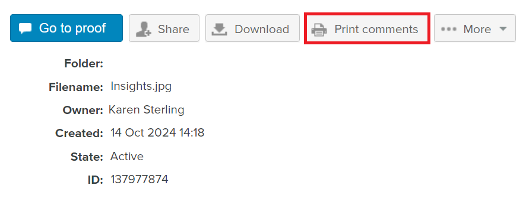

# 주석 인쇄 및 내보내기 [!DNL Workfront Proof]

>[!IMPORTANT]
>
>이 문서는 독립 실행형 제품의 기능에 대해 설명합니다 [!DNL Workfront Proof]. 내부 교정에 대한 정보 [!DNL Adobe Workfront], 참조 [증명](../../../review-and-approve-work/proofing/proofing.md).

## 주석 인쇄

의견 요약은 다음 영역에서 바로 액세스할 수 있습니다.

* [증명 뷰어](#the-proof-viewer)
* [증명 세부 정보 페이지](#the-proof-details-page)
* [다음 [!DNL Proof] 작업 메뉴](#the-proof-actions-menu)

### 증명 뷰어 {#the-proof-viewer}

썸네일이나 전체 보기 이미지를 포함한 증명의 설명 요약을 클릭하여 인쇄할 수 있습니다. **[!UICONTROL 인쇄]** 아이콘 을 클릭하여 증명 뷰어에서 확인할 수 있습니다. (1)

### 증명 세부 정보 페이지 {#the-proof-details-page}

다음을 클릭하여 증명의 댓글 요약을 인쇄할 수 있습니다. **[!UICONTROL 인쇄]** (증명 세부 정보 페이지의 아이콘) (2)

### 다음 [!DNL Proof] 작업 메뉴 {#the-proof-actions-menu}

다음을 클릭하여 증명의 댓글 요약을 인쇄할 수 있습니다. **[!UICONTROL 인쇄]** 아이콘 [!UICONTROL 증명 작업] 메뉴 아래의 제품에서 사용할 수 있습니다.

에 액세스하려면 [!UICONTROL 댓글 요약] 목록 보기의 페이지:

1. 을(를) 클릭합니다 **[!UICONTROL 작업]** 메뉴 아래의 제품에서 사용할 수 있습니다. (3)
1. 선택 **[!UICONTROL 댓글 인쇄]**. (4)

\
설명 요약 페이지에서 다음과 같은 인쇄 옵션을 선택할 수 있습니다.

* 썸네일 보기(1)
* 전체 페이지 보기 (2)
* 페이지 인쇄 (3)
* 댓글이 포함된 증명을 PDF 파일로 내보내기(4)
* 증명 주석을 다음으로 내보내기 [!DNL Excel] 파일 (5)

### 썸네일 보기

썸네일 보기에는 각 댓글에 대한 전체 스레드와 함께 각 댓글이 순서대로 표시됩니다. 주석을 정렬하고 Markups가 추가된 각 주석에 대한 썸네일을 볼 수도 있습니다.

축소판 보기를 인쇄하려면 **[!UICONTROL 프린터]** 아이콘을 클릭하고 다음 중 하나를 선택합니다.

* 댓글 ID 또는 페이지 (1)로 정렬
* 마크업이 추가된 각 댓글에 대한 썸네일(2)

### 전체 페이지 보기

전체 페이지 보기에는 각 페이지가 순서대로 표시되며, 해당 페이지에 있는 주석과 해당 주석의 마크업이 있는 위치를 나타내는 핀이 표시됩니다.

전체 페이지 보기를 인쇄하려면 **[!UICONTROL 프린터]** 페이지의 오른쪽 상단 모서리에 있는 아이콘

## 내보내기 [!DNL Excel] 요약

다운로드하려면 [!DNL Excel] 요약:

1. 증명의 오른쪽에 있는 증명의 작업 메뉴를 연 다음 **[!UICONTROL [!DNL Excel]요약]**. (1)\
   

다운로드하려면 [!DNL Excel] 증명 세부 정보 페이지의 요약:

1. 내보내기 대상 클릭 **[!DNL Excel]** 아이콘. (2)
1. 

## PDF으로 내보내기

모든 마크업 및 주석과 함께 증명을 PDF으로 내보내려면 다음 단계를 수행합니다.

1. 다음으로 이동 **[!UICONTROL 보기]** 화면의 왼쪽에 있습니다.
1. 다음을 클릭합니다. **[!UICONTROL 자세히]** 아이콘과 증명을 인라인으로 연결한 다음 **[!UICONTROL 댓글 인쇄]**.

1. 페이지의 오른쪽 상단에 있는 PDF으로 내보내기 아이콘을 클릭합니다.

   PDF이 준비되면 다운로드 링크가 포함된 이메일을 받게 됩니다.

모든 주석이 PDF 판독기에 표시됩니다. 주석에 연결된 마크업이 여러 개 있는 경우 주석은 주석 목록에 여러 번(마크업마다 한 번) 표시됩니다.

>[!IMPORTANT]
>
>PDF으로 내보내기 기능은 정적 파일에만 사용할 수 있습니다.
