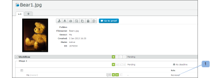

# 에서 증명 역할 관리 [!DNL Workfront Proof]

<!-- Audited: 01/2024 -->

>[!IMPORTANT]
>
>이 문서는 독립 실행형 제품의 기능에 대해 설명합니다 [!DNL Workfront Proof]. 내부 교정에 대한 정보 [!DNL Adobe Workfront], 참조 [증명](../../../review-and-approve-work/proofing/proofing.md).

증명 역할을 사용하면 사용자 프로필에 구성된 권한 프로필에 의해 제한된 사용자에게 권한을 부여할 수 있습니다. 권한 프로필에 대한 자세한 내용은 [에서 증명 권한 프로필 [!DNL Workfront Proof]](../../../workfront-proof/wp-acct-admin/account-settings/proof-perm-profiles-in-wp.md).)

증명 역할이 계정 프로필과 다릅니다. 계정 프로필은 계정에 있는 전체 권한 수준과 관련이 있으며, 사용자와 명시적으로 공유되지 않은 모든 증명에 대한 권한에 영향을 미칩니다.

자세한 내용은 [에서 증명 권한 프로필 [!DNL Workfront Proof]](../../../workfront-proof/wp-acct-admin/account-settings/proof-perm-profiles-in-wp.md).

## 증명 역할 정보

다음 증명 역할은 사용자가 증명을 검토하도록 초대될 때 개별 증명에 대한 사용자에게 부여됩니다.

* [읽기 전용](#read-only)
* [검토자](#reviewer)
* [승인자](#approver)
* [검토자 및 승인자](#reviewer-approver)
* [작성자](#author)
* [중재자](#moderator)

증명 역할은 검토자가 해당 특정 증명과 관련하여 취할 수 있는 작업을 정의합니다.

예를 들어 검토자인 경우 마크업과 주석을 추가하여 증명을 검토하라는 메시지가 표시됩니다. 검토자 및 승인자인 경우 증명에 대한 검토 및 결정을 요청 받습니다.

특정 증명 역할은 검토자에게 증명에 대한 편집 권한을 부여하고(계정 프로필이 그렇지 않은 경우에도) 댓글에 작업을 추가하고, 새 버전을 만들고, 증명에 검토자를 더 추가하는 것과 같은 몇 가지 추가 기능을 사용할 수 있도록 합니다.

자세한 내용은 다음 문서를 참조하십시오.

* [증명 댓글에 작업 사용](../../../review-and-approve-work/proofing/reviewing-proofs-within-workfront/comment-on-a-proof/use-actions-on-comments-in-viewer.md)
* [에서 증명 공유 [!DNL Workfront Proof]](../../../workfront-proof/wp-work-proofsfiles/share-proofs-and-files/share-proof.md)

### 읽기 전용

{#read-only}

 증명 보기 가능

 마크업을 추가할 수 없음

 주석을 추가할 수 없음

 결정을 내릴 수 없음

 다른 사용자가 작성한 댓글은 삭제할 수 없음

 증명에 대한 편집 권한이 없습니다.

>[!NOTE]
>
>폴더를 다음 사용자와 공유하는 경우: [!DNL Workfront Proof], 폴더에 있는 기존 항목 및 이후에 추가된 모든 항목에 대한 읽기 전용 권한이 자동으로 부여됩니다.

자세한 내용은 [에서 폴더 공유 [!DNL Workfront Proof]](../../../workfront-proof/wp-work-proofsfiles/organize-your-work/share-folders.md).

### 검토자 {#reviewer}

 증명 보기 가능

 마크업을 추가할 수 있음

 주석을 추가할 수 있음

![[!DNL cleaner].png](assets/cleaner.png) 답글이 없는 경우 자신의 의견을 편집할 수 있음

 결정을 내릴 수 없음

 다른 사용자가 작성한 댓글을 편집하거나 삭제할 수 없음

 증명에 대한 편집 권한이 없습니다.

### 승인자 {#approver}

 증명 보기 가능

 의사 결정 가능

 마크업을 추가할 수 없음

 주석을 추가할 수 없음

 다른 사용자가 작성한 댓글을 편집하거나 삭제할 수 없음

 증명에 대한 편집 권한이 없습니다.

### 검토자 및 승인자 {#reviewer-approver}

 증명 보기 가능

 마크업을 추가할 수 있음

 주석을 추가할 수 있음

![[!DNL cleaner].png](assets/cleaner.png) 답글이 없는 경우 자신의 의견을 편집할 수 있음

 의사 결정 가능

 다른 사용자가 작성한 댓글을 편집하거나 삭제할 수 없음

 증명에 대한 편집 권한이 없습니다.

### 작성자 {#author}

 마크업을 추가할 수 있음

 주석을 추가할 수 있음

![[!DNL cleaner].png](assets/cleaner.png) 답글이 없는 경우 자신의 의견을 편집할 수 있음

 의사 결정 가능

 새 버전을 제출할 수 있음

 증명의 복사본을 만들 수 있음

 다른 사용자와 증명 공유 가능

 댓글에 작업을 적용할 수 있음

 댓글 확인 가능

 다른 사용자가 작성한 댓글을 편집하거나 삭제할 수 없음

>[!NOTE]
>
>이 역할은 다음의 사용자에게만 할당할 수 있습니다. [!DNL Workfront Proof].

### 중재자 {#moderator}

 마크업을 추가할 수 있음

 주석을 추가할 수 있음

![[!DNL cleaner].png](assets/cleaner.png) 답글이 없는 경우 자신의 의견을 편집할 수 있음

 의사 결정 가능

 새 버전을 제출할 수 있음

 새 검토자를 추가할 수 있음

 댓글에 작업을 적용할 수 있음

 댓글 확인 가능

 증명에서 댓글 및 답글 삭제 가능(본인 또는 다른 사용자가 작성)

* 댓글 스레드에서 첫 번째 주석을 삭제하면 전체 스레드가 삭제됩니다.
* 댓글 스레드에서 답글을 삭제하면 해당 답글만 삭제됩니다.

 다른 사용자가 작성한 댓글은 편집할 수 없음

이 역할을 통해 증명에 대한 주석을 관리하고 조정할 수 있으므로 증명에 대한 관련 주석만 유지하고 관련되지 않은 주석은 제거할 수 있습니다.

>[!NOTE]
>
>이 역할은 다음의 사용자에게만 할당할 수 있습니다. [!DNL Workfront Proof].

## 증명 역할 할당

새 증명을 만들거나, 기존 증명의 새 버전을 만들거나, 기존 증명에서 증명 역할을 할당할 수 있습니다.

### 새 증명 {#new-proofs}

증명 역할은 의 검토자에게 할당할 수 있습니다. [!UICONTROL 새 증명] 증명 생성 프로세스 중 페이지(1).

### 새 버전 {#new-versions}

새 증명 버전을 만들 때 이전 버전의 검토자가 자동으로 표시됩니다(이전 버전과 동일한 역할 사용).

새 버전(1)을 만들 때 검토자에게 적용되는 증명 역할을 편집할 수 있습니다.

### 기존 증명 {#existing-proofs}

기존 증명에서 개인의 역할을 변경하려는 경우 [!UICONTROL 증명 세부 정보] 워크플로우 섹션(1)에서 역할을 인라인 편집하여 페이지를 작성합니다.

## 증명 뷰어에서 역할 확인

증명 뷰어(1)에서 직접 검토자의 역할을 확인하고 필요한 경우 편집(2)할 수 있습니다.

## 기본 증명 역할

다음에서 기본 증명 역할을 설정할 수 있습니다. [!DNL Proofing Defaults] 개인 설정에서 페이지를 설정합니다. 즉, 증명에 추가되면 기본 증명 역할이 자동으로 채워집니다. 증명에 대한 편집 권한이 있는 사용자가 증명 수준에서 이 역할을 변경할 수 있습니다.

>[!NOTE]
>
>관리자 또는 청구 관리자 프로필이 있는 사용자만 계정의 다른 사용자에 대한 증명 기본값을 변경할 수 있습니다.

자세한 내용은 [의 개인 설정 [!DNL Workfront Proof]](../../../workfront-proof/wp-getstarted/personal-settings/personal-settings.md).

## 작성자 및 소유자

작성자 및 소유자는 증명에 대한 전체 편집 권한이 있습니다.

### 크리에이터 {#creators}

증명 작성자는 첫 번째 인스턴스에서 증명을 업로드하는 사람입니다. 증명 작성자가 증명의 사람 목록(기본 역할)에 자동으로 표시됩니다.

다음에서 [!UICONTROL 새 증명] 페이지 증명 작성자에게 기본 역할 이외의 다른 증명 역할을 할당할 수 있습니다.

증명 생성자는 증명에서 변경하거나 제거할 수 없습니다.

### 소유자 {#owners}

기본적으로 작성자는 증명의 소유자이기도 합니다. 그러나 처음 증명( )을 만들 때 작성자는 다른 사용자를 증명 소유자로 만들 수 있습니다. [!UICONTROL 새 증명] page).

새 증명 페이지에서 소유자를 변경하려면:

1. 작성자 이름 옆에 표시된 변경 링크를 클릭합니다.
1. 드롭다운 메뉴에서 새 소유자 를 선택합니다. (2)

증명이 생성되면 여전히 소유자를 변경할 수 있습니다. 증명에 대한 편집 권한이 있는 모든 사용자는 [!UICONTROL 증명 세부 정보] 페이지(아래 참조)

증명 소유자를 변경하는 기능은 워크플로우 관리 관점에서 특히 유용합니다. 이를 통해 프로젝트 담당자가 증명의 소유권을 인수하여 증명의 편집 권한과 에서 볼 수 있는 기능을 제공할 수 있습니다 [!UICONTROL 내 증명] 보기.

을(를) 통해 증명 소유자를 변경하려면 [!UICONTROL 증명 세부 정보] 페이지:

* 소유자로 지정할 사용자의 이름 옆에 있는 작업 메뉴를 클릭합니다.
* 선택 [!UICONTROL **소유자로 설정**] 드롭다운 메뉴에서 을(를) 선택합니다.
* 또는 을 클릭하여 [!UICONTROL **소유자**] 증명 이미지 옆에 있는 필드를 선택하고 표시되는 드롭다운에서 새 소유자 를 선택합니다.

이 작업이 완료되면 해당 사용자의 이름 옆에 &quot;소유자&quot;라는 단어가 표시됩니다.

>[!NOTE]
>
>동일한 계정 또는 파트너 계정의 사용자만 증명 소유자로 만들 수 있습니다. 다음과 같은 경우에만 파트너 계정의 사용자를 증명 소유자로 설정할 수 있습니다.
>
>* 계정 간에 기존 파트너 관계가 설정되어 있습니다. 자세한 내용은 [의 파트너 계정 [!DNL Workfront Proof]](../../../workfront-proof/wp-acct-admin/partner-accounts/partner-accounts.md).
>* 에 사용자 정의 필드가 없습니다. [!UICONTROL 새 증명] 페이지를 가리키도록 업데이트하는 중입니다.
>* 증명이 폴더에 할당되지 않았습니다.
>* 증명에 적용된 태그가 없습니다.

내에서 증명 소유권을 일시적으로 위임하려면 [!DNL Workfront Proof], 참조 [에서 임시 증명 소유자 지정 [!DNL Workfront Proof]](../../../workfront-proof/wp-getstarted/personal-settings/designate-temp-proof-owners.md).
